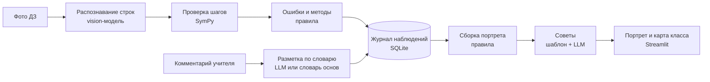

# Портрет ученика

**VENTUREHACK 2026 · трек «Образование»** (направления: инструменты для учителей, оценивание и обратная связь, образовательная аналитика).

Веб-приложение для учителя математики. Автопроверка домашних работ по алгебре записывает в журнал ошибки, методы и привычки ученика, а из журнала и комментариев учителя собирается **портрет «где слаб и как работать»**. Учитель получает не разовую проверку, а накопленную картину того, как решает каждый ученик.

> **Данные в демо синтетические.** 8 вымышленных учеников × 6 домашних работ. Мы сгенерировали только «рукописные» строки решений; все ошибки, методы и привычки в журнал записала та же проверка SymPy, что и в живом режиме. Реальные работы добавляются через страницу «Проверка работы».

## Что умеет MVP

| Страница | Что показывает |
|---|---|
| **Карта класса** | Таблица «ученики × навыки» в цвете: доля работ с ошибками (свежие весят больше), проверка ответа, опоздания, главное по каждому. Что повторить со всем классом. Клик по строке открывает портрет. |
| **Портрет ученика** | 1) где слаб(а) — с доказательствами до строки работы; 2) как решает — способы и привычки; 3) что пишет учитель — теги с цитатами, «подтверждено дважды»; 4) как работать — по 3 совета учителю и ученику; 5) все работы построчно. Версия для ученика — мягкая, без комментариев учителя. |
| **Проверка работы** | Фото тетради (vision-модель) или ввод строк текстом → проверка каждой строки → подсвечена первая неверная строка → наводящий вопрос без ответа (рус/каз) → запись в журнал → «портрет обновился: потеря корня 4/6 → 5/7». |
| **Журнал наблюдений** | Все строки «ученик · что замечено · где доказательство», фильтры, выгрузка CSV. Ответ на вопрос «откуда портрет это знает?». |
| **Как это работает** | Схема, правила, формула, словарь тегов, своё/стороннее. |

Интерфейс, подсказки и советы — на русском и казахском.

**Входит:** алгебра 7–9 классов — линейные и квадратные уравнения (включая дробно-рациональные с ОДЗ), упрощение выражений.
**Дальше:** геометрия и текстовые задачи, интеграция с электронным журналом, аккаунты и роли, мобильное приложение, байесовская модель знаний (BKT) вместо взвешенной доли.

## Как запустить

Нужен Python 3.9+.

```bash
python -m venv .venv
.venv\Scripts\activate          # Windows;  на macOS/Linux: source .venv/bin/activate
pip install -r requirements.txt
streamlit run app.py
```

Откроется http://localhost:8501. При первом запуске база `data/portret.db` создаётся сама: синтетическая история прогоняется через проверку (≈ 3 с). Кнопка «Сбросить демо-данные» в боковой панели возвращает исходное состояние.

**Языковая модель (необязательно).** Нужна только для распознавания фото, разметки комментариев и формулировок советов. Ключ можно ввести в боковой панели или задать заранее:

```bash
set ANTHROPIC_API_KEY=sk-ant-...        # Windows (cmd); PowerShell: $env:ANTHROPIC_API_KEY="..."
# или любой OpenAI-совместимый API:
set LLM_PROVIDER=openai
set OPENAI_API_KEY=...
set LLM_MODEL=gpt-4o
set LLM_BASE_URL=https://api.openai.com/v1   # Gemini: https://generativelanguage.googleapis.com/v1beta/openai/
```

Без ключа всё работает: строки вводятся текстом, комментарии размечаются словарём основ слов, советы берутся из словаря.

**Тесты:** `python -m pytest -q` (27 тестов: каждый тип ошибки, методы, привычки, рукописная нормализация, небезопасный ввод, сквозной сценарий демо).

### Деплой на Streamlit Community Cloud

1. Залить репозиторий на GitHub.
2. share.streamlit.io → New app → репозиторий, ветка `main`, файл `app.py`.
3. Advanced settings → Secrets — вставить ключ по образцу `.streamlit/secrets.toml.example` (необязательно).

## Сценарий демо (2 минуты)

1. **Карта класса** — видно, у кого и где провалы: Айгерим — квадратные уравнения 4/6, Данияр — знаки в линейных, Арман — ФСУ и опоздания.
2. **Портрет Айгерим** — «Потеря корня при делении обеих частей на выражение с x — в 4 работах из 6», подтверждено дважды (работы + учитель); квадратные — только через дискриминант; проверка ответа — в 1 работе из 6; учитель пишет «торопится» в 3 комментариях; 3 совета с опорой на ДЗ и строки.
3. **Проверка работы** → ДЗ №7 → «Ввести текстом» → «Вставить демо-работу» (или фото, если подключена модель) → «Проверить»: в №3 подсвечена строка `x = 7`, вопрос «В строке 1 обе части фактически разделены на x. Может ли x быть равно нулю?».
4. «Записать в журнал и обновить портрет» → **«Потеря корня: 4/6 → 5/7 (67 % → 76 %)»** → «Открыть портрет».

## Как это устроено



Языковая модель стоит только на входе (почерк, свободный текст учителя) и на выходе (формулировки советов). Всё, что считает и решает, — обычный код, поэтому каждый вывод можно воспроизвести. Проверка и комментарии пишут в один журнал, а портрет каждый раз собирается из него заново — поэтому новая работа сразу меняет портрет.

### Проверка строк — `core/checker.py`

- **Нормализация рукописной записи:** `−`, `·`, `²`, `x₁`, `√`, `±`, `x1,2`, десятичная запятая, кириллические «х»/«Д» в формулах, слова «Ответ / Жауабы», «Проверка / Тексеру», «ОДЗ / ММЖ», «или / немесе», «не подходит / жарамайды», «корней нет / түбірі жоқ».
- **Уравнения:** соседние строки сравниваются по множеству решений на ℝ (`solveset`) с учётом ОДЗ условия — так ловятся потерянные и лишние корни. Отдельно проверяются строки `D = …` (цепочка вычислений и значение b² − 4ac), теорема Виета (сумма и произведение), цепочки `x₁ = (…)/2 = …`, строка «Ответ», строки «x = 2 не подходит».
- **Выражения:** разность соседних строк упрощается до нуля или совпадает в 20 случайных точках.
- **Тип ошибки** на первой неверной строке:

| Тег | Правило |
|---|---|
| ФСУ | строка равносильна предыдущей, если в ней заменить (a±b)² или (a−b)(a+b) типичным неверным раскрытием (a²+b², a²−b², без 2ab, не тот знак) |
| Знак | смена знака одного слагаемого делает строки равносильными (перенос, раскрытие скобок с минусом, −b в формуле корней) |
| Вычислительная | строки расходятся ровно в одном числе (находим, какое число должно быть) |
| Потеря корня | множество решений уменьшилось; если prev = q·cur и обе части делятся на q(x) — «деление на q» |
| Посторонний корень | множество решений выросло или в ответе остался корень вне ОДЗ |
| Другое | ни одно правило не подошло — строка уходит учителю с цитатой |

- **Методы:** дискриминант, теорема Виета, разложение на множители. **Привычки:** проверка ответа, пропуск шагов (строк вдвое меньше эталона при верном ответе), запись ОДЗ, сдача после срока.
- **Наводящий вопрос** указывает строку и направление, но не называет ответ (есть тест на это).
- **Безопасность:** строка из распознавания попадает в SymPy только после белого списка символов и ограничения длины и степеней — произвольный код выполнить нельзя (есть тест).

### Журнал наблюдений — `core/db.py`

| Таблица | Зачем |
|---|---|
| students | псевдоним, класс — без настоящих имён |
| assignments, problems | задание, условия, навык, эталонное решение |
| submissions | факт и время сдачи (source: synthetic / live) |
| attempts, steps | разбор работы по задачам и строкам: распознанный текст, нормализованный, статус |
| **observations** | ученик · работа · строка · вид · тег · навык · цитата · источник · уверенность — сырьё для портрета |
| teacher_comments | исходный текст комментария |
| tags | словарь тегов: названия и советы на русском и казахском |

Контракт одной строки журнала:

```json
{"student_id": 1, "submission_id": 42, "line": 1, "kind": "error", "tag": "lost_root",
 "skill": "quadratic", "evidence": "x² = 7x  →  x = 7", "source": "auto", "confidence": 0.9}
```

### Сборка портрета — `core/portrait.py`

Для каждой пары «навык × ошибка» — взвешенная доля работ с ошибкой, свежие весят больше:

p = Σ wᵢ·eᵢ / Σ wᵢ, wᵢ = 0.8^kᵢ (kᵢ — сколько работ назад сдана работа i).

- **Слабое место** — не меньше 3 случаев и p ≥ 40 %. Меньше трёх — пометка «мало данных» вместо вывода.
- **Подтверждено дважды** — учитель и автопроверка отмечают одно и то же (например, «торопится» + редкая проверка ответа).
- **Советы** — готовые действия из словаря тегов для учителя и для ученика; модель (если подключена) только привязывает их к конкретным работам, а код проверяет, что упомянутые работы существуют.
- **Тон:** портрет описывает действия («в 4 работах из 6 нет проверки»), а не черты характера. Ученик видит мягкую версию с планом.

## Своё и стороннее

| Компонент | Чьё |
|---|---|
| Нормализация рукописной записи; правила классификации ошибок, методов и привычек; наводящие вопросы | **своё** — `core/checker.py` |
| Журнал наблюдений, взвешенная доля, пороги, «подтверждено дважды», сборка советов, «что изменилось» | **своё** — `core/portrait.py`, `core/pipeline.py`, `core/db.py` |
| Словарь тегов, советы и вопросы на русском и казахском; словарь основ для разметки комментариев | **своё** — `core/tags.py` |
| Синтетическая история класса | **своё** — `core/seed.py` |
| Интерфейс | **своё**, на фреймворке Streamlit |
| Символьная математика (равносильность, `solveset`, упрощение) | SymPy, open source |
| Распознавание почерка, разметка комментариев, формулировка советов | внешняя языковая модель по API (Claude или OpenAI-совместимая); промпты и проверка её ответов — свои (`core/llm.py`) |
| Хранение и таблицы | SQLite, pandas |

## Персональные данные

Псевдонимы вместо имён. Фото не сохраняется: после распознавания в базе остаются только строки текста. Реальные работы — только с согласия. Модель не может добавить в портрет новый вывод: теги — только из словаря, цитаты — только подстрока исходного текста.

## Валидация

- `python evaluate.py` — доля верно найденных первых ошибок на размеченных работах (`eval/labels.csv`, как размечать — в `eval/README.md`); с `--ocr` — ещё и доля верно распознанных строк. Две цифры для слайда.
- Показать 2–3 портрета (на работах одноклассников, с согласия) учителю математики: сходство по шкале 1–5 и неверные пункты.
- Опрос учителей: сколько часов в неделю уходит на проверку ДЗ и что они хотели бы знать о каждом ученике.

## Структура

```
app.py              интерфейс Streamlit (5 страниц)
core/checker.py     нормализация строк, проверка SymPy, классификация ошибок
core/tags.py        словарь тегов, советы, наводящие вопросы (рус/каз)
core/pipeline.py    проверка → журнал; комментарий → журнал
core/portrait.py    портрет и карта класса из журнала
core/llm.py         vision/LLM: распознавание, разметка, формулировки
core/db.py          схема SQLite
core/seed.py        синтетическая история (8 × 6) и демо-работа
evaluate.py         оценка точности на реальных работах
tests/              pytest
```
