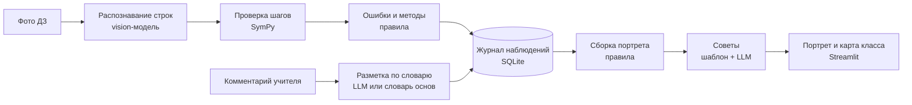

# Портрет ученика

**VENTUREHACK 2026 · трек «Образование»** (направления: инструменты для учителей, оценивание и обратная связь, образовательная аналитика).

Веб-приложение для учителя математики. Автопроверка домашних работ по алгебре записывает в журнал ошибки, методы и привычки ученика, а из журнала и комментариев учителя собирается **портрет «где слаб и как работать»**. Учитель получает не разовую проверку, а накопленную картину того, как решает каждый ученик.

> **Данные в демо синтетические.** 8 вымышленных учеников × 6 домашних работ. Мы сгенерировали только «рукописные» строки решений; все ошибки, методы и привычки в журнал записала та же проверка SymPy, что и в живом режиме. Реальные работы добавляются через страницу «Проверка работы».

## Что умеет MVP

Экран входа и 8 разделов:

| Раздел | Что показывает |
|---|---|
| **Карта класса** | Таблица «ученики × навыки» в цвете: доля работ с ошибками (свежие весят больше) и тренд ▼/▲, проверка ответа, опоздания, главное по каждому. Что повторить со всем классом, динамика класса. Клик по строке открывает портрет. |
| **Портрет ученика** | 1) где слаб(а) — с доказательствами до строки работы; 2) как решает — способы по каждой теме и привычки; 3) что пишет учитель — теги с цитатами, «подтверждено дважды»; 4) как работать — по 3 совета учителю и ученику, отметка «совет применён» и эффект до/после; 5) все работы построчно; 6) динамика — по работам, с интервалом и трендом. Блок «Тренажёр» — чем кончились тренировки. У доказательств — отметки учителя «✓ верно / ✗ неверно / ↻ другой тег», внизу — «🎯 Похоже ли это на ученика?» (1–5). Версия для ученика — мягкая, без комментариев учителя, с кнопкой «🧩 Потренироваться». |
| **Проверка работы** | Фото тетради (vision-модель; у каждой строки уверенность, сомнительные помечены ⚠️; по желанию два прочтения) или ввод строк текстом → проверка каждой строки → подсвечена первая неверная строка → наводящий вопрос без ответа (рус/каз) → запись в журнал (только при согласии) → «портрет обновился: потеря корня 4/6 → 5/7». «Это не ошибка» — записать работу, но вывод сразу снять. |
| **Журнал наблюдений** | Все строки «ученик · что замечено · где доказательство», фильтры (источник: автопроверка / учитель / тренажёр), отметки учителя, выгрузка CSV. Ответ на вопрос «откуда портрет это знает?». |
| **Качество** | Точность каждого тега по отметкам учителя, кандидаты на исправление правил, точность на размеченных работах (та же цифра, что `python evaluate.py`), время проверки, похожесть портрета, выгрузка метрик. |
| **Управление** | Учитель: итоги класса в CSV для электронного журнала, согласия, задания (эталон проходит ту же проверку SymPy). Администратор ещё: классы и импорт списков, пользователи, журнал действий, удаление данных ученика. |
| **Тренажёр** | Разбор своей ошибки и задачи под слабое место. Подсказки по ступеням «вопрос → правило → разобранный пример», готового ответа нет; задачу, решённую только с примером, тренажёр возвращает через 2 и 5 дней. Исход (исправил сам / после правила / нужен пример) пишется в журнал. Языковой модели нет. |
| **Как это работает** | Схема, правила проверки по темам, формула, словарь тегов, своё/стороннее, персональные данные. |

**Роли:** учитель видит только свои классы; ученик — только свой портрет (мягкая версия) и тренажёр; администратор — всё, а также ключ модели и «Сбросить демо-данные».

Интерфейс, подсказки и советы — на русском и казахском.

**Входит:** алгебра 7–9 классов — линейные и квадратные уравнения (включая дробно-рациональные с ОДЗ), упрощение выражений, неравенства (линейные, квадратные, дробно-рациональные — метод интервалов), системы двух уравнений, биквадратные уравнения, алгебраические дроби. Задания по новым темам — ДЗ №8–11; синтетической истории по ним нет, пока не задан `PORTRET_EXTRA_SEED=1`.
**Дальше:** геометрия и текстовые задачи, интеграция с электронным журналом (сейчас — выгрузка CSV), PostgreSQL вместо SQLite, калибровка распознавания на реальных фото, мобильное приложение.

## Как запустить

Нужен Python 3.9+.

```bash
python -m venv .venv
.venv\Scripts\activate          # Windows;  на macOS/Linux: source .venv/bin/activate
pip install -r requirements.txt
streamlit run app.py
```

Откроется http://localhost:8501 с экраном входа: **«Войти как демо-учитель»** (синтетический класс 8 «А») или **«Войти как демо-ученик»** (портрет Айгерим и тренажёр). При первом запуске база `data/portret.db` создаётся сама: синтетическая история прогоняется через проверку (≈ 3 с). Кнопка «Сбросить демо-данные» в боковой панели есть только у администратора: она удаляет всю базу, включая аккаунты, и возвращает исходное состояние.

Локально без входа: `PORTRET_AUTH=off streamlit run app.py` (Windows: `set PORTRET_AUTH=off`, затем `streamlit run app.py`).

> ⚠️ **`PORTRET_AUTH=off` — только для локальной разработки.** В этом режиме каждый посетитель получает права администратора. На публичной ссылке эту переменную задавать нельзя.

| Переменная | Значение |
|---|---|
| `PORTRET_AUTH` | `off` — вход отключён, псевдо-администратор (только локально) |
| `PORTRET_DEMO` | `0` — скрыть кнопки демо-входа (для настоящей школы); по умолчанию они есть |
| `PORTRET_DEMO_PASSWORD` | пароль демо-аккаунтов `demo_teacher` и `demo_student` для входа формой — задаётся, когда аккаунты создаются в новой базе (на существующей базе смена переменной ничего не меняет); не задан — случайный, вход только кнопкой |
| `PORTRET_ADMIN_LOGIN`, `PORTRET_ADMIN_PASSWORD` | создать администратора при запуске; если пароль в окружении сменился, он обновится в базе |
| `PORTRET_DB` | путь к базе; по умолчанию `data/portret.db` |
| `PORTRAIT_MODEL` | `weighted` (по умолчанию) — взвешенная доля; `bkt` — слабое место по модели знаний BKT |
| `PORTRET_EXTRA_SEED` | `1` — синтетическая история и по ДЗ №8–11 (по умолчанию её нет: иначе меняются числа демо) |
| `ANTHROPIC_API_KEY`, `OPENAI_API_KEY`, `LLM_PROVIDER`, `LLM_MODEL`, `LLM_BASE_URL`, `LLM_API_KEY` | языковая модель, см. ниже |

**Языковая модель (необязательно).** Нужна только для распознавания фото, разметки комментариев и формулировок советов. Ключ живёт на сервере: в переменных окружения или в `.streamlit/secrets.toml`. Поле ключа в боковой панели видит только администратор, и значение ключа в браузер не уходит. Не больше 30 обращений к модели в час на пользователя.

```bash
set ANTHROPIC_API_KEY=sk-ant-...        # Windows (cmd); PowerShell: $env:ANTHROPIC_API_KEY="..."
# или любой OpenAI-совместимый API:
set LLM_PROVIDER=openai
set OPENAI_API_KEY=...                  # или LLM_API_KEY — ключ для провайдера из LLM_PROVIDER
set LLM_MODEL=gpt-4o
set LLM_BASE_URL=https://api.openai.com/v1   # Gemini: https://generativelanguage.googleapis.com/v1beta/openai/
```

Без ключа всё работает: строки вводятся текстом, комментарии размечаются словарём основ слов, советы берутся из словаря.

**Тесты:** `python -m pytest -q` — по файлу на модуль и направление (`tests/test_*.py`); сквозной сценарий демо и дымовой тест всех разделов для каждой роли — в `tests/test_omega.py`.

### Деплой на Streamlit Community Cloud

1. Залить репозиторий на GitHub.
2. share.streamlit.io → New app → репозиторий, ветка `main`, файл `app.py`.
3. Advanced settings → Secrets — по образцу `.streamlit/secrets.toml.example`: `PORTRET_ADMIN_LOGIN` и `PORTRET_ADMIN_PASSWORD` (без них администратора нет), ключ модели (необязательно), для настоящей школы — `PORTRET_DEMO = "0"`. Корневые secrets Streamlit отдаёт как переменные окружения.
4. `PORTRET_AUTH` на публичной ссылке не задавать.

## Сценарий демо (2 минуты)

1. **Вход** — «Войти как демо-учитель»: виден только синтетический класс 8 «А».
2. **Карта класса** — видно, у кого и где провалы: Айгерим — квадратные уравнения 4/6, Данияр — знаки в линейных, Арман — ФСУ и опоздания.
3. **Портрет Айгерим** — «Потеря корня при делении обеих частей на выражение с x — в 4 работах из 6», подтверждено дважды (работы + учитель); квадратные — только через дискриминант; проверка ответа — в 1 работе из 6; учитель пишет «торопится» в 3 комментариях; 3 совета с опорой на ДЗ и строки.
4. **Проверка работы** → ДЗ №7 → «Ввести текстом» → «Вставить демо-работу» (или фото, если подключена модель) → «Проверить»: в №3 подсвечена строка `x = 7`, вопрос «В строке 1 обе части фактически разделены на x. Может ли x быть равно нулю?».
5. «Записать в журнал и обновить портрет» → **«Потеря корня (квадратные уравнения): 4/6 → 5/7 (67% → 76%)»** → «Открыть портрет». Повторная проверка той же работы заменяет прежнюю запись и снова даёт 4/6 → 5/7.

По желанию: **ДЗ №8 «Неравенства»** → «Вставить демо-работу» → «Проверить»: в №1 строка `x < −3` — знак неравенства не сменён при делении на −3; №2 решена верно методом интервалов; в №3 в ответ попала граница −1 вне ОДЗ. Или «Выйти» → «Войти как демо-ученик» → мягкая версия портрета → «🧩 Потренироваться».

## Как это устроено



Языковая модель стоит только на входе (почерк, свободный текст учителя) и на выходе (формулировки советов). Всё, что считает и решает, — обычный код, поэтому каждый вывод можно воспроизвести. Проверка и комментарии пишут в один журнал (туда же тренажёр пишет свои исходы), а портрет каждый раз собирается из него заново — поэтому новая работа сразу меняет портрет. Отметки учителя лежат отдельно и применяются при сборке.

### Проверка строк — `core/checker.py`, `core/kinds/`

- **Нормализация рукописной записи:** `−`, `·`, `²`, `x₁`, `√`, `±`, `x1,2`, десятичная запятая, кириллические «х»/«Д» в формулах, слова «Ответ / Жауабы», «Проверка / Тексеру», «ОДЗ / ММЖ», «или / немесе», «не подходит / жарамайды», «корней нет / түбірі жоқ».
- **Уравнения:** соседние строки сравниваются по множеству решений на ℝ (`solveset`) с учётом ОДЗ условия — так ловятся потерянные и лишние корни. Отдельно проверяются строки `D = …` (цепочка вычислений и значение b² − 4ac), теорема Виета (сумма и произведение), цепочки `x₁ = (…)/2 = …`, строка «Ответ», строки «x = 2 не подходит».
- **Выражения:** разность соседних строк упрощается до нуля или совпадает в 20 случайных точках.
- **Тип ошибки** на первой неверной строке:

| Тег | Правило |
|---|---|
| ФСУ | строка равносильна предыдущей, если в ней заменить (a±b)² или (a−b)(a+b) типичным неверным раскрытием (a²+b², a²−b², без 2ab, не тот знак) |
| Знак | смена знака одного слагаемого делает строки равносильными (перенос, раскрытие скобок с минусом, −b в формуле корней) |
| Вычислительная | строки расходятся ровно в одном числе (находим, какое число должно быть) |
| Потеря корня | множество решений уменьшилось; если prev = q·cur и обе части делятся на q(x) — «деление на q» |
| Посторонний корень | множество решений выросло или в ответе остался корень вне ОДЗ |
| Другое | ни одно правило не подошло — строка уходит учителю с цитатой |

- **Новые темы** — отдельные модули в `core/kinds/`: `checker.check_problem` сначала ищет вид задачи там, поэтому журнал, портрет и карта класса подхватывают тему без правок. Где подходят, работают и общие теги (знак, ФСУ, вычислительная, потеря корня).

| Тема | Где | Свои ошибки | Методы |
|---|---|---|---|
| Неравенства | `core/kinds/inequality.py` | знак неравенства при делении на отрицательное; деление на выражение с x; не тот промежуток; граница — строгое / нестрогое, точка вне ОДЗ | метод интервалов |
| Системы двух уравнений | `core/kinds/system.py` | подстановка без скобок; перепутаны x и y в ответе | подстановка, сложение |
| Биквадратные уравнения | `core/kinds/biquadratic.py` | x² = t при t < 0; потерян корень ± после обратной замены; уравнение в t не совпадает с исходным | замена переменной |
| Алгебраические дроби | `core/checker.py` (вид «выражение») | сокращение слагаемых вместо множителей | — |

- **Методы:** дискриминант, теорема Виета, разложение на множители и методы новых тем. **Привычки:** проверка ответа, пропуск шагов (строк вдвое меньше эталона при верном ответе), запись ОДЗ, сдача после срока.
- **Наводящий вопрос** указывает строку и направление, но не называет ответ (есть тест на это).
- **Безопасность:** строка из распознавания попадает в SymPy только после белого списка символов и ограничения длины и степеней — произвольный код выполнить нельзя (есть тест).

### Журнал наблюдений — `core/db.py`

| Таблица | Зачем |
|---|---|
| students | псевдоним, класс — без настоящих имён |
| assignments, problems | задание, условия, навык, эталонное решение |
| submissions | факт и время сдачи (source: synthetic / live) |
| attempts, steps | разбор работы по задачам и строкам: распознанный текст, нормализованный, статус |
| **observations** | ученик · работа · строка · вид · тег · навык · цитата · источник · уверенность — сырьё для портрета |
| teacher_comments | исходный текст комментария |
| tags | словарь тегов: названия и советы на русском и казахском |

Контракт одной строки журнала:

```json
{"student_id": 1, "submission_id": 42, "line": 1, "kind": "error", "tag": "lost_root",
 "skill": "quadratic", "evidence": "x² = 7x  →  x = 7", "source": "auto", "confidence": 0.9}
```

`source`: `auto` — автопроверка, `teacher` — теги из комментария учителя, `practice` — исходы тренажёра (исправил сам по вопросу / после правила / понадобился пример). Портрет считает только `auto` и `teacher`, поэтому тренажёр его чисел не меняет.

Остальные таблицы создают сами модули (`ensure_schema`); существующие таблицы они не меняют:

| Таблица | Модуль | Зачем |
|---|---|---|
| reviews, portrait_ratings | `core/review.py` | отметки учителя на наблюдениях (верно / неверно / другой тег); оценка похожести портрета 1–5 |
| check_timings, quality_settings | `core/quality.py` | время проверки в приложении; ручная цифра учителя для сравнения |
| ocr_lines | `core/ocr_store.py` | что прочитала модель и что оставил учитель (без фото) |
| practice_sessions, practice_items, practice_attempts, practice_reviews | `core/practice.py` | тренажёр: сессии, задачи, попытки, повторения |
| interventions | `core/interventions.py` | «совет применён» — для эффекта до/после |
| users, teacher_classes | `core/auth.py` | пользователи (пароль — только хэш PBKDF2 с солью), классы учителя |
| classes | `core/roster.py` | классы, в том числе пустые |
| consents | `core/consent.py` | согласие: основание, номер и дата бумажной формы, отзыв |
| audit_log | `core/audit.py` | журнал действий: кто, код действия, id объекта |

### Сборка портрета — `core/portrait.py`

Для каждой пары «навык × ошибка» — взвешенная доля работ с ошибкой, свежие весят больше:

p = Σ wᵢ·eᵢ / Σ wᵢ, wᵢ = 0.8^kᵢ (kᵢ — сколько работ назад сдана работа i).

- **Слабое место** — не меньше 3 случаев и p ≥ 40 %. Меньше трёх — пометка «мало данных» вместо вывода.
- **`PORTRAIT_MODEL=bkt`** — вместо доли модель знаний BKT (`core/knowledge.py`): слабое место — не меньше 3 случаев и P(освоен) ≤ 0.6; параметры подбираются по всем ученикам базы.
- **Подтверждено дважды** — учитель и автопроверка отмечают одно и то же (например, «торопится» + редкая проверка ответа).
- **Отметки учителя** (`core/review.py`): «неверно» убирает наблюдение из портрета, «другой тег» подменяет тег; сам журнал не меняется.
- **Динамика** (`core/knowledge.py`): тренд — первая половина работ против второй (от 4 работ), 80-процентный интервал Уилсона (от 3 работ), P(освоен) по BKT.
- **Советы** — готовые действия из словаря тегов для учителя и для ученика; модель (если подключена) только привязывает их к конкретным работам, а код проверяет, что упомянутые работы существуют.
- **Тон:** портрет описывает действия («в 4 работах из 6 нет проверки»), а не черты характера. Ученик видит мягкую версию с планом.

## Своё и стороннее

| Компонент | Чьё |
|---|---|
| Нормализация рукописной записи; правила классификации ошибок, методов и привычек; наводящие вопросы | **своё** — `core/checker.py`, `core/kinds/` |
| Уверенность распознанных строк, журнал распознаваний | **своё** — `core/ocr.py`, `core/ocr_store.py` |
| Журнал наблюдений, взвешенная доля, пороги, «подтверждено дважды», сборка советов, «что изменилось» | **своё** — `core/portrait.py`, `core/pipeline.py`, `core/db.py` |
| Динамика: тренд, интервал Уилсона, BKT, эффект советов | **своё** — `core/knowledge.py`, `core/interventions.py` |
| Тренажёр: задачи под слабое место, лестница подсказок | **своё** — `core/practice.py`, `core/hints.py` |
| Отметки учителя, метрики качества | **своё** — `core/review.py`, `core/quality.py` |
| Аккаунты и роли, согласие, журнал действий, удаление данных, классы и задания | **своё** — `core/auth.py`, `core/consent.py`, `core/audit.py`, `core/privacy.py`, `core/roster.py` |
| Словарь тегов, советы и вопросы на русском и казахском; словарь основ для разметки комментариев | **своё** — `core/tags.py` |
| Синтетическая история класса | **своё** — `core/seed.py` |
| Интерфейс | **своё**, на фреймворке Streamlit — `app.py`, `ui/` |
| Символьная математика (равносильность, `solveset`, упрощение) | SymPy, open source |
| Подбор параметров BKT, графики динамики | numpy, Altair — open source, идут вместе с pandas и Streamlit |
| Подготовка фото (поворот, размер) | Pillow, open source |
| Распознавание почерка, разметка комментариев, формулировка советов | внешняя языковая модель по API (Claude или OpenAI-совместимая); промпты и проверка её ответов — свои (`core/llm.py`) |
| Хранение и таблицы | SQLite, pandas |

## Персональные данные

- Псевдонимы вместо имён. Фото не сохраняется: после распознавания в базе остаются только строки текста.
- **Согласие.** Без активного согласия живую работу нельзя записать в журнал, а тренажёр не сохраняет решения и исходы. Основание — бумажная форма родителя; в базе только её номер и дата, без скана. Отмечает и отзывает учитель: «Управление» → «Согласия». Синтетическим ученикам демо согласие ставится само.
- **Доступ.** Учитель видит только свои классы, ученик — только свой портрет и тренажёр. Пароли — только хэш PBKDF2 с солью; после 5 неудачных попыток за 10 минут вход по логину приостанавливается; после 60 минут без действий сессия заканчивается.
- **Журнал действий** (`audit_log`): вход, просмотр портрета, запись работы, выгрузки, удаление, согласия, действия администратора — только код действия и id, без имён и текстов работ. Администратор смотрит его в «Управление» → «Журнал действий».
- **Удаление.** По запросу администратор удаляет все данные ученика во всех таблицах: «Управление» → «Удаление данных» (подтверждение — ввод псевдонима).
- Модель не может добавить в портрет новый вывод: теги — только из словаря, цитаты — только подстрока исходного текста.

## Валидация

- `python evaluate.py` — доля верно найденных первых ошибок на размеченных работах (`eval/labels.csv`, как размечать — в `eval/README.md`); ту же цифру показывает страница «Качество». С `--ocr` — ещё и доля верно распознанных строк; `--out eval/results.md` — таблица для слайда. Две цифры для слайда.
- Показать 2–3 портрета (на работах одноклассников, с согласия) учителю математики: сходство по шкале 1–5 и неверные пункты — форма «🎯 Похоже ли это на ученика?» внизу портрета, сводка — на странице «Качество».
- Опрос учителей: сколько часов в неделю уходит на проверку ДЗ и что они хотели бы знать о каждом ученике. Ручную цифру можно ввести на странице «Качество» — рядом появится сравнение со временем проверки в приложении.

## Отчёты направлений

- [`docs/alpha.md`](docs/alpha.md) — Альфа: распознавание фото
- [`docs/beta.md`](docs/beta.md) — Бета: новые темы и типы ошибок
- [`docs/gamma.md`](docs/gamma.md) — Гамма: тренажёр ученика
- [`docs/delta.md`](docs/delta.md) — Дельта: динамика и эффект советов
- [`docs/epsilon.md`](docs/epsilon.md) — Эпсилон: учитель в контуре, страница «Качество»
- [`docs/zeta.md`](docs/zeta.md) — Дзета: аккаунты, классы, безопасность
- [`docs/omega.md`](docs/omega.md) — Омега: согласованность после слияния

`agents/*.md` — задания агентов фазы 1; карта кода в них историческая, актуальная — ниже.

## Структура

```
app.py                  интерфейс Streamlit: 8 разделов, боковая панель, общие помощники
ui/login.py             экран входа, сессия, демо-вход
ui/manage.py            «Управление»: выгрузка, согласия, пользователи, журнал действий, удаление
ui/classes.py           вкладка «Классы»: классы, импорт списков, учителя класса
ui/assignments.py       вкладка «Задания»: учитель создаёт ДЗ
ui/review.py            отметки учителя, оценка портрета, страница «Качество»
ui/dynamics.py          «Динамика» в портрете, «совет применён», тренды на карте класса
ui/practice.py          «Тренажёр» и его блок в портрете
core/checker.py         нормализация строк, проверка SymPy, классификация ошибок
core/kinds/             новые виды задач: inequality.py, system.py, biquadratic.py
core/tags.py            словарь тегов, навыков, советов, наводящих вопросов (рус/каз)
core/pipeline.py        проверка → журнал; комментарий → журнал; удаление работы
core/portrait.py        портрет и карта класса из журнала
core/knowledge.py       динамика: тренд, интервал Уилсона, BKT
core/interventions.py   «совет применён» и эффект до/после
core/review.py          отметки учителя и оценка портрета
core/quality.py         метрики качества, время проверки, точность на разметке
core/practice.py        тренажёр: задачи из шаблонов, попытки, исходы в журнал
core/hints.py           лестница подсказок
core/llm.py             vision/LLM: распознавание, разметка, формулировки
core/ocr.py             уверенность распознанных строк, очистка LaTeX
core/ocr_store.py       журнал распознаваний
core/auth.py            пользователи, роли, видимость, лимит обращений к модели
core/consent.py         согласие на обработку работ
core/audit.py           журнал действий
core/privacy.py         удаление данных ученика, выгрузка итогов класса в CSV
core/roster.py          классы, импорт списков, задания учителя
core/db.py              схема SQLite (базовые таблицы)
core/seed.py            синтетическая история (8 × 6), ДЗ №7–11 и демо-работы
evaluate.py             оценка точности на размеченных работах
eval/                   разметка labels.csv и инструкция README.md
tests/test_*.py         pytest
docs/                   отчёты направлений и скриншоты
agents/                 задания агентов фазы 1
```
