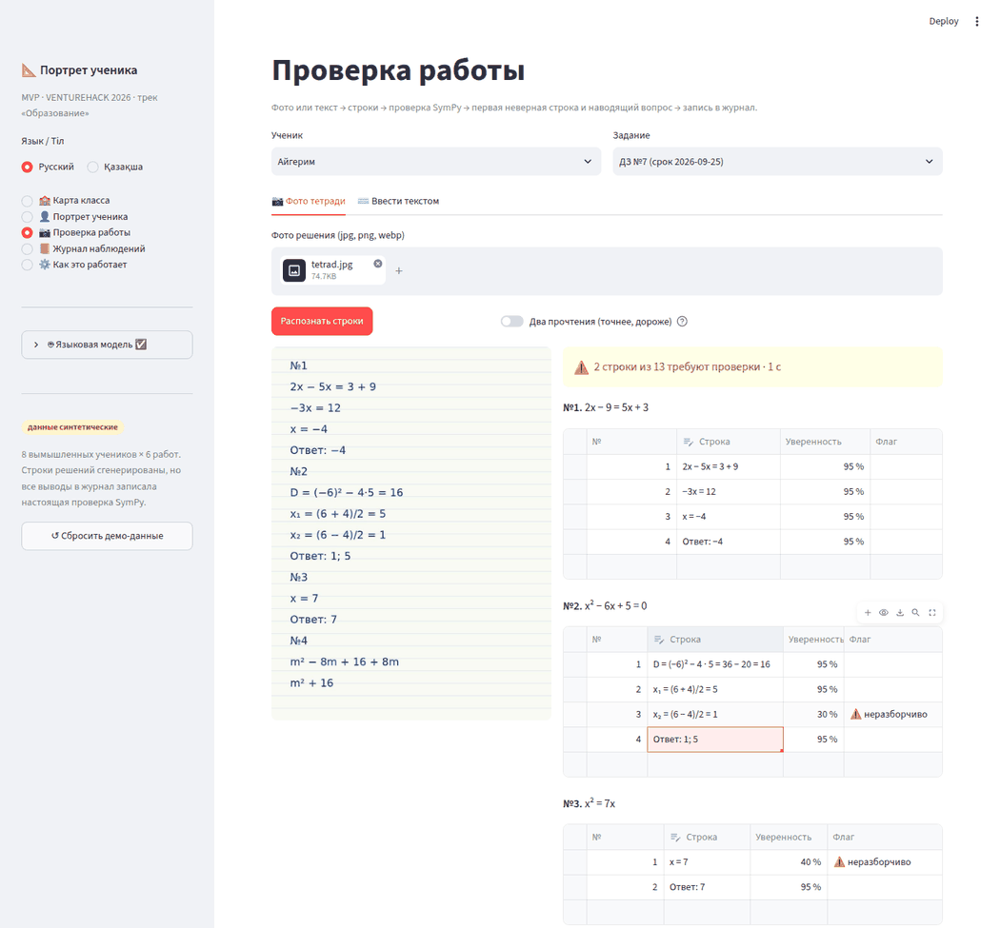
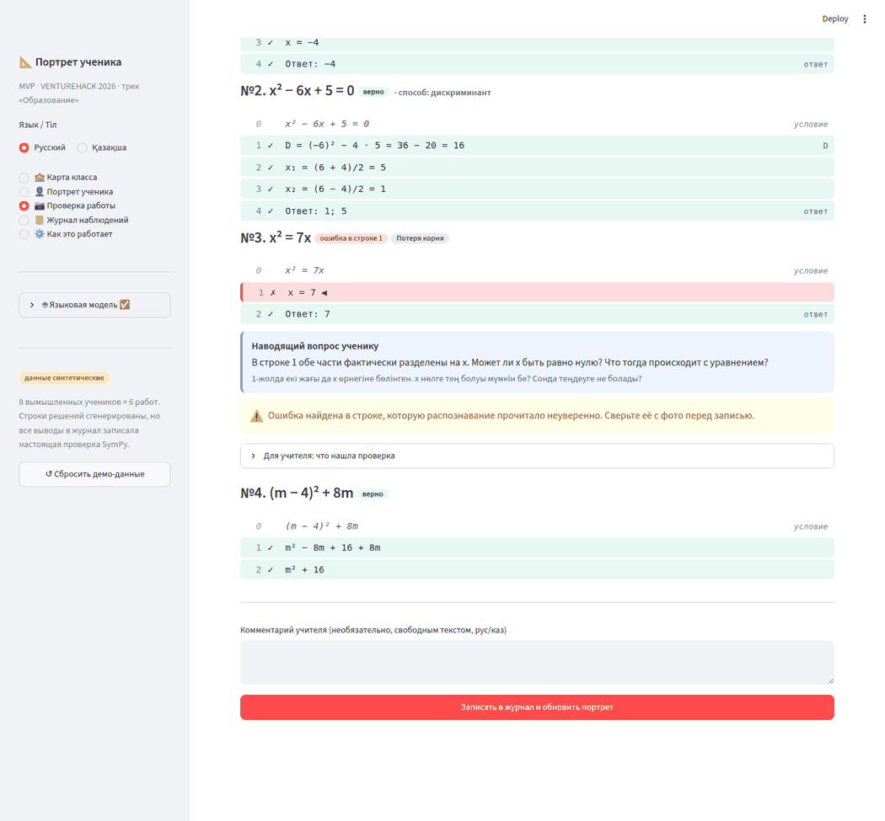
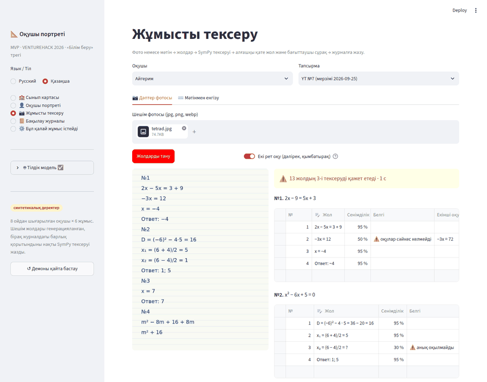

# Агент Альфа · Надёжное распознавание фото — отчёт

Путь «фото тетради → строки решения» теперь показывает учителю сомнительные строки рядом с фото и не даёт портрету молча опираться на непроверенное распознавание. Для честных цифр есть CER, калибровка флага, время на фото и черновая разметка.

**Главное ограничение:** в среде разработки не было ни ключа API, ни реальных фото тетрадей. Поэтому цифры G1 и G2 **не измерены**. Весь путь с моделью проверен на подменённой модели (тесты и браузер). Инструменты для замера готовы: см. «Что не сделано».

## Что сделано

### Этап A

**A1. `core/llm.py`: `recognize_detailed(cfg, image_bytes, problems, passes=1)`**
- Возвращает `{номер задачи: [{"text", "unsure"}]}`. Строки, которые модель не отнесла к задаче, лежат под ключом `llm.UNASSIGNED = 0`.
- Промпт `OCR_DETAILED_PROMPT` сохраняет правила `OCR_PROMPT`: не исправлять, не решать, не добавлять строк, не переписывать условие. Добавлено: неразборчивый символ в `text` заменяется на `?`, а в `unsure` идёт сомнительный фрагмент; LaTeX запрещён. Уверенность числом модель не выставляет.
- Надёжный JSON. Принимается JSON и внутри ```-блока, и с текстом вокруг. Если ответ не разобрался, идёт один повторный запрос без фото с текстом прошлого ответа и просьбой «верни только JSON по схеме». Вторая неудача даёт `LLMError`: «Модель дважды вернула ответ не в формате JSON — распознать строки не удалось…».
- Разбор схемы терпит неточности: номер `"№2"`, строки-строки вместо объектов, `unsure` строкой, пустые строки.
- `recognize()`: сигнатура и формат `{1: ["x = 7", "Ответ: 7"]}` прежние. Внутри вызывает `recognize_detailed` и выбрасывает строки без задачи.
- HEIC принимается, если установлен `pillow-heif`: открыватель регистрируется в `prepare_image`, а список `llm.PHOTO_TYPES` расширяется. В `requirements.txt` пакет **не** добавлен: `pip install pillow-heif`, если учителя фотографируют на iPhone.

**A2. `core/ocr.py`**
- `UNSURE = 0.8`.
- `clean_text()` переводит обрывки LaTeX в запись для `checker.normalize`. Каждое правило покрыто тестом (23 случая):
  - `$…$`, `\text{…}`/`\mathrm{…}`;
  - `\frac{a}{b}`/`\dfrac`, например `(a)/(b)`: скобки ставятся, если числитель или знаменатель не число и не одна буква, поэтому `\frac{…}{2a}` → `(…)/(2a)`, а не `/2a`;
  - `\sqrt{…}` → `√(…)`, `\sqrt 5` → `√5`;
  - `\cdot`/`\times` → `·`, `\pm` → `±`, `\le`/`\ge`/`\ne` → `≤`/`≥`/`≠`;
  - `^{2}`/`^2` → `²`, `^{…}` → `^(…)`;
  - `x_{1}`/`x_1` → `x₁`, `x_{1,2}` → `x₁,₂`;
  - `\left`/`\right`, `\quad`, лишние пробелы.
- `score_lines()` добавляет строке `confidence` и `flags`:
  - `illegible` (≤ 0.4): `?` в тексте или непустой `unsure`;
  - `unparsable` (≤ 0.3): нет метки (ответ, проверка, ОДЗ, «не подходит») и часть строки, разрезанной по `=`, `|`, `;`, не разбирается `checker.parse`. Перед разбором `±` → `+`;
  - `disagree` (≤ 0.5, этап B1);
  - иначе 0.95.

  Два уточнения к правилу «не разбирается»:
  - строка из одних слов («Решение») — это текст, а не ошибка распознавания;
  - запятая перед `x₂ =` тоже разделяет части, как в `checker._split_parts`, иначе `x₁ = 3, x₂ = 2` ложно помечалась бы.

  Проверено: ни одна из 756 строк синтетической истории не получает `unparsable` (есть тест).
- `unverified(ocr_raw, answers)` возвращает `{(problem_id, line_no): confidence}` для неуверенных строк, которые учитель не поправил. Номер строки считается как в `checker`: `enumerate(lines, 1)`, пустые строки пропускаются, но номер занимают. Строки сопоставляются по тексту (`strip()`) через `difflib`, поэтому вставка или удаление строки учителем не сбивает соответствие.
- `error_unverified(problem_id, result, line_confidence)` — общая функция для журнала и предупреждения на экране (см. A4).

**A3. Вкладка «📷 Фото тетради» (`app.py`, блок `with tab_photo:`)**
- Слева фото, справа по каждой задаче `st.data_editor` с колонками «№» (только чтение), «Строка» (правится), «Уверенность» (%, только чтение), «Флаг» (⚠️ + причина). Строки можно добавлять и удалять.
- Над таблицами сводка «⚠️ 2 строки из 13 требуют проверки · 1 с» (с русскими падежами) и время распознавания.
- «Распознать строки»: `llm.recognize_detailed` → `ocr.clean_text` → `ocr.score_lines`. Результат ложится в `ss["ocr_raw"] = {problem_id: [...]}`, для таблиц — копия в `ss["ocr_view"]`.
- «Принять строки» записывает тексты в `ss[f"lines_{aid}_{problem_id}"]` (только из блока фото, затем `st.rerun()`). Вкладка «Ввести текстом», «Проверить» и запись в журнал работают без изменений.
- Фото показывается уже после выбора файла, до распознавания: повёрнутое по EXIF и уменьшенное через `prepare_image`, поэтому HEIC тоже отображается.
- Подпись «Фото не сохраняется…» на месте и по-прежнему правдива:
  - байты фото живут только в виджете загрузки;
  - в `submissions.photo_name` пишется имя файла, как и раньше;
  - в `ocr_lines` — только текст (есть тест, что в таблице нет колонок для изображения).

**A4. Журнал распознаваний и честность выводов**
- `core/ocr_store.py`: таблица `ocr_lines` по схеме из задания, `ensure_schema`, `save`, `stats`. `stats` считает `edited_share`, `unsure_share`, `edited_among_unsure`, плюс `unsure_among_edited` — полноту флага на живых работах.
- `save` сопоставляет распознанные строки с итоговыми (`final_text = None`, если учитель строку удалил). Перед записью удаляются прежние строки этой работы и строки удалённых работ: повторная живая проверка удаляет прежнюю работу, а SQLite может выдать новой тот же `id`.
- `pipeline.record_submission(..., line_confidence=None)`. Если первая ошибка задачи опирается на неуверенную неправленую строку, наблюдение пишется с `confidence = 0.6` (для `other` остаётся 0.5, то есть берётся минимум) и `detail["ocr_unverified"] = True`. При `None` поведение прежнее, демо и старые тесты не изменились. Импорт из `ocr` — внутри функции.
- `app.py`, обработчик «Записать в журнал…»:
  - в вызов добавлено `line_confidence=ocr.unverified(...)`;
  - сразу после вызова — `ocr_store.save(...)` только для задач этого задания и `ss.pop("ocr_raw")`.
- `app.py`, вывод результатов: внутри `if fe:`, после наводящего вопроса, выводится предупреждение «⚠️ Ошибка найдена в строке, которую распознавание прочитало неуверенно. Сверьте её с фото перед записью.»

> **Отличие от буквы задания (G4 строже).** Задание требовало понижать уверенность, только если неуверенна *сама строка первой ошибки*. На прогоне нашёлся случай, когда этого мало. Строка `x₂ = (6 − 4)/2 = ?` не разбирается, проверка её пропускает, и первая ошибка «потеря корня» ставится на уверенную строку `x₁ = …`. Поэтому `ocr.error_unverified` считает ошибку непроверенной в трёх случаях:
> - неуверенна строка ошибки;
> - неуверенна строка *перед* ней: ошибка — это переход «до → после»;
> - в задаче есть неуверенная строка, которую проверка не смогла разобрать.
>
> Одна и та же функция работает в журнале и в предупреждении на экране.

**A5. `evaluate.py`**
- Необязательные колонки `problem` (по умолчанию 1) и `status`. Старый формат работает (есть тест). Фото с несколькими задачами распознаётся один раз.
- Метрики:
  - строки без правки (G1);
  - CER (своя функция Левенштейна);
  - «помечено N строк, из них действительно ошибочны K» и полнота флага;
  - первая ошибка по распознанному: строка (G2) и строка + тег;
  - время на фото: среднее и медиана.
- В e2e-оценке распознанные строки проходят `clean_text`, как в приложении.
- `--out eval/results.md` — таблица для слайда: дата, модель, число фото и строк, все метрики, таблица калибровки.
- `--draft photo.jpg --statement "…" [--kind] [--problem]` распознаёт фото и дописывает строку со `status=draft`. `error_line`/`error_tag` предлагает `checker`. Если в файле ещё нет новых колонок, заголовок дописывается. Черновики в метрики не входят.
- `--passes 2` включает два прочтения.

### Этап B

- **B1. Два прочтения.**
  - При `passes=2` второй запрос идёт с другой формулировкой (`OCR_SECOND_PROMPT`: «посимвольная расшифровка сверху вниз, различай + и −, 1 и 7…»).
  - `ocr.merge_readings` выравнивает строки через `difflib.SequenceMatcher` по нормализованному тексту. Строки, где прочтения разошлись, получают `alternatives = [первое, второе]`. Если строка есть только в одном прочтении, второй вариант пустой («строки нет»).
  - `score_lines` ставит флаг `disagree`, `confidence ≤ 0.5`.
  - В таблице появляются колонки «Второе прочтение» и галочка «Взять его».
  - Переключатель «Два прочтения (точнее, дороже)», по умолчанию выключен.
- **B2. Строки без задачи.** Отдельная таблица «Строки без задачи», у каждой строки выбор задачи («—» или «№k»). При «Принять строки» строка дописывается в конец выбранной задачи и в `ocr_raw` этой задачи, чтобы её уверенность учитывалась.
- **B3. Калибровка порога — инструмент готов, данных нет.** `evaluate.py --ocr` печатает и пишет в `results.md` таблицу «порог → полнота → ложные тревоги» для порогов 0.35 / 0.45 / 0.55 / 0.8 / 0.96. Уверенность дискретна (0.3 / 0.4 / 0.5 / 0.95), поэтому осмысленных порогов ровно столько. Без реальных фото и ключа замерить нельзя, `UNSURE = 0.8` оставлен из задания. Что получится при нынешних правилах:

  | Порог | Что попадает в «требуют проверки» |
  |---|---|
  | 0.35 | только `unparsable` |
  | 0.45 | + `illegible` |
  | 0.55 | + `disagree` |
  | 0.8 (сейчас) | то же, что 0.55: все флаги |
  | 0.96 | все строки: полнота 100 %, флаг бесполезен |

  Порог 0.8 означает «любой флаг → проверить». Если на реальных фото полнота флага окажется ниже 90 %, двигать порог бесполезно. Нужны новые сигналы:
  - `passes=2` по умолчанию;
  - флаг «строка не следует из предыдущей» от `checker`;
  - сравнение числа строк с эталоном.

  Таблицу нужно заполнить после замера: `python evaluate.py --ocr --out eval/results.md`.
- **B4. Синтетический набор.**
  - `eval/make_synthetic.py` рисует строки из синтетической истории шрифтом Caveat (SIL OFL 1.1, кириллица и казахские буквы; `√` и `✓` — запасным DejaVu) на листе в клетку. На каждый символ — дрожь размера и высоты, на строку — наклон и поворот, цвет чернил меняется.
  - Набор: 30 фото с одной задачей (половина с ошибкой, половина без) и одно фото с ДЗ №7 целиком (4 задачи, проверяет колонку `problem`). 596 КБ, оттенки серого.
  - Разметка `eval/synthetic/labels.csv` (`status=synthetic`), `manifest.json` (`"synthetic": true`), пометка SYNTHETIC в метаданных PNG. `evaluate.py` предупреждает, что это не цифры для слайда.
  - Шрифт в репозиторий не кладётся: скачивается при первом запуске в `~/.cache/portret/`, или путь передаётся через `--font`.
- **B5. Статистика правок.** После «Принять строки» выводится «Строки приняты: исправлено 1 из 12» (`ocr.edit_stats`). В журнале — `ocr_store.stats(conn, submission_id)`.

## Что не сделано и почему

- **G1/G2 не измерены**, `eval/results.md` не создан. Не было ни ключа API, ни реальных фото: реальных фото **0 из 30**. Цифры не подгонялись и не подставлялись. Чтобы получить цифры:
  1. Положить фото в `eval/photos/`.
  2. `python evaluate.py --draft photos/NN.jpg --statement "…"` для каждой задачи → поправить эталон → убрать `draft`.
  3. `python evaluate.py --ocr --out eval/results.md` (и то же с `--passes 2` для сравнения).
- **B3** — только инструмент и анализ выше, числа после замера.
- Дымовой прогон на синтетике с настоящей моделью тоже не выполнен (нет ключа). Команда: `python evaluate.py --ocr --labels eval/synthetic/labels.csv`.
- Флаг в таблице не пересчитывается сразу после правки строки: `data_editor` не даёт менять свои данные в том же прогоне. Он показывает, что прочитала модель; итог виден в сводке «исправлено N из M» и в предупреждении после «Проверить».
- Фото и таблицы стоят в двух колонках. При 4+ задачах таблицы длиннее фото, и фото уезжает вверх при прокрутке. Липкую колонку фото (CSS `position: sticky`) не делал: это правка общих стилей `app.py` вне моего блока.

## Как проверено

```
$ python -m pytest -q
95 passed in 17.53s            # 27 прежних + 68 новых в tests/test_alpha.py
```

`tests/test_alpha.py` (без сети; модель подменена через `monkeypatch` на `llm._call`) покрывает:
- `score_lines`: `x = ?7`, `x₁ = (5 + 1)/2 = 3`, метки, `x = ((`, `disagree`, все строки seed;
- `clean_text`: каждое правило;
- `recognize_detailed`: корректный JSON, JSON в ```-блоке, битый → повтор → успех, два битых → `LLMError`, нестрогая схема, два прочтения;
- `recognize()` в прежнем формате;
- `unverified`: нумерация и вставки;
- `error_unverified`;
- `ocr_store.save`/`stats`/повторное сохранение;
- `record_submission`: 0.6 + `ocr_unverified`, без параметра 0.9/0.5;
- Левенштейн, CER, калибровка;
- `evaluate.py --ocr --out` целиком, старый формат `labels.csv`, `--draft`;
- синтетический набор помечен.

Браузер (Playwright + Chromium, приложение с подменённой моделью, которая вернула JSON в ```-блоке с LaTeX, одной неразборчивой и одной неуверенной строкой):
1. Загрузка фото → «Распознать строки» → «⚠️ 2 строки из 13 требуют проверки».
2. Правка строки `x₂ = (6 − 4)/2 = ?` → `= 1` прямо в таблице → «Принять строки» → «исправлено 1 из 12».
3. «Проверить» → у задачи 3 (`x = 7`, неуверенная, не правилась) предупреждение ⚠️.
4. «Записать в журнал» → в `observations`: `lost_root`, `confidence 0.6`, `detail.ocr_unverified = true`. В `ocr_lines` 12 строк, одна `edited = 1`.
5. Казахский интерфейс + два прочтения: строка с расхождением `−3x = 12` / `−3x = 72` получила 50 % и «⚠️ оқулар сәйкес келмейді».

Без ключа (G5), `streamlit.testing.AppTest`: вкладка фото показывает подсказку, «Вставить демо-работу» → «Проверить» → «Записать» → «Потеря корня (квадратные уравнения): 4/6 → 5/7».

`python evaluate.py` на `eval/labels.csv` и на синтетике: первая ошибка на эталонных строках 4/4 и 34/34.

## Скриншоты

| | |
|---|---|
| Фото и строки рядом, сводка, флаги |  |
| Предупреждение у ошибки в неуверенной строке |  |
| Два прочтения, казахский интерфейс |  |

Пример синтетического фото: `eval/synthetic/syn_live_hw7.png`.

## Новые казахские тексты для вычитки

| Русский | Қазақша |
|---|---|
| Фото решения (jpg, png, webp) | Шешім фотосы (jpg, png, webp) |
| Два прочтения (точнее, дороже) | Екі рет оқу (дәлірек, қымбатырақ) |
| Фото читается дважды разными запросами; строки, где прочтения разошлись, помечаются ⚠️ и показывают оба варианта. | Фото екі түрлі сұраумен екі рет оқылады; оқулар сәйкес келмеген жолдар ⚠️ белгіленіп, екі нұсқасы да көрсетіледі. |
| неразборчиво | анық оқылмайды |
| не разбирается | талданбайды |
| прочтения разошлись | оқулар сәйкес келмейді |
| Фото не сохраняется. Загрузите его снова, чтобы сверять строки рядом с ним. | Фото сақталмайды. Жолдарды қасында салыстыру үшін оны қайта жүктеңіз. |
| N строк из M требуют проверки | Тексеруді қажет ететін жолдар: N / M |
| Строка / Уверенность / Флаг / Задача | Жол / Сенімділік / Белгі / Есеп |
| Второе прочтение / Взять его | Екінші оқу / Соны алу |
| Строки без задачи | Есепке жатпайтын жолдар |
| Модель не поняла, к какой задаче относятся эти строки. Выберите задачу или оставьте «—». | Модель бұл жолдардың қай есепке жататынын анықтамады. Есепті таңдаңыз немесе «—» қалдырыңыз. |
| Принять строки | Жолдарды қабылдау |
| Строки приняты: исправлено N из M. Нажмите «Проверить» ниже или поправьте текст во вкладке «Ввести текстом». | Жолдар қабылданды. Түзетілген жолдар: N / M. Төмендегі «Тексеру» батырмасын басыңыз немесе мәтінді «Мәтінмен енгізу» қойындысында түзетіңіз. |
| ⚠️ Ошибка найдена в строке, которую распознавание прочитало неуверенно. Сверьте её с фото перед записью. | ⚠️ Қате тану сенімсіз оқыған жолдан табылды. Журналға жазбас бұрын оны фотомен салыстырыңыз. |

## Риски

- **Точность не измерена.** До замера на реальных фото нельзя обещать на слайде «≥ 90 %».
- **Калибровка флага** по-прежнему зависит от того, отмечает ли модель неразборчивое честно. Уверенно неверно прочитанная цифра (`7` вместо `1`) без `?` получит 95 %. Против этого — `passes=2` и предупреждение у первой ошибки.
- **Уверенность дискретна** (4 уровня): «порог» — по сути выбор набора флагов.
- **`difflib`-сопоставление** в `unverified`/`ocr_store`: если учитель переписал строку и случайно совпал с другой неуверенной строкой той же задачи, соответствие может сместиться. Это редкий случай, и он только добавляет осторожности.
- **`data_editor`** с `num_rows="dynamic"`: новые строки получают пустой «№». Это ожидаемо, номер строки считает `checker` после принятия.
- **Два прочтения** удваивают стоимость и время распознавания.

## Нужно от других

- **Эпсилон** (`portrait._obs`, `ui/review.py`): наблюдения с `detail.ocr_unverified = true` стоит показывать в очереди проверки учителем. По желанию — не считать их «подтверждёнными дважды», пока учитель не подтвердил.
- **Бета** (`core/checker.py`): полезен статус строки «не следует из предыдущей, но и не ошибка» — это ещё один сигнал для флага. Правила `clean_text` можно перенести в `normalize`, если Бета сочтёт LaTeX частью нормализации.
- **Дзета** (`core/privacy.py`): `ocr_lines` хранит только текст, но это текст ученической работы. Удаление данных ученика должно чистить и `ocr_lines` по `submission_id`.
- **Человек при слиянии:**
  - ссылка на `docs/alpha.md` в README;
  - при желании — `pillow-heif` в `requirements.txt`;
  - `~/.cache/portret/` вне репозитория, в `.gitignore` ничего не нужно.
