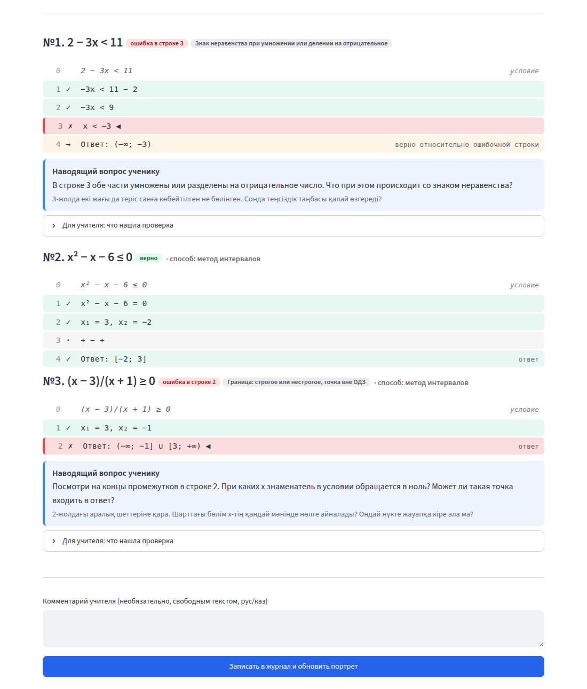
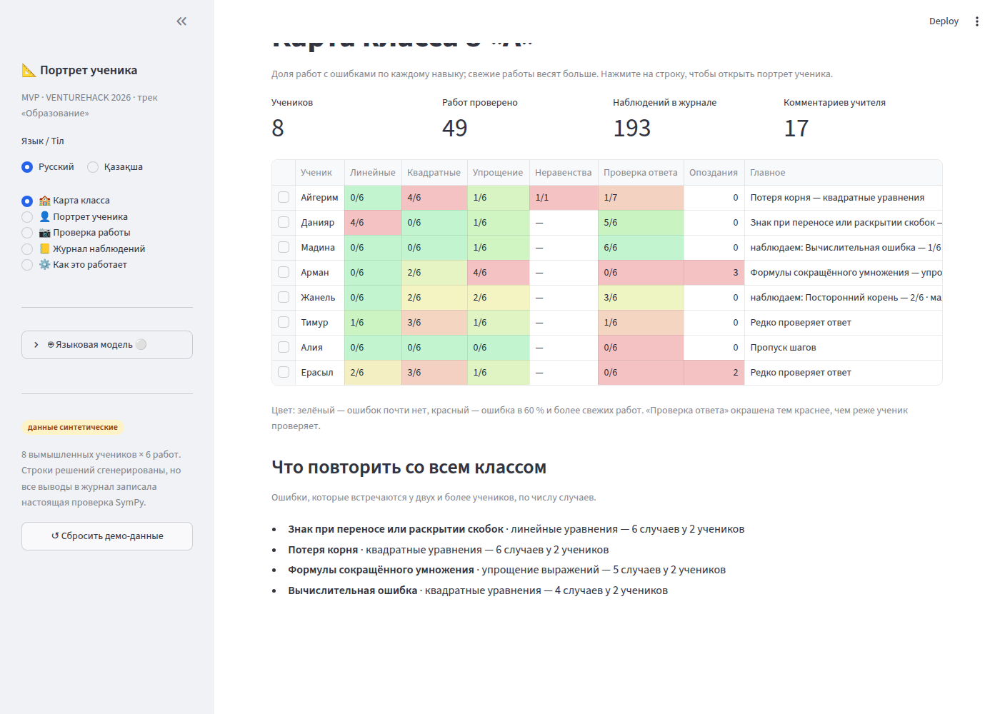

# Агент Бета · Новые темы и типы ошибок

Ветка `claude/happy-keller-3e4ef9`. Каждая тема — отдельный модуль. Журнал, портрет и карта класса подхватывают новые темы без правок `pipeline`, `portrait` и страниц `app.py`.

## Что сделано

### Этап A — неравенства

| Шаг | Что сделано |
|---|---|
| A1 | `core/kinds/__init__.py`: реестр `KINDS`. `checker.check_problem` сначала ищет вид в реестре (импорт внутри функции). Вид возвращает обычный `CheckResult`; `true_answer = None`, текст ответа лежит в `final`. |
| A2 | `core/kinds/inequality.py` понимает знаки `< > ≤ ≥ <= >= ⩽ ⩾`, двойные неравенства, совокупности «или / немесе / or». Разбирает запись промежутков `(−∞; 2) ∪ [3; +∞)`, `[1; 5)`, `(−∞; +∞)`, `R`, `ℝ`, `∅`, «нет решений», `{3}`, `U`/`∪`, `oo`, а запятую как разделитель — по исходной строке (`(2,5; 3]` → 5/2). Строки уравнения и корней считаются критическими точками. Знаки «+ − +» и пробные точки «x = 0: −1/2 < 0» — информационные строки. |
| A3 | Сравнение множеств — точное, по точкам: границы, середины промежутков, точки снаружи. Соседние строки сравниваются на ОДЗ условия, итоговый ответ — с решением условия без поправки на ОДЗ. Порядок правил: `ineq_flip` → `ineq_div_var` (деление на x или умножение на знаменатель, `detail.mul`) → `interval_choice` → `boundary` (`detail.domain`) → `fsu` → `sign` → `calc` (одно число в строке или одна граница промежутка) → `other`. Метод `interval_method`, привычки `check_done`, `skip_steps`, `domain_noted`. |
| A4 | `tags.py`: навык `inequality`, 4 тега ошибок и метод с советами на ru/kk, вопросы (`ineq_div_var_mul`, `boundary_domain` — отдельные ветки `question_for`), `CONFIRMS`, `LEXICON`. |
| A5 | `tests/test_beta.py` — все случаи из таблицы A5 и отдельные случаи, где правило срабатывать не должно. |
| A6 | `seed.EXTRA_ASSIGNMENTS`, `_add_extra_assignment`: ДЗ №8 «Неравенства» (линейное, квадратное, дробно-рациональное). `live_assignment_id` — дословно по заданию. В `app.py` выбор задания по умолчанию — `seed.live_assignment_id(conn)`. Синтетические сдачи по новым темам (`EXTRA_VARIANTS`, `EXTRA_PLAN`) пишутся только при `PORTRET_EXTRA_SEED=1`. |
| A7 | `page_class`: колонки только для навыков, по которым есть работы. |

### Этап B (каждая тема — отдельный коммит)

- **B1. Системы** — `core/kinds/system.py`, вид и навык `system`. Условие — «a; b». Σ считается через `sympy.solve`, действительные решения, параметрические для бесконечного множества. Проверка:
  - строка-уравнение должна быть следствием Σ;
  - строка-система (через «;» или двумя строками `⎧ … / ⎩ …`) — равносильна условию;
  - значения — лежать в проекции Σ.

  Ответ: `(3; 2)`, несколько пар, `x = 3, y = 2`, «нет решений», «бесконечно много решений». Теги: `subst` (сменён знак слагаемого подставленного выражения; коэффициент умножен на одно слагаемое; правило действует, пока подстановка ещё не сделана верно), `swap_xy`, `sign`, `calc`, `fsu`, `lost_root`, `extra_root`. Методы `substitution` и `addition`. После первой ошибки строки проверяются относительно «ошибочной» системы — статус `after`. ДЗ №9.
- **B2. Биквадратные** — `core/kinds/biquadratic.py`. Замена «t = x²» или «пусть x² = t» (любая буква, кроме x). Порядок:
  - строки до замены — через `check_equation`;
  - уравнение в t, после подстановки x², должно совпасть с текущим уравнением как многочлен, иначе `subst` с `detail.change` (свой вопрос);
  - строки в t — через `check_equation`, ссылка на ошибку указывает на уравнение в t;
  - обратная замена сверяется с найденными t, итог — с условием.

  Теги `neg_t`, `lost_root` с `detail.pm`. Метод `var_change`. Индексы `x₃`, `x3,4`, `t1,2` поддержаны; `checker.normalize` теперь понимает `⁴`. Без строки замены решение проверяется как обычное уравнение. ДЗ №10.
- **B3. Дроби** — навык `fractions`, тег `cancel_terms`. Правило стоит в `classify_expr_step` перед ФСУ и ловит два случая:
  - общее слагаемое вычеркнуто в числителе и знаменателе: `(x + 2)/(x + 4)` → `2/4`;
  - одно слагаемое числителя «сокращено» на знаменатель: `(x² + 3x)/x` → `x² + 3`, `(5x + 10)/5` → `x + 10`.

  Верное сокращение множителя ошибкой не считается. ДЗ №11.

## Что не сделано и почему

- В `app.py` нет подписей для новых видов строк (`ineq`, `interval`, `signs`, `system`, `point`): по границам задания в `app.py` разрешены только правки A6 и A7. Строки подсвечиваются правильно, только без подписи справа.
- Кнопки «Вставить демо-работу» для ДЗ №8 нет: для этого нужна правка `app.py`. Демо-строки — ниже, их можно вставить руками.
- Системы: только две переменные x, y и два уравнения. Если у системы нет решений, промежуточные строки проверить нельзя (следствием пустого множества является всё) — проверяется только ответ.
- Неравенства: модуль `|x|`, иррациональные неравенства и неравенства выше второй степени с неразрешимыми формами не поддержаны. В таких случаях строка помечается «не удалось проверить».

## Демо ДЗ №8 (вставить в «Ввести текстом»)

```
№1:  −3x < 11 − 2 / −3x < 9 / x < −3 / Ответ: (−∞; −3)        → ошибка в строке 3: знак неравенства
№2:  x² − x − 6 = 0 / x₁ = 3, x₂ = −2 / + − + / Ответ: [−2; 3]  → верно, метод интервалов
№3:  x₁ = 3, x₂ = −1 / Ответ: (−∞; −1] ∪ [3; +∞)              → граница, точка вне ОДЗ
```

## Как проверено

```
$ python -m pytest -q
143 passed          # 27 старых без правок + 116 в tests/test_beta.py
$ python evaluate.py
Первая ошибка (строка и тег): 4/4 = 100%   # вывод совпадает с main
```

- Демо 4/6 → 5/7 проходит (`test_demo_scenario`). ДЗ №7 по-прежнему живое задание (`test_extra_assignment_keeps_demo`).
- При `PORTRET_EXTRA_SEED=1` все четыре новых навыка появляются в карте класса, а числа по старым темам не меняются (`test_all_extra_skills_in_class_map`).
- Приложение запущено (`streamlit run app.py`). Проверка ДЗ №8 из интерфейса без ключа API, запись в журнал, колонка «Неравенства» в карте класса после записи — скриншоты ниже.

Тестов на тему: неравенства — 60, системы — 22, биквадратные — 17, дроби — 17.

## Скриншоты





## Новые казахские тексты для вычитки

Все — в `core/tags.py` (`SKILLS`, `SKILLS_SHORT`, `TAGS`, `QUESTIONS`, `LEXICON`):

- `"inequality": {"ru": "Неравенства", "kk": "Теңсіздіктер"}`
- `"system": {"ru": "Системы уравнений", "kk": "Теңдеулер жүйелері"}`
- `"biquadratic": {"ru": "Биквадратные уравнения", "kk": "Биквадрат теңдеулер"}`
- `"fractions": {"ru": "Алгебраические дроби", "kk": "Алгебралық бөлшектер"}`
- `"inequality": {"ru": "Неравенства", "kk": "Теңсіздік"}`
- `"system": {"ru": "Системы", "kk": "Жүйелер"}`
- `"biquadratic": {"ru": "Биквадратные", "kk": "Биквадрат"}`
- `"fractions": {"ru": "Дроби", "kk": "Бөлшектер"}`
- `"kk": "Теріс санға көбейткенде не бөлгенде теңсіздік таңбасы"`
- `"teacher_kk": "−ax < b түріндегі 5 теңсіздік беріп, бөлмес бұрын бөлгіштің таңбасын дауыстап айтуды сұраңыз. Сандармен талдаңыз: −2 < 3, ал −1-ге көбейткенде 2 > −3 шығады."`
- `"student_kk": "Екі жағын теріс санға көбейтсең не бөлсең, теңсіздік таңбасын бірден аудар: < таңбасы > болады, ≤ таңбасы ≥ болады."`
- `"ru": "Деление неравенства на выражение с x", "kk": "Теңсіздікті x-і бар өрнекке бөлу"`
- `"teacher_kk": "x² > kx және x(x − a) > b(x − a) түріндегі 3 теңсіздік беріп, бөлгіңіз келетін өрнектің таңбасы қандай екенін сұраңыз. Оларды интервалдар әдісімен шығаруды сұраңыз."`
- `"student_kk": "Теңсіздікті x-і бар өрнекке бөлме де, көбейтпе де: оның таңбасы белгісіз. Барлығын бір жаққа шығарып, көбейткіштерге жікте де, интервалдар әдісімен шығар."`
- `"ru": "Выбран не тот промежуток", "kk": "Басқа аралық таңдалған"`
- `"teacher_kk": "Сан түзуінің үстіне әр аралықтағы таңбаны бір сынақ нүктесімен тексеріп қоюды, содан кейін ғана жауапты жазуды сұраңыз. Критикалық нүктелері табылған 3 есеп беріңіз."`
- `"student_kk": "Критикалық нүктелерден кейін әр аралықтан бір саннан қойып, таңбасын жаз. Жауапқа керек таңбалы аралықтарды ал: «> 0» — плюс, «< 0» — минус."`
- `"ru": "Граница: строгое или нестрогое, точка вне ОДЗ", "kk": "Шекара: қатаң не қатаң емес, ММЖ-дан тыс нүкте"`
- `"teacher_kk": "Рәсімдеу ережесін енгізіңіз: боялған нүкте — «≤, ≥» үшін, ойық нүкте — «<, >» үшін және бөлімнің нөлдері үшін әрқашан. Аралық шеттерін тексеруге 4 жауап беріңіз."`
- `"student_kk": "Аралықтың әр шеті үшін өзіңнен сұра: теңсіздік қатаң ба, жоқ па, нүкте бөлімді нөлге айналдырмай ма? Бөлімнің нөлі әрқашан ойық — дөңгелек жақша."`
- `"ru": "Подстановка без скобок", "kk": "Жақшасыз алмастыру"`
- `"teacher_kk": "Ереже енгізіңіз: өрнек тек жақшамен қойылады, содан кейін ғана жақша ашылады. Алдында минус не коэффициент тұрған y-ке y = a − bx түріндегі 4 алмастыру беріңіз."`
- `"student_kk": "Айнымалының орнына өрнекті қойғанда, алдымен оны толық жақшаға жаз, содан кейін жақшаны аш — әр қосылғыштың таңбасын бөлек тексер."`
- `"ru": "Перепутаны x и y в ответе", "kk": "Жауапта x пен y ауысып кеткен"`
- `"teacher_kk": "Жауапты алдымен «x = …, y = …» түрінде, содан кейін (x; y) жұбы түрінде жазуды сұраңыз. Табылған мәндерді жүйенің екі жолына да қоятын 3 есеп беріңіз."`
- `"student_kk": "(x; y) жұбында бірінші әрқашан x жазылады. Жауап бермес бұрын жұпты жүйенің екі теңдеуіне де қойып тексер."`
- `"ru": "x² = t при t < 0 не имеет решений", "kk": "t < 0 болғанда x² = t шешімі жоқ"`
- `"teacher_kk": "Алмастырудан кейін t ≥ 0 шартын жазуды және әр табылған t-ны онымен салыстыруды талап етіңіз. t-дағы түбірдің бірі теріс болатын 3 теңдеу беріңіз."`
- `"student_kk": "Санның квадраты теріс болмайды. Егер t < 0 болса, x² = t теңдеуінің түбірі жоқ — ол t-ны сызып таста."`
- `"ru": "Сокращение слагаемых вместо множителей", "kk": "Көбейткіштің орнына қосылғышты қысқарту"`
- `"teacher_kk": "Сандармен талдаңыз: (2 + 3)/(2 + 5) ≠ 3/5. Тәртіп енгізіңіз: алдымен алым мен бөлімді көбейткіштерге жіктеп, ортақ көбейткіштің астын сызу, тек соны қысқарту. «Қатені тап» деген 4 бөлшек беріңіз."`
- `"student_kk": "Тек көбейткіштерді қысқартуға болады, қосылғыштарды емес. Алдымен алым мен бөлімді көбейткіштерге жікте (ортақ көбейткішті шығар, формулаларды қолдан) — содан кейін қысқарт."`
- `"interval_method": {"kind": "method", "ru": "Метод интервалов", "kk": "Интервалдар әдісі"}`
- `"substitution": {"kind": "method", "ru": "Способ подстановки", "kk": "Алмастыру тәсілі"}`
- `"addition": {"kind": "method", "ru": "Способ сложения", "kk": "Қосу тәсілі"}`
- `"var_change": {"kind": "method", "ru": "Замена переменной", "kk": "Айнымалыны алмастыру"}`
- `"kk": "{n}-жолда екі жағы да теріс санға көбейтілген не бөлінген. Сонда теңсіздік таңбасы қалай өзгереді?"`
- `"kk": "{n}-жолда екі жағы да {f} өрнегіне көбейтілген. Әр түрлі x үшін {f} таңбасы қандай? Сонда теңсіздік таңбасына не болады?"`
- `"kk": "{n}-жолда екі жағы да {f} өрнегіне бөлінген. {f} әрқашан оң ба? Таңбасы белгісіз өрнекке теңсіздікті бөлуге бола ма?"`
- `"kk": "{n}-жолдағы аралық шеттері дұрыс табылған. Әр аралықтан бір саннан алып, {P_nom_kk} ішіндегі өрнекке қой: қандай таңба шығады және қандай таңба керек?"`
- `"kk": "{n}-жолдағы аралық шеттеріне қара. Шарттағы бөлім x-тің қандай мәнінде нөлге айналады? Ондай нүкте жауапқа кіре ала ма?"`
- `"kk": "{n}-жолдағы аралық шеттеріне қара: олар жауапқа кіре ме? {P_nom_kk} ішіндегі теңсіздік таңбасымен салыстыр — ол қатаң ба, қатаң емес пе?"`
- `"kk": "{n}-жолда {var} орнына {expr} өрнегі қойылған. Ол жақшаға алынды ма? Жақшаны ашқаннан кейін әр қосылғыштың таңбасын тексер."`
- `"kk": "{n}-жолда {f} бөлшегі қысқартылған. Не қысқарды — көбейткіштер ме, әлде қосылғыштар ма? Кез келген санды, мысалы 1-ді қойып тексер."`
- `"kk": "{n}-жолда {t} = x² алмастыруы жасалған. {t} орнына қайтадан x² қойып көр: {P_nom_kk} теңдеуі шыға ма?"`
- `"kk": "{n}-жолда x² = {t} теңдеуінен x табылған. Бұл {t} қандай таңбалы? Санның квадраты теріс бола ма?"`
- `"kk": "{n}-жолдағы және {P_nom_kk} ішіндегі түбірлер санын салыстыр. Квадраты оң сан болатын неше сан бар?"`
- `"kk": "{n}-жолда сандар жұбы жазылған. Жұпта қай сан бірінші тұруы керек? Жұпты жүйенің екі теңдеуіне де қойып көр."`
- `LEXICON`: «теңсіздік таңбасы», «аралық», «шекара», «алмастыр», «x пен y», «теріс t», «қысқарт»

## Риски

- `LEXICON` у тега `sign` содержит основу «знак», поэтому комментарий «не меняет знак неравенства» размечается и как `ineq_flip`, и как `sign`. Словарь `sign` чужой по смыслу, я его не трогал.
- «аралық» и «сокращ» — широкие основы: комментарий про «промежуточный срок» или «сократить время» даст ложный тег. Пока это видно только в разметке комментариев без языковой модели.
- Сравнение множеств опирается на `S.boundary` и `S.contains` из SymPy. Для необычных форм (`ConditionSet`) строка остаётся неразобранной и помечается «не удалось проверить».
- В `detail` у `calc` для неравенств есть поле `expected` (верное число). Его видит только учитель в раскрывающемся блоке; в вопрос ученику оно не попадает — это проверяют тесты.

## Нужно от других

- **Гамма / владелец `app.py`:** подписи в `status_note` для видов строк `ineq`, `interval`, `signs`, `system`, `point`, `subst`. Кнопка «Вставить демо-работу» для ДЗ №8 из строк выше.
- **Эпсилон:** `portrait.METHOD_MONO` сейчас только про квадратные уравнения. Для неравенств и систем можно добавить аналогичный совет (методы `interval_method`, `substitution`, `addition` уже пишутся в журнал).
- **Дельта:** в `class_map` у новых навыков будет мало работ — порог «мало данных» стоит показывать и в ячейках карты.
- **Альфа:** в подсказке распознавания стоит попросить модель сохранять `≤ ≥ ∞ ∪` и скобки промежутков как есть.
