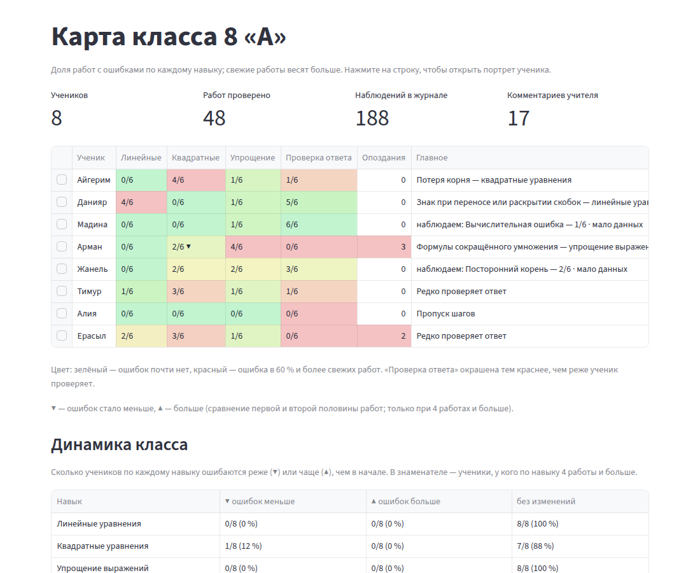
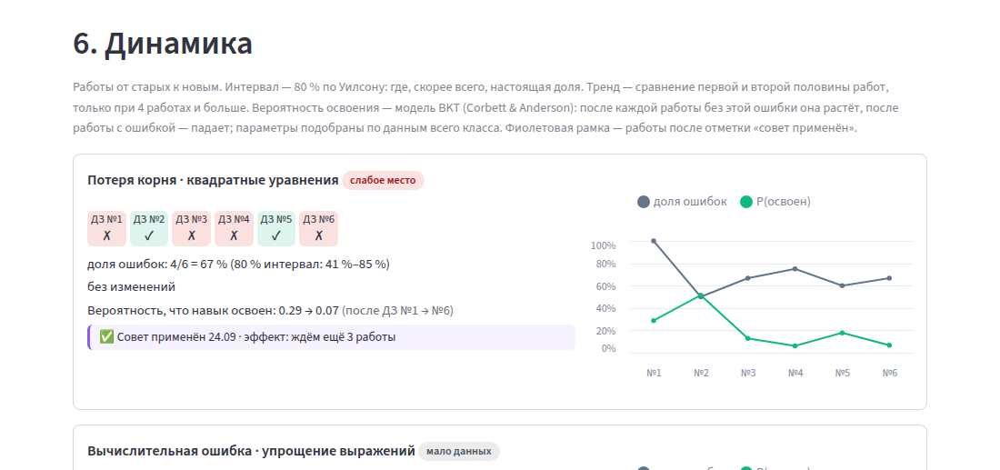
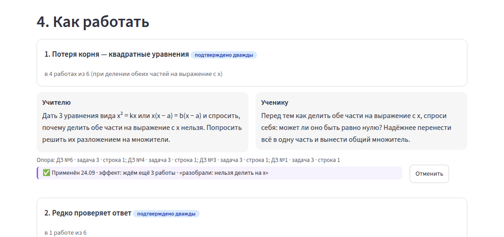
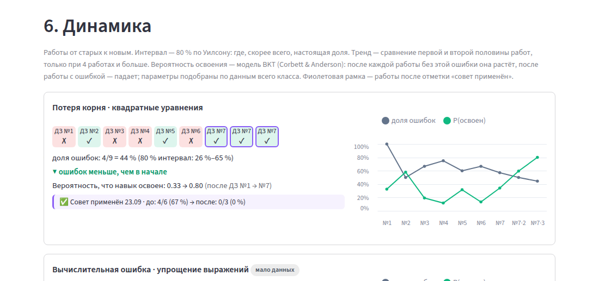
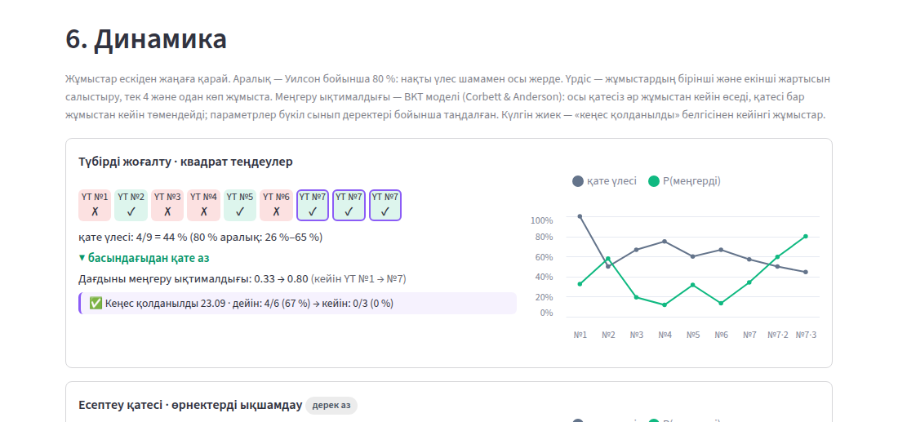

# Агент Дельта · Динамика и эффект советов

Портрет был снимком. Теперь у него есть время: траектория по работам, честный интервал, тренды на карте класса, отметка «совет применён» с эффектом до/после и модель знаний BKT. Всё считается обычным кодом по журналу наблюдений, без языковой модели и без ключа API.

**Итог:** этапы A и B сделаны полностью. `python -m pytest -q` — **53 passed** (27 прежних без правок + 26 новых в `tests/test_delta.py`). Числа портрета и сценарий демо по умолчанию не изменились.

## Что сделано — по шагам задания

### Этап A

| Шаг | Где | Что |
|---|---|---|
| D1 | `core/knowledge.py` | `sequence(conn, sid, skill, tag)` — работы с задачами навыка, от старых к новым: `{"sub_id", "work_no", "submitted_at", "error"}`. Данные берутся через `portrait._works`, `portrait._skills_per_work`, `portrait._obs` (только `source="auto"`, `kind="error"`), поэтому определение «работа с навыком» совпадает с портретом, а фильтры Эпсилона в `_obs` учтутся автоматически. `tag=None` — любая ошибка навыка. `habit_sequence(conn, sid, habit)` — все работы, поле `hit`. Помощники `values()` и `cumulative()`. |
| D2 | `core/knowledge.py` | `wilson(e, n, z=1.2816)` — 80-процентный интервал Уилсона; при `n < 3` возвращает `None`, и интерфейс пишет «мало данных». |
| D3 | `core/knowledge.py` | `trend(seq)` → `"down"`, `"up"`, `"flat"` или `None`. При нечётной длине средняя работа не участвует, так что половины равны. 4–5 работ: разница ≥ 1 случая **и** ≥ 30 п. п.; 6 и больше: разница ≥ 2 случаев. Пороги заданы константами в начале модуля. |
| D4 | `core/interventions.py` | Таблица `interventions` создаётся в `ensure_schema(conn)`, не в `db.SCHEMA`. Функции `mark_applied`, `list_for`, `latest`, `remove`, `effect`. `effect` считает по последней отметке: для `<навык>:<тег>` — доля работ с ошибкой, для `habit:<привычка>` — доля работ с привычкой; отдаёт `ready = n_after >= 3`, иначе `need_more = 3 − n_after`. Работы, сданные в день отметки, считаются «после». Для `method:mono` доли ошибок нет, поэтому результат — `supported: False`. |
| D5 | `ui/dynamics.py` | `rec_controls(...)`: если совет не отмечен — всплывающая форма «✓ Совет применён» (дата, по умолчанию сегодня, и заметка); если отмечен — «Применён 24.09 · эффект: ждём ещё 3 работы» или «до: 4/6 (67 %) → после: 0/3 (0 %)» и кнопка «Отменить». `render_section(...)` — раздел «6. Динамика»: по каждой ошибке (слабые места первыми) и по «проверке ответа» — полоска ✓✗ с номерами ДЗ, доля с интервалом Уилсона, тренд словами, P(освоен) по BKT и график Altair (накопленная доля и P(освоен)). Работы после отметки «совет применён» обведены фиолетовой рамкой. |
| D6 | `core/portrait.py`, `app.py` | В каждой ячейке `class_map` появилось поле `trend`: `knowledge.trend` по последовательности «была ли в работе хоть одна ошибка навыка». Остальные поля прежние, `knowledge` импортируется внутри функции. На карте ячейка выглядит как «2/6 ▼», под таблицей — легенда стрелок. |

### Этап B

| Шаг | Где | Что |
|---|---|---|
| B1 | `core/knowledge.py` | Классическая BKT (Corbett & Anderson, 1994): `BKTParams(L0, T, S, G)`, `bkt_step`, `bkt_trajectory(seq, params)`. `fit_bkt(seqs)` перебирает сетку L0 0.1–0.9 (шаг 0.1), T 0.05–0.4, S 0.05–0.3, G 0.1–0.4 (шаг 0.05), всего 3024 точки, векторно на numpy, и берёт максимум правдоподобия. Меньше 10 наблюдений — значения по умолчанию `0.3 / 0.15 / 0.1 / 0.2`. `fit_for(conn, skill, tag)` подбирает параметры по всем ученикам базы (`class_sequences`; в демо это один класс), результат кэшируется по самим последовательностям. `mastery(...)` — траектория ученика. В интерфейсе: «Вероятность, что навык освоен: 0.33 → 0.80 (после ДЗ №1 → №7)» и объяснение модели в подписи раздела. |
| B2 | `core/portrait.py` | `build(conn, sid, lang, model=None)`. Новый необязательный параметр; если он не задан, берётся `PORTRAIT_MODEL`, по умолчанию `weighted`. При `bkt` слабое место — `count ≥ MIN_CASES` и `P(освоен) ≤ 0.6`, в ошибку добавляется поле `mastery`. Формулировки, сортировка и рекомендации прежние. При `weighted` код идёт по старому пути, поля `mastery` нет. |
| B3 | `ui/dynamics.py`, `app.py` | Блок «Динамика класса» на карте класса: по каждому навыку — доля учеников с ▼, с ▲ и без изменений. В знаменателе — ученики, у кого по навыку 4 работы и больше. |
| B4 | `tests/test_delta.py` | `test_improvement_scenario`: база через `seed.build`, отметка совета, затем 3 живые сдачи ДЗ №7 для Айгерим с верным решением «x² = 7x» разложением на множители. Проверяется: тренд `down`, P(освоен) растёт на каждой из трёх работ, эффект «до 4/6 → после 0/3», ячейка карты класса «4/9 ▼». |

### Вставки в общие файлы

- `core/portrait.py`: `import os`; помощник `_bkt_fields` (вызывается только при `model == "bkt"`); необязательный `model` в `build`; `trend` в `class_map`. Функции `_obs` и `_ref` не тронуты.
- `app.py`: импорт `from ui import dynamics as dynamics_view`; строка ячейки карты → `dynamics_view.cell_text(cell)`; под таблицей — `dynamics_view.legend(L)` и `dynamics_view.class_block(rows, L, lang)` (B3); в цикле рекомендаций после «Опора: …» — `dynamics_view.rec_controls(...)`; в конце `portrait_teacher` — `dynamics_view.render_section(...)`.
- `core/checker.py`, `core/pipeline.py`, `core/seed.py`, `README.md`, существующие тесты — без изменений. Новых зависимостей нет: Altair и numpy уже идут со Streamlit и pandas.

## Скриншоты

Карта класса на демо-данных: стрелка у Армана («Квадратные 2/6 ▼»), легенда, блок «Динамика класса».



Раздел «6. Динамика» у Айгерим на демо-данных, совет отмечен сегодня.



Отметка под рекомендацией: «Применён 24.09 · эффект: ждём ещё 3 работы».



После трёх верных работ (как в тесте B4): ▼, P(освоен) 0.33 → 0.80, «до: 4/6 (67 %) → после: 0/3 (0 %)».



Казахская версия.



## Как проверено

```text
$ python -m pytest -q
.....................................................                    [100%]
53 passed in 24.06s
```

- **Streamlit AppTest.** Карта класса и портрет на `ru` и `kk` открываются без исключений; в портрете 6 разделов, последний — «6. Динамика».
- **Живой браузер** (Playwright + Chromium, `streamlit run app.py`): открыл форму «✓ Совет применён», ввёл заметку и нажал «Отметить». Строка появилась в `interventions`, под советом — «Применён 24.09 · эффект: ждём ещё 3 работы».
- **Скорость:** `class_map` при `weighted` — 0.004 с; при `PORTRAIT_MODEL=bkt` — 0.10 с на холодном кэше и 0.035 с на тёплом (8 учеников).
- **Модель `bkt` на демо-данных:** набор слабых мест у всех 8 учеников совпадает с моделью `weighted`.

## Что не сделано и почему

- **Кэш трендов по `(student_id, число наблюдений)` не понадобился.** Тренд на карте считается из уже собранных в `class_map` данных, без новых запросов к базе. Подбор BKT кэшируется через `lru_cache`.
- **Эффект для `method:mono` («один способ для всех») не считается.** Это не доля ошибок; интерфейс так и пишет: «эффект для этого совета не считается».
- **Отметки «совет применён» нет в версии для ученика.** Это инструмент учителя.

Дополнено после слияния (агент Омега, `docs/omega.md`):

- **Параметры BKT подбираются по всем ученикам базы, а не по классу ученика.** `knowledge.class_sequences` берёт всех учеников; при нескольких классах это уже не «данные класса». Подпись раздела «Динамика» исправлена (O17). Подбирать ли по классу — вопрос к человеку; рекомендация — пока оставить по всем (данных мало).
- **«Мало данных» в ячейках карты класса по новым темам и исходы тренажёра как сигнал эффекта советов** — пожелания Беты и Гаммы. В фазу 1 не вошли (`agents/OMEGA.md`, «Не входит»).
- **Отметки «совет применён» не пишутся в журнал действий** — Дзета просила это «по желанию»; не сделано.

## Риски

- **Подобранные на синтетике параметры BKT упираются в края сетки** (L0 = 0.8, T = 0.05, S = 0.05, G = 0.4). Модель объясняет данные так: «большинство класса навык освоило, а кто ошибается — не освоил». Поэтому у Айгерим P(освоен) падает до 0.07 после ошибок и быстро растёт после верных работ. Это честный максимум правдоподобия на 48 наблюдениях; на реальных данных параметры сдвинутся.
- **Тренд на длинных последовательностях.** Для 6 и больше работ порог — 2 случая без условия на долю, как в задании. На 20 и больше работах это может ловить шум; при необходимости стоит добавить порог по доле (константы в начале `knowledge.py`).
- **Точность эффекта — день.** Работа, сданная в день отметки, считается «после».
- **Заметка к отметке — свободный текст.** Учитель может написать в неё настоящее имя (см. «Нужно от других», Дзета).
- **Предупреждение о `use_container_width`.** Новый код использует его так же, как остальной `app.py`; Streamlit 1.64 предупреждает о будущем удалении. Менять стоит сразу во всём приложении.

## Новые казахские тексты для вычитки

| RU | KK |
|---|---|
| 6. Динамика | 6. Динамика |
| Работы от старых к новым. Интервал — 80 % по Уилсону: где, скорее всего, настоящая доля. Тренд — сравнение первой и второй половины работ, только при 4 работах и больше. Вероятность освоения — модель BKT (Corbett & Anderson): после каждой работы без этой ошибки она растёт, после работы с ошибкой — падает; параметры подобраны по данным всего класса. Фиолетовая рамка — работы после отметки «совет применён». | Жұмыстар ескіден жаңаға қарай. Аралық — Уилсон бойынша 80 %: нақты үлес шамамен осы жерде. Үрдіс — жұмыстардың бірінші және екінші жартысын салыстыру, тек 4 және одан көп жұмыста. Меңгеру ықтималдығы — BKT моделі (Corbett & Anderson): осы қатесіз әр жұмыстан кейін өседі, қатесі бар жұмыстан кейін төмендейді; параметрлер бүкіл сынып деректері бойынша таңдалған. Күлгін жиек — «кеңес қолданылды» белгісінен кейінгі жұмыстар. |
| Ошибок в журнале нет — показываем только привычку проверять ответ. | Журналда қате жоқ — тек жауапты тексеру әдетін көрсетеміз. |
| доля ошибок | қате үлесі |
| доля работ с проверкой | тексерілген жұмыс үлесі |
| доля с проверкой (график) | тексеру үлесі |
| (80 % интервал: 41 %–85 %) | (80 % аралық: 41 %–85 %) |
| мало данных для интервала | аралыққа дерек аз |
| тренд: мало работ (нужно 4) | үрдіс: жұмыс аз (4 керек) |
| ▼ ошибок меньше, чем в начале | ▼ басындағыдан қате аз |
| ▲ ошибок больше, чем в начале | ▲ басындағыдан қате көп |
| ▼ проверяет реже, чем в начале | ▼ басындағыдан сирек тексереді |
| ▲ проверяет чаще, чем в начале | ▲ басындағыдан жиі тексереді |
| без изменений | өзгеріс жоқ |
| Вероятность, что навык освоен: 0.33 → 0.80 (после ДЗ №1 → №7) | Дағдыны меңгеру ықтималдығы: 0.33 → 0.80 (ҮТ №1 → №7 кейін) |
| P(освоен) | P(меңгерді) |
| Совет применён 23.09 | Кеңес қолданылды 23.09 |
| ✓ Совет применён (кнопка) | ✓ Кеңес қолданылды |
| Применён 24.09 | Қолданылды 24.09 |
| Когда | Қашан |
| Заметка (необязательно) | Жазба (міндетті емес) |
| например: разобрали на уроке разложение на множители | мысалы: сабақта көбейткіштерге жіктеуді талдадық |
| Эффект появится, когда после этой даты накопится 3 работы. | Осы күннен кейін 3 жұмыс жиналғанда әсері көрінеді. |
| Отметить | Белгілеу |
| Отменить | Болдырмау |
| Убрать отметку «совет применён» | «Кеңес қолданылды» белгісін алып тастау |
| эффект: ждём ещё 2 работы | әсері: тағы 2 жұмыс күтеміз |
| до: 4/6 (67 %) → после: 0/3 (0 %) | дейін: 4/6 (67 %) → кейін: 0/3 (0 %) |
| работ не было | жұмыс болған жоқ |
| эффект для этого совета не считается | бұл кеңестің әсері есептелмейді |
| ▼ — ошибок стало меньше, ▲ — больше (сравнение первой и второй половины работ; только при 4 работах и больше). | ▼ — қате азайды, ▲ — көбейді (жұмыстардың бірінші және екінші жартысын салыстыру; тек 4 және одан көп жұмыста). |
| Динамика класса | Сынып динамикасы |
| Сколько учеников по каждому навыку ошибаются реже (▼) или чаще (▲), чем в начале. В знаменателе — ученики, у кого по навыку 4 работы и больше. | Әр дағды бойынша қанша оқушы басындағыдан сирек (▼) немесе жиі (▲) қателеседі. Бөлімінде — дағды бойынша 4 және одан көп жұмысы бар оқушылар. |
| Навык | Дағды |
| ▼ ошибок меньше / ▲ ошибок больше | ▼ қате азайды / ▲ қате көбейді |

## Нужно от других

- **Эпсилон.** Сохранить сигнатуру `portrait._obs(conn, sid)` и поля `submission_id`, `source`, `kind`, `tag`, `skill`. Если отклонённые учителем наблюдения будут отфильтрованы в `_obs`, динамика и эффект их не увидят автоматически — этого и хотим.
- **Дзета.**
  - Таблица `interventions` содержит `student_id` и свободную заметку. Её стоит учесть в фильтрах видимости по классу и в удалении данных ученика (`core/privacy.py`).
  - По желанию — запись `mark_applied` и `remove` в аудит (`core/audit.py`).
- **Бета.** Новые навыки из `T.SKILLS` автоматически появятся в карте, в трендах и в блоке «Динамика класса». Условие одно: задачи навыка записаны через `pipeline.record_submission`.
- **Гамма.** Наблюдения с `source="practice"` динамика не учитывает (фильтр `source == "auto"`). Если тренажёр должен влиять на траекторию, нужно договориться отдельно.
- **Человек при слиянии:** ссылка на `docs/delta.md` в README.
