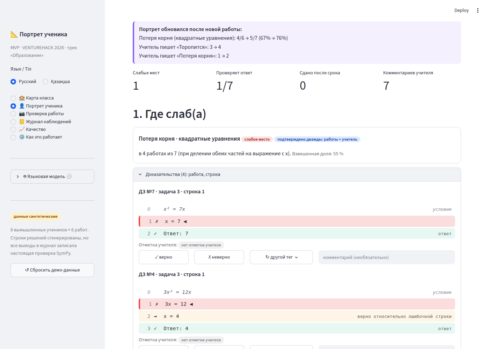
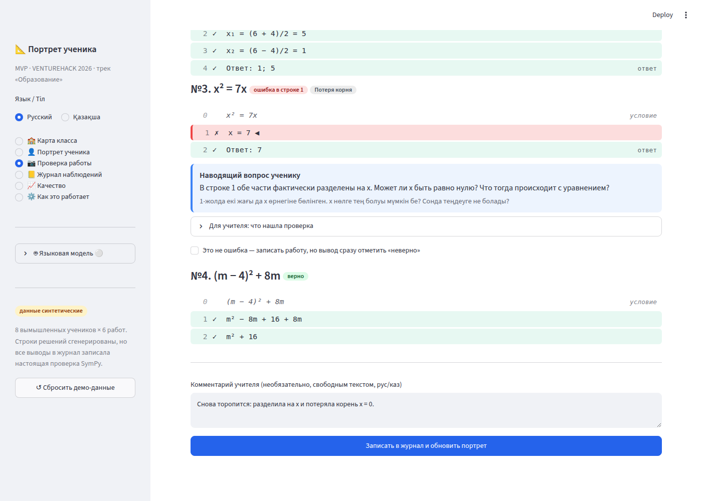
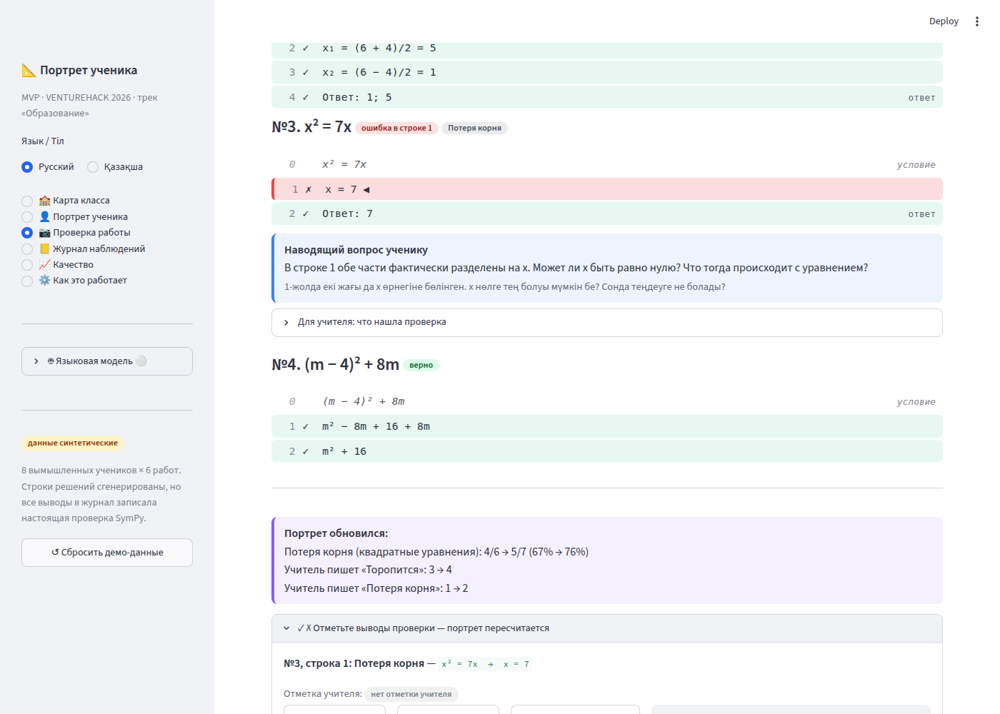
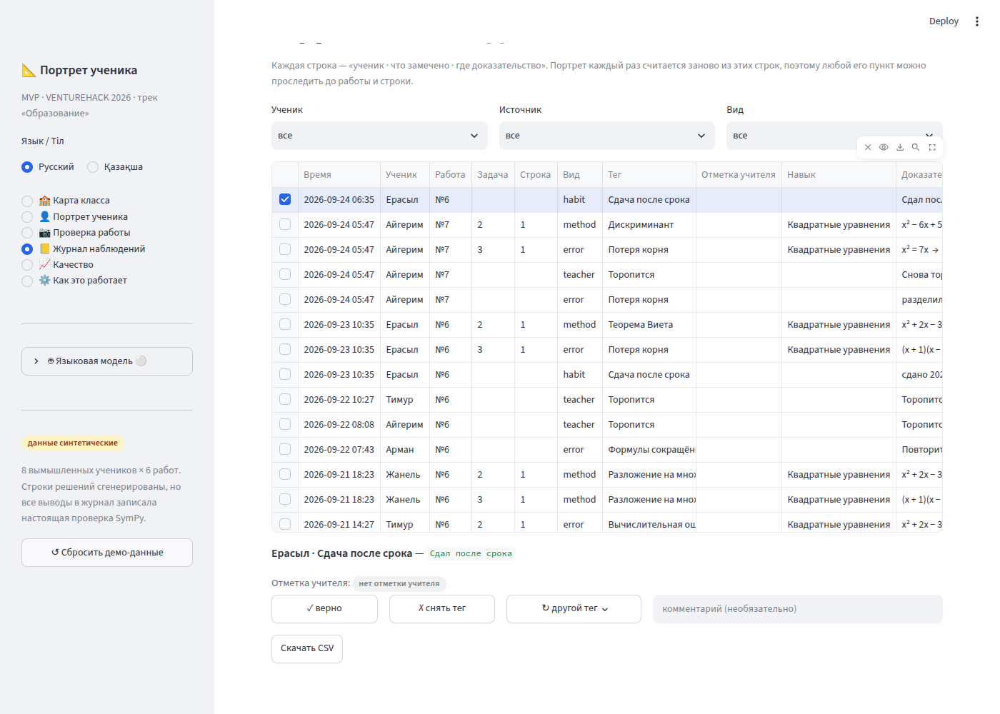
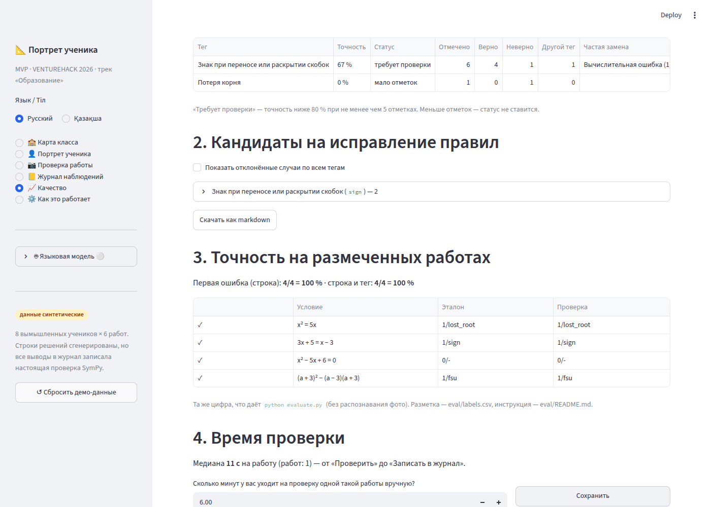
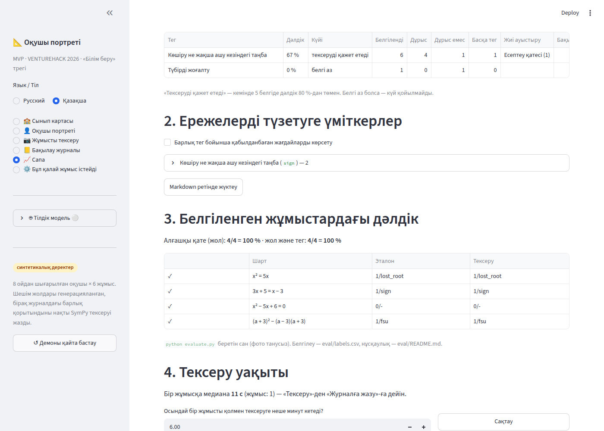

# Эпсилон · Учитель в контуре

Задание: [`agents/EPSILON.md`](../agents/EPSILON.md). Цель: любой вывод портрета можно опровергнуть, портрет учитывает опровержения, а у команды есть настоящие цифры точности и экономии времени.

**Итог:** этап A (E1–E6) и этап B (B1–B4) сделаны. `python -m pytest -q` → **43 passed** (27 старых + 16 новых). Демо из README без ключа API проходит как раньше: «Потеря корня: 4/6 → 5/7».

## Что сделано

### Этап A

| Шаг | Что сделано | Где |
|---|---|---|
| **E1. Отметки** | Таблица `reviews` (схема из задания). `ensure_schema`, `add` (проверяет вердикт, существование наблюдения, `new_tag` из словаря того же вида, иначе `ValueError`; `reviewer` по умолчанию `«учитель»`), `latest` (последняя отметка побеждает, по `id`), `apply`. `apply`: `reject` убирает строку, `retag` подменяет `tag` и кладёт исходный в `orig_tag`, `confirm` ставит `reviewed="confirm"`. Строки без отметок возвращаются как есть, тем же объектом. `apply` сам вызывает `ensure_schema` и делает **один запрос на пачку** до 900 наблюдений (предел параметров SQLite). DDL выполняется через `execute`, а не `executescript`, чтобы не закрыть чужую открытую транзакцию. | `core/review.py` |
| **E2. Портрет учитывает отметки** | `portrait._obs` → `review.apply(conn, rows)`; `portrait._ref` → поле `"obs_id"`. Других изменений в портрете нет. | `core/portrait.py` (+3 строки) |
| **E3. Элементы интерфейса** | `controls(conn, obs_id, L, key)`: бейдж текущей отметки (кто и когда — во всплывающей подсказке, комментарий — рядом), кнопки «✓ верно» и «✗ неверно», всплывающее окно «↻ другой тег» со списком тегов того же вида, необязательный комментарий, после нажатия `st.rerun()`. `precision_badge(conn, tag, L)` возвращает `badge b-low` «требует проверки: точность X %, отметок: N» или пустую строку. | `ui/review.py` |
| **E4. Встраивание** | Портрет, раздел 1: отметки под каждым доказательством и бейдж точности в строке слабого места. Экран проверки: запуск таймера после `ss["check"] = …`; `after_record(...)` и `ss["last_sub_id"] = sub_id` непосредственно перед `after = portrait.snapshot(...)`; в блоке `if chk["saved"]:` — отметки для ошибок этой работы. Журнал: колонка «Отметка учителя», выбор строки → отметка. Отметки ставятся только на `source = "auto"` (плюс теги комментариев — см. B1). | `app.py` |
| **E5. Страница «📈 Качество»** | `render_quality`: 4 метрики вверху; (1) точность по тегам — отмечено, верно, неверно, другой тег, точность, частая замена, статус «требует проверки / мало отметок / в норме»; (2) кандидаты на исправление правил; (3) точность на `eval/labels.csv`; (4) время проверки; (5) похожесть портрета; (6) «Скачать метрики» в markdown и CSV. Пороги: точность ниже 80 % при 5 и более отметках. Отметки на синтетических работах подписаны бейджем «данные синтетические». Регистрация: `"quality"` перед `"about"`, `L("📈 Качество", "📈 Сапа")`. | `core/quality.py`, `ui/review.py`, `app.py` |
| **E5.2. Точность на размеченных** | `quality.eval_accuracy(path)` повторяет логику `evaluate.py` без `--ocr`: доля совпавших первых ошибок по строке и по строке с тегом. Если файла нет — `available=False`, страница объясняет, как заполнить файл, и ссылается на `eval/README.md`. `evaluate.py` не тронут. | `core/quality.py` |
| **E6. Время проверки** | Таблицы `check_timings` и `quality_settings`. `record_timing`, `timing_summary` (медиана, число работ, экономия и ускорение — только если задана настройка). Настройка `manual_minutes_per_work` вводится на странице: «Сколько минут у вас уходит на проверку одной такой работы вручную?». По умолчанию пусто; без неё экономия не показывается. Таймер запускается первым «Проверить» для пары ученик × задание. Повторное «Проверить» после правки строк таймер не сбрасывает; через 30 минут начинается новый замер. Останавливается при «Записать в журнал». | `core/quality.py`, `ui/review.py` |

### Этап B

| Шаг | Что сделано |
|---|---|
| **B1. Отметки комментариев учителя** | На наблюдения `source = "teacher"` можно поставить отметку: «✗ снять тег» или «↻ другой тег» (из тегов того же вида, как их пишет `pipeline.record_comment`). Места: журнал (выбрать строку) и экран проверки после записи — блок «Теги из комментария учителя». Портрет убирает снятый тег из раздела 3 «Что пишет учитель». На странице «Качество» — отдельная таблица точности разметки комментариев. |
| **B2. Кандидаты на исправление правил** | Раздел 2 страницы «Качество»: по тегам со статусом «требует проверки» — отклонённые и перетегированные случаи. У каждого: работа, задача, строка, ученик, цитата, комментарий учителя. Флажок «показать по всем тегам». Кнопка «Скачать как markdown» (`rule_candidates.md`) — материал для агента Беты. |
| **B3. Похожесть портрета** | Внизу портрета учителя — форма «🎯 Похоже ли это на ученика?»: оценка 1–5, «какие пункты неверны» (слабые места, сильные стороны, теги учителя, советы), комментарий → таблица `portrait_ratings`. На странице «Качество» — среднее по последней оценке каждого ученика, число оценок и пункты, которые чаще всего отмечают неверными. |
| **B4. «Это не ошибка» до записи** | На экране проверки у задачи с первой ошибкой — флажок «Это не ошибка — записать работу, но вывод сразу отметить «неверно»». Работа записывается целиком, а автоматическая ошибка этой задачи сразу получает `reject` с комментарием «до записи: это не ошибка». Отметка ставится до снимка `after`, поэтому «Портрет обновился» уже её учитывает. |

## Что не сделано и почему

- **Число «N наблюдений в журнале» в шапке портрета** считается после `apply` (`n_obs = len(obs)` в `portrait.build`). После «неверно» оно уменьшается, хотя в журнале остаётся всё. Портрет, кроме `_obs` и `_ref`, трогать нельзя, поэтому не правил (см. «Нужно от других»).
- **Бейдж «требует проверки» стоит только у слабых мест** — в месте, указанном в задании. В списке «Наблюдаем, но выводов пока нет» его нет: это другое место вставки.
- **Отменить «неверно» прямо в портрете нельзя**: наблюдение пропадает из доказательств. Вернуть его можно в журнале (выбрать строку → «✓ верно») или на экране проверки для только что записанной работы: там показываются все отметки, включая `reject`.
- **PR не создан.** По правилам этой сессии работа запушена в назначенную ей ветку `claude/charming-cori-49jtvz`, а не в `agent/epsilon`. Описание PR — ниже; PR открывается по запросу.

## Отступления от мест вставки

Для этапа B понадобились две точечные вставки в `app.py` сверх списка в задании:

1. `portrait_teacher` — последней строкой `review_view.rating_form(conn, p, L)` (B3: «форма на портрете»).
2. `page_check` — в блоке `if fe:` каждой задачи: `if not chk["saved"]: review_view.not_error_toggle(aid, pid, L)` (B4: «у первой ошибки — кнопка»).

Ещё в `page_log` колонка «Отметка учителя» стоит сразу после «Тег», иначе её не видно за длинными доказательствами. Выбор строки сбрасывается при смене фильтров (ключ таблицы зависит от фильтров). `ui/__init__.py` создан пустым.

## Как проверено

```text
$ python -m pytest -q
...........................................                              [100%]
43 passed in 7.24s

$ python evaluate.py
  1 ✓ x² = 5x                          эталон: 1/lost_root  проверка: 1/lost_root
  2 ✓ 3x + 5 = x − 3                   эталон: 1/sign       проверка: 1/sign
  3 ✓ x² − 5x + 6 = 0                  эталон: 0/-          проверка: 0/-
  4 ✓ (a + 3)² − (a − 3)(a + 3)        эталон: 1/fsu        проверка: 1/fsu
Первая ошибка (строка) на эталонных строках: 4/4 = 100%
Первая ошибка (строка и тег):               4/4 = 100%
```

На странице «Качество» — те же 4/4 (тест `test_eval_accuracy_matches_evaluate_py`).

`tests/test_epsilon.py` (без сети и ключа API):

| Тест | Что проверяет |
|---|---|
| `test_apply_reject_retag_confirm` | `reject` / `retag` (`orig_tag`) / `confirm` (`reviewed`); строка без отметки — тот же объект; журнал не меняется |
| `test_latest_mark_wins` | побеждает последняя отметка |
| `test_add_validates_tag` | `new_tag` другого вида, не из словаря, пустой; неизвестный вердикт; нет наблюдения → `ValueError` |
| `test_apply_on_fresh_db_without_table` | `apply` на свежей базе сам создаёт таблицу |
| `test_apply_one_query_per_batch` | один `SELECT … FROM reviews` на всю пачку наблюдений |
| `test_reject_one_lost_root_gives_3_of_6` | **G2**: «неверно» на одно из 4 → «3 из 6», признак «слабое место» пересчитан; ещё одно → 2/6, «мало данных», первая рекомендация уже не `lost_root` |
| `test_retag_moves_observation` | «другой тег» переносит наблюдение в группу нового тега |
| `test_without_marks_portrait_is_unchanged` | **G3**: без отметок `portrait.build` для всех 8 учеников и `class_map` совпадают с результатом без модуля (`apply` подменён тождеством); новое только поле `obs_id` |
| `test_confirm_does_not_change_numbers` | «верно» не меняет чисел портрета |
| `test_reject_teacher_tag_removes_it_from_portrait` | B1: снятый тег комментария уходит из раздела «Что пишет учитель» |
| `test_not_an_error_before_record` | B4: живая проверка ДЗ №7 + «это не ошибка» → 4/7 вместо 5/7 |
| `test_tag_precision` | **G4**: отмечено / верно / неверно / другой тег, точность 50 %, частая замена `calc`, «требует проверки»; markdown кандидатов |
| `test_needs_review_requires_enough_marks` | при 4 отметках статус не ставится даже при точности 0 % |
| `test_eval_accuracy_matches_evaluate_py` | **G5**: 4 из 4; нет файла → `available=False` |
| `test_timing_summary_median` | **G6**: медиана; без настройки экономии нет; настройка ставится и снимается |
| `test_ratings_and_export` | B3: среднее по последней оценке ученика; выгрузка markdown и CSV, казахская версия |

В браузере (Streamlit 1.64, headless Chromium, без ключа API) пройдены сценарии:

1. Сценарий README: «Проверка работы» → ДЗ №7 → «Вставить демо-работу» → «Проверить» → «Записать в журнал…» → «Потеря корня (квадратные уравнения): 4/6 → 5/7». Время записано в `check_timings`.
2. Демо Эпсилона: портрет Айгерим → «Доказательства (4)» → «✗ неверно» на одной работе → «в 3 работах из 6»; ещё «↻ другой тег → Вычислительная ошибка» → «в 2 работах из 6», слабых мест 0, пункт ушёл в «мало данных».
3. B4: флажок «Это не ошибка» → в базе `reject` с комментарием «до записи: это не ошибка»; диф портрета без «4/6 → 5/7».
4. Журнал: выбор строки учителя → «✗ снять тег»; колонка «Отметка учителя» заполняется.
5. «Качество»: `sign` при 6 отметках и точности 67 % → «требует проверки», попадает в кандидаты; время ручной проверки 6 мин → «Медиана 11 с на работу против 6 мин вручную: экономия ≈ 5.8 мин». Переключение на казахский язык.

## Скриншоты

| Экран | Файл |
|---|---|
| Отметки в доказательствах портрета |  |
| «Это не ошибка» до записи |  |
| Отметки после записи: ошибки работы и теги комментария |  |
| Журнал: колонка и отметка выбранной строки |  |
| Страница «Качество» |  |
| Страница «Сапа» (каз.) |  |

Цифры на скриншотах получены в демо: 6 отметок `sign` добавлены кодом, остальные — кликами. Это не результаты реальных работ.

## Новые казахские тексты для вычитки

**Интерфейс отметок** (`ui/review.py`, `app.py`):

- 📈 Сапа
- Мұғалім белгісі / Мұғалім белгісі: / мұғалім белгісі жоқ
- ✓ дұрыс · ✗ дұрыс емес · ✗ тегті алу · ↻ басқа тег · ↻ басқа тег: · Дұрыс тег · Сақтау
- · портретте ескерілмейді
- Пікір / пікір (міндетті емес) / Пікір (міндетті емес)
- тексеруді қажет етеді: {N} белгі бойынша дәлдігі {X %}
- Бұл қате емес — жұмысты жазу, бірақ қорытындыны бірден «дұрыс емес» деп белгілеу
- жазар алдында: бұл қате емес
- ✓ ✗ Тексеру қорытындыларын белгілеңіз — портрет қайта есептеледі
- №{k}, {n}-жол
- Мұғалім пікіріндегі тегтер
- Белгілер автотексеру қорытындыларына және пікір тегтеріне қойылады.
- Мұғалім белгісін қою үшін кестеде жолды сол жағынан таңдаңыз.

**Похожесть портрета:**

- 🎯 Бұл оқушыға ұқсай ма? Портретті бағалаңыз
- Соңғы баға: {s}/5 ({дата}), барлық баға: {N}
- 1 — мүлде ұқсамайды, 5 — өте ұқсайды
- Қай тармақтар дұрыс емес?
- Бағаны сақтау
- 1-ден 5-ке дейін баға таңдаңыз.
- Баға сақталды — ол «Сапа» бетіне түседі.
- Әлсіз тұс: · Жақсы шығады: · Мұғалім жазады: · Кеңес:

**Страница «Сапа»:**

- Қорытындылар сапасы
- Барлық сан — тек мұғалім белгілері мен осы қосымшадағы өлшеулерден, ештеңе «көзбен» бағаланбайды. Белгілер портрет дәлелдерінде, жазғаннан кейін тексеру экранында және журналда қойылады.
- Белгілер бойынша ережелер дәлдігі · дұрыс / белгіленген, автотексерудің барлық тегі · белгі: {N} · белгі жоқ
- Белгіленгендегі алғашқы қате · жол және тег, eval/labels.csv
- Тексеру медианасы · бір жұмысқа, өлшеу: {N}
- Портрет ұқсастығы · баға: {N}
- 1. Мұғалім белгілері бойынша ережелер дәлдігі
- Әзірге белгі жоқ. Портрет → «Дәлелдер» бөлімін ашып, қорытындыларды «✓ дұрыс» не «✗ дұрыс емес» деп белгілеңіз.
- {M} белгінің {N} — демодағы синтетикалық жұмыстарда. Слайд үшін нақты жұмыстардағы белгілер керек.
- «Тексеруді қажет етеді» — кемінде 5 белгіде дәлдік 80 %-дан төмен. Белгі аз болса — күй қойылмайды.
- Мұғалім пікірлеріндегі тегтер (модель не сөздік белгілеген)
- Колонки: Тег · Дәлдік · Күйі · Белгіленді · Дұрыс · Дұрыс емес · Басқа тег · Жиі ауыстыру · Бақылау · Коды
- Статусы: тексеруді қажет етеді · белгі аз · қалыпты
- 2. Ережелерді түзетуге үміткерлер
- Барлық тег бойынша қабылданбаған жағдайларды көрсету
- «Тексеруді қажет етеді» күйіндегі тег және қабылданбаған жағдай жоқ.
- Markdown ретінде жүктеу
- 3. Белгіленген жұмыстардағы дәлдік
- eval/labels.csv файлы жоқ. Оны eval/README.md нұсқаулығы бойынша толтырыңыз: бір жол — бір есеп, шешім жолдары дәптердегідей, алғашқы қате жолдың нөмірі және қате тегі.
- eval/labels.csv-те жол жоқ — eval/README.md қараңыз.
- Алғашқы қате (жол): … · жол және тег: …
- Шарт · Эталон · Тексеру
- `python evaluate.py` беретін сан (фото танусыз). Белгілеу — eval/labels.csv, нұсқаулық — eval/README.md.
- 4. Тексеру уақыты
- Әзірге өлшеу жоқ: уақыт «Жұмысты тексеру» экранында жазылады — «Тексеру»-ден «Журналға жазу»-ға дейін.
- Бір жұмысқа медиана **{T} с** (жұмыс: {N}) — «Тексеру»-ден «Журналға жазу»-ға дейін.
- Осындай бір жұмысты қолмен тексеруге неше минут кетеді?
- мұғалімдер сауалнамасы бойынша
- Бір жұмысқа медиана {T} с, қолмен — {M} мин (сауалнама бойынша): үнемдеу ≈ бір жұмысқа {S} мин.
- Қолмен тексеру уақыты енгізілмейінше, үнемдеу көрсетілмейді.
- 5. Портреттің ұқсастығы
- Әзірге баға жоқ: «Бұл оқушыға ұқсай ма?» формасы — портреттің төменгі жағында.
- Орташа баға **5-тен {m}** — әр оқушының соңғы бағасы бойынша (оқушы: {N}, барлық баға: {K}).
- Жиі дұрыс емес:
- 6. Слайдқа арналған сандар · Алдын ала қарау · Метрикаларды жүктеу (markdown) · Метрикаларды жүктеу (CSV)

**Выгрузка для слайда** (`core/quality.py`):

- Қорытындылар сапасы — слайдқа арналған сандар
- Мұғалім белгілері бойынша ережелер дәлдігі
- Белгіленген қорытынды: {N}, оның дұрысы: {K} — {X} %.
- Оның {N} — демодағы синтетикалық жұмыстарда.
- Әзірге белгі жоқ. · Белгіленген жұмыс жоқ (eval/labels.csv). · Әзірге өлшеу жоқ.
- Бір жұмысқа медиана {T} с (жұмыс: {N}) · , қолмен — {M} мин (сауалнама бойынша)
- Орташа баға 5-тен {m} (оқушы: {N}, баға: {K}).
- Ережелерді түзетуге үміткерлер · Қабылданбаған қорытынды жоқ.
- дұрыс емес · басқа тег · дәлдік · белгі · шарт · дәлел · мұғалім пікірі

## Риски

- **Отметки живут, пока живо наблюдение.** Повторная живая проверка той же работы (`delete_submission`) удаляет наблюдения, и их отметки перестают на что-либо ссылаться. `apply` их игнорирует, как и задумано.
- **Замер времени хранится в сессии браузера.** После перезагрузки страницы между «Проверить» и «Записать» замер не пишется, и это лучше, чем выдуманная цифра. С ключом API в замер попадает время разметки комментария моделью: вставка стоит перед `after = …`, как в задании.
- **Две копии расчёта точности на размеченных работах**: `evaluate.py` у Альфы и `quality.eval_accuracy`. Если Альфа изменит формулу, цифры разойдутся. Тест закрепляет 4/4 на текущем файле.
- **Для слайда нужны отметки на реальных работах.** Отметки на синтетических работах страница считает, но подписывает бейджем «данные синтетические».
- Нужен Streamlit ≥ 1.35 (выбор строки в `st.dataframe`) и ≥ 1.32 (`st.popover`); в `requirements.txt` уже `>=1.40`. Новых зависимостей нет.

## Нужно от других

- **Дзета:** передавать пользователя в `review.add(..., reviewer=…)` и `review.add_rating(..., reviewer=…)` (параметр уже есть, по умолчанию «учитель»); закрыть страницу «Качество» и отметки для ролей без права менять журнал.
- **Бета:** новые теги ошибок сами появятся в «↻ другой тег» (выбор идёт по `kind`). Исходные данные для доработки правил — «Скачать как markdown» в разделе 2 страницы «Качество».
- **Альфа:** вынести в `evaluate.py` функцию, которая возвращает итог (например, `check_labels(path) -> dict`), чтобы `quality.eval_accuracy` вызывал её, а не повторял логику.
- **Человеку при слиянии / владельцу `portrait.build`:** в шапке портрета «N наблюдений в журнале» считать по журналу без отметок (например, отдельным `COUNT(*)`), чтобы «неверно» не уменьшало это число.
- **Дельта:** тренды в `class_map` строятся из `portrait.build` и уже учитывают отметки. Если тренды будут считаться прямо из `observations`, применять `review.apply`.

## Описание PR

**Эпсилон · Учитель в контуре: отметки на выводах и страница «Качество»**

- Отметки «✓ верно / ✗ неверно / ↻ другой тег» с комментарием в доказательствах портрета, на экране проверки после записи и в журнале; работают и для тегов из комментариев учителя.
- Портрет пересчитывается с учётом отметок (`portrait._obs` → `review.apply`); без отметок результат прежний.
- «Это не ошибка» до записи работы.
- Страница «📈 Качество»: точность каждого тега и статус «требует проверки», кандидаты на исправление правил (markdown), точность на `eval/labels.csv` (4/4, как `evaluate.py`), медиана времени проверки против ручной (только по введённой цифре опроса), похожесть портрета 1–5, выгрузка метрик.
- Новые файлы: `core/review.py`, `core/quality.py`, `ui/review.py`, `ui/__init__.py`, `tests/test_epsilon.py`, `docs/epsilon.md`. Общие файлы — точечные вставки, перечислены выше.
- `python -m pytest -q` → 43 passed.
