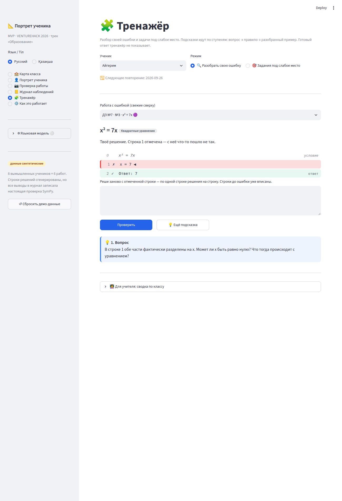
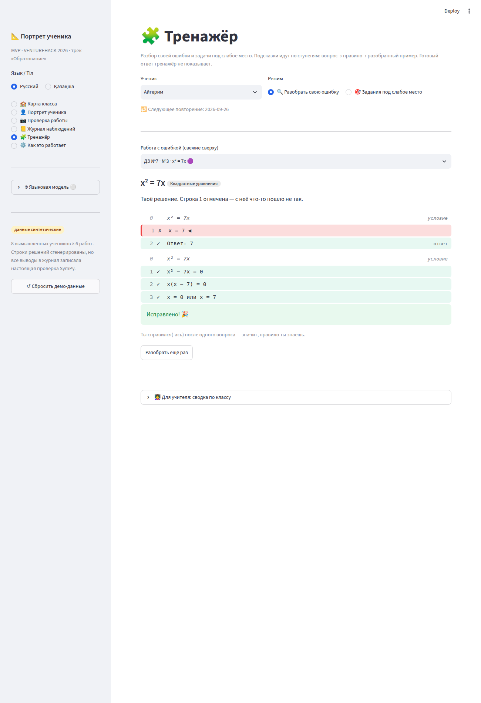
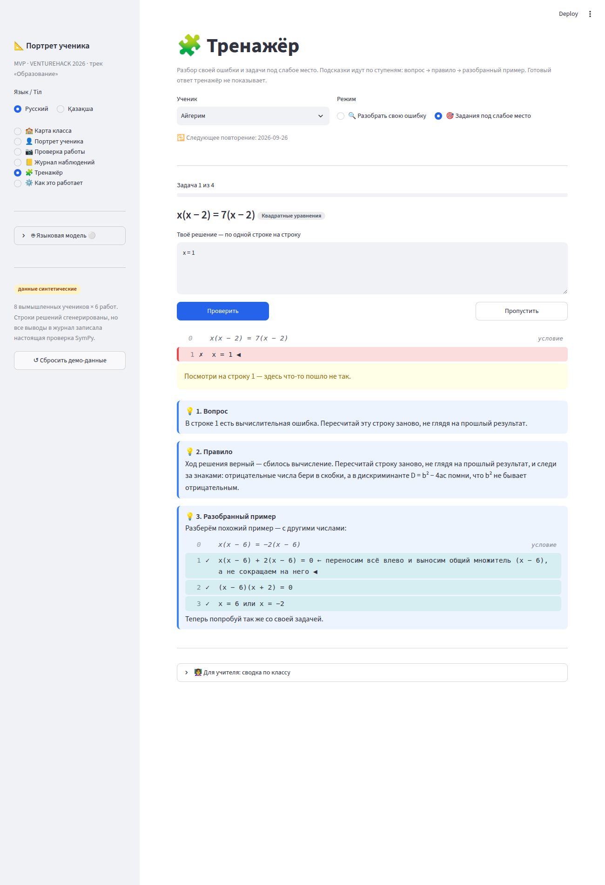
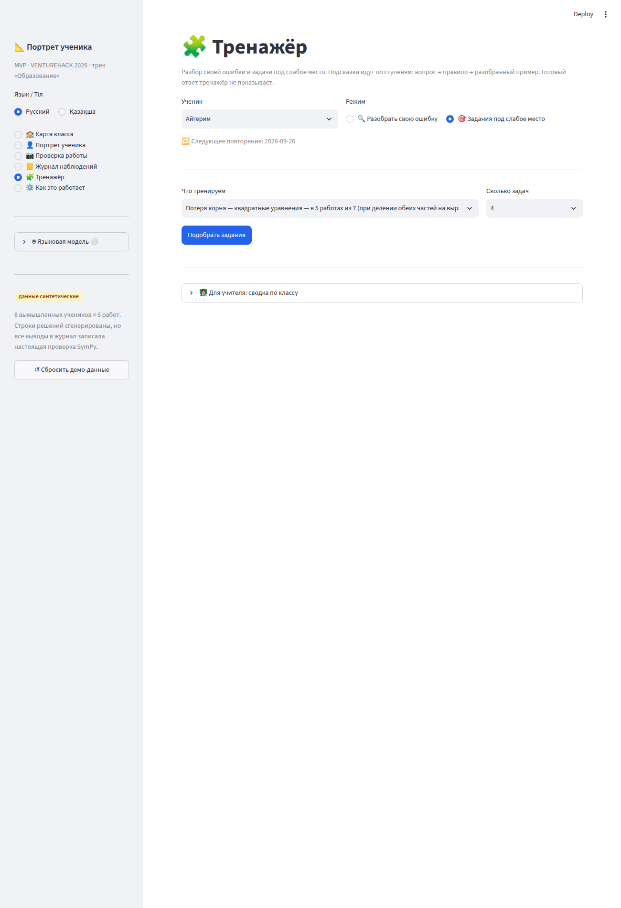
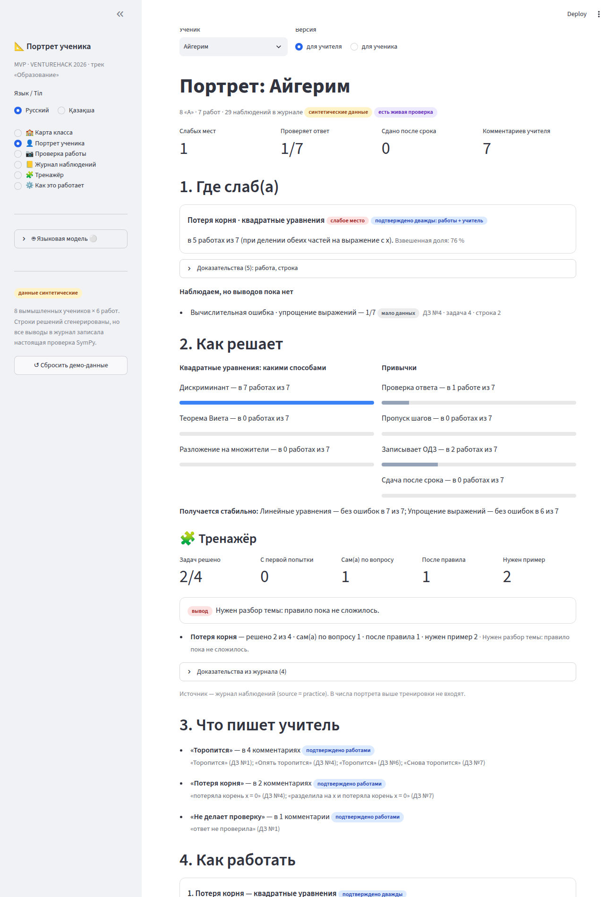
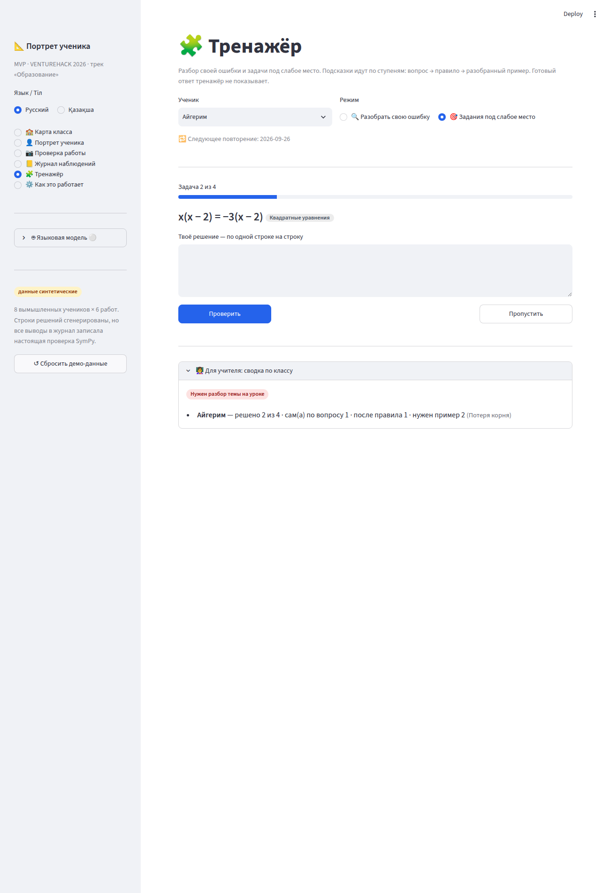
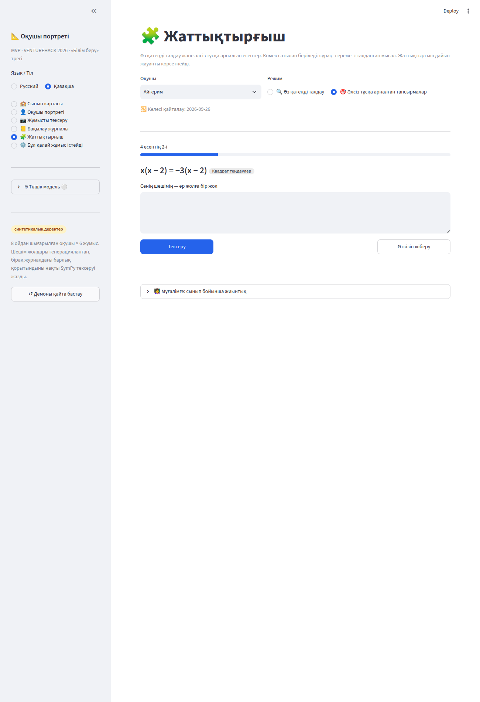

# Агент Гамма · Тренажёр ученика — отчёт

Петля на стороне ученика: **ошибка → лестница подсказок без готового ответа → самостоятельное исправление → задачи под слабое место**. В журнал попадает новый сигнал: исправляет ли ученик ошибку сам по вопросу (скорее невнимательность) или ему нужен разобранный пример (скорее непонимание).

Языковой модели в тренажёре нет: задачи — из шаблонов с целыми параметрами, подсказки — из словаря, пример — из шаблона. Эталон каждой задачи и каждого примера проходит ту же `check_problem`, что и домашние работы. Всё работает без ключа API.

## Что сделано

### Этап A

| Шаг | Что сделано | Где |
|---|---|---|
| A1. Подсказки | `hint(first_error, level, lang, statement, skill)`: 1 — `tags.question_for`; 2 — правило `RULES[tag][lang]` для всех 6 тегов ошибок (+ `ineq_flip`, `boundary` для тем Беты), неизвестный тег — общее правило «проверь переход подстановкой числа»; 3 — разобранный пример той же семьи с другими числами, ключевой шаг отмечен («← здесь выносим x за скобки, а не делим на x…»). Пример не совпадает с задачей ученика и, если можно, не содержит её корней. `leaks_answer(text, true_answer)` ловит «x = 5», «x₁ = 0», «Ответ: …» и перечисление всех корней. | `core/hints.py` |
| A2. Генератор | 13 шаблонов по образцу `_quad_variants`: `lost_root` — x² = kx, ax² = bx, x(x − p) = q(x − p); `extra_root` — x²/(x − p) = (sx − t)/(x − p) с одним посторонним корнем; `sign` — ax + b = cx + d, a(x − p) + b = cx − d; `fsu` — (a + p)² − (a − p)(a + p), (x ∓ p)² ± 2px; `calc` — x² − sx + p = 0 с целыми корнями; `skip_steps` — две пары скобок; `check_done` — обычная задача + обязательная проверка подстановкой. **Самопроверка:** эталон каждой задачи идёт через `check_problem`, нужно `first_error is None` и `correct is True`, иначе задача отбрасывается. `generate(tag, skill, n, seed)` без повторов, `worked_example(tag, skill, avoid, seed)`, `targets_for(conn, student_id, lang)`: рекомендация портрета → «мало данных» → смешанный набор «на закрепление». Задачи из ДЗ (включая будущее ДЗ №7) в наборы не попадают. | `core/practice.py` |
| A3. Хранение | `ensure_schema(conn)`: `practice_sessions`, `practice_items`, `practice_attempts` по схеме задания (+ дополнительные столбцы, см. «Отличия от задания») и `practice_reviews` для этапа B. В `db.SCHEMA` ничего не добавлено, `ALTER TABLE` нет. | `core/practice.py` |
| A4. Сигнал в журнал | Теги-привычки `self_fixed`, `fixed_after_rule`, `needs_example` (название, совет учителю и ученику на ru/kk). Исход пишется `db.add_observation(..., "habit", tag, skill, evidence, detail, source="practice", confidence=0.9)`; `detail = {"hint_level", "error_tag", "item_id", "solved"}`; `submission_id` — исходная работа в режиме «разбор своей ошибки», иначе `NULL`. Правило исхода: ступень ≤ 1 → `self_fixed`, 2 → `fixed_after_rule`, 3 или задача не решена → `needs_example`. Решённая с первой попытки задача наблюдения не даёт. Тренировки не пишутся в `submissions`. | `core/tags.py`, `core/practice.py` |
| A5. Страница «🧩 Тренажёр» | Ученик — только через переданный `students()`. **Разобрать свою ошибку:** работы с ошибкой, свежие сверху; работа через `render_lines` с подсвеченной строкой; сразу виден наводящий вопрос; поле заполнено строками до ошибочной; «Проверить» → `check_problem`; «Ещё подсказка» (1 → 2 → 3); «Исправлено!» и запись исхода. **Задания под слабое место:** `targets_for` → `generate(n = 3…5)` → задачи по одной, тот же цикл, «Пропустить» после ошибки = `needs_example`. Тон мягкий, правильный ответ не показывается. | `ui/practice.py`, `app.py` |
| A6. Блок в портрете учителя | `practice.summary(conn, student_id)`: по целевым тегам — сколько задач решено, сколько с первой попытки, сколько `self_fixed` / `fixed_after_rule` / `needs_example`; вывод по правилу (≥ 60 % `self_fixed` при ≥ 3 задачах → «исправляет сам(а) по вопросу…», ≥ 50 % `needs_example` → «нужен разбор темы…», иначе «мало данных»). Исходы читаются из журнала. `render_portrait_block` ничего не выводит без данных; вставка — одна строка перед «3. Что пишет учитель». | `core/practice.py`, `ui/practice.py`, `app.py` |

### Этап B

| Шаг | Что сделано |
|---|---|
| B1 | Кнопка «🧩 Потренироваться» в `portrait_student` → `go("practice", student_id)`; страница тренажёра подхватывает ученика. |
| B2 | Интервальное повторение: исход `needs_example` ставит задачу в `practice_reviews` на +2 и +5 дней. Блок «🔁 Пора повторить» на странице (или дата следующего повторения); решённое повторение снимается. |
| B3 | Задания по привычкам: `skip_steps` засчитывается, только если строк решения не меньше половины эталона (`requirement.min_lines`); `check_done` — только если в результате проверки есть привычка `check_done`. Ученику объясняется, чего не хватает, а не «неверно». |
| B4 | Темы Беты: правила для `ineq_flip`, `boundary` в `RULES`; шаблон неравенства регистрируется (`register_optional_topics`) только если тег есть в `T.TAGS`. Задача попадает в набор, лишь когда её эталон проходит `check_problem`, поэтому до слияния с Бетой шаблон безвреден (сейчас проверка отвечает `ParseError`, задачи отбрасываются). `targets_for` предлагает только теги, у которых реально генерируются задачи. |
| B5 | Сводка по классу на странице тренажёра (раскрывающийся блок для учителя): «исправляют сами по вопросу», «нужен разбор темы», «картина неоднозначная», «мало данных». |

### Отличия от задания (все аддитивные)

- `hint(...)` и `hints.example(...)` — необязательные `seed` и `family`. `family` — семья шаблонов задачи: если в задаче на `lost_root` проверка назвала ошибку вычислительной, пример всё равно из семьи `lost_root`, как и задумано («задача той же семьи»).
- `generate(...)` — необязательный `avoid` (не повторять задачи ДЗ и задачу ученика).
- `practice_items` — дополнительные столбцы `target_tag`, `requirement`, `template`, `solved`, `outcome`, `review_id`; `practice_attempts.attempt_no = 0` — исходная работа в режиме «разбор своей ошибки» (так ошибка до тренажёра учитывается в правиле исхода).
- `practice_sessions.mode` — ещё значение `review` (повторение).

## Как проверено

```
$ python -m pytest -q
90 passed in 17.3s          # было 27, добавлено 63 в tests/test_gamma.py
```

Что проверяют новые тесты (`tests/test_gamma.py`):

- **Генераторы:** каждый из 13 шаблонов на 20 seed — эталон проходит `check_problem` без ошибок, задачи с разными seed различаются; `generate` даёт 5 разных задач для каждого тега и для смешанного набора; требования `check_done` и `skip_steps`.
- **`hint`:** для 6 тегов ошибок ступени 1–3 не пустые и различаются на `ru` и `kk`; ступень 3 — не задача ученика, сама проходит самопроверку, берётся из семьи задачи и не содержит корней задачи ученика; `leaks_answer` ложно для ступеней 1–2 (`x² = 5x`, ответ 0; 5 и задачи всех 6 тегов) и истинно для утечек.
- **Сценарий без интерфейса:** сессия → попытка с ошибкой (`lost_root`) → подсказка 1 → верная попытка → одно наблюдение `self_fixed`, `source="practice"`, с нужным `detail`; после этого портрет Айгерим — прежние 4/6, снимок портрета не изменился, `recs[0]` — `lost_root`, `submissions` не изменились.
- **Демо ДЗ №7:** после живой проверки первая работа с ошибкой — `x² = 7x`, строка 1, вопрос «Может ли x быть равно нулю?», решение `x(x − 7) = 0` → `self_fixed`, привязка к работе и строке, портрет 5/7 не меняется.
- **Исход и повторение:** правило исхода для ступеней 0–3; «не решена» → `needs_example`, один раз; повторения через 2 и 5 дней, решённое снимается.
- **`summary`:** «мало данных», «исправляет сам(а)» (3/4), «нужен разбор темы» (2/4), «неоднозначно»; сводка по классу; задача с первой попытки видна, но исхода не даёт.
- **`targets_for`:** для Айгерим — `lost_root`, навык `quadratic`, задачи вида x² = kx, без задач из ДЗ (30 seed); у каждого ученика цель с шаблонами.
- **Темы Беты:** шаблон неравенства появляется только вместе с тегом; задачи, которые проверка не принимает, отбрасываются.

Сценарий в браузере (Streamlit + Chromium, без ключа API): «Проверка работы» → ДЗ №7 → «Вставить демо-работу» → «Проверить» → «Записать в журнал…» → «Потеря корня: 4/6 → 5/7 (67% → 76%)» → «Тренажёр» → Айгерим → «Разобрать свою ошибку» → строка `x = 7` подсвечена, вопрос «Может ли x быть равно нулю?» → `x² − 7x = 0 / x(x − 7) = 0 / x = 0 или x = 7` → «Исправлено! 🎉» → в портрете учителя блок «🧩 Тренажёр». Далее «Потренироваться» из версии для ученика, набор под слабое место, три ступени подсказки, «Пропустить», переключение на казахский. Исключений на странице нет.

## Скриншоты

| | |
|---|---|
| Разбор своей ошибки: подсвеченная строка и вопрос  | «Исправлено!»  |
| Лестница подсказок: вопрос → правило → разобранный пример  | Выбор цели под слабое место  |
| Блок «Тренажёр» в портрете учителя  | Сводка по классу  |
| Казахский интерфейс  | |

## Новые казахские тексты для вычитки

**Словарь тегов (`core/tags.py`)**

- `self_fixed`: «Бағыттаушы сұрақ бойынша өзі түзетті»; учителю: «Оқушы ережені біледі, бірақ жұмыста қолданбайды. Тақырыпты қайта талдау қажет емес — өзін-өзі тексеру әдеті керек: әр ауысуды қайта оқып, жауапты шартқа қоюды сұраңыз.»; ученику: «Тоқтап, өзіңе сұрақ қойғанда қатені өзің табасың. Тапсырар алдында осындай үзіліс жаса: әр ауысуды қайта оқып шық.»
- `fixed_after_rule`: «Ереже-кеңестен кейін түзетті»; учителю: «Ереже әлі берік бекімеген: еске салғаннан кейін оқушы дұрыс шығарады. Сабақ басында ережені қайталап, оны қолдануға 2–3 қысқа есеп беріңіз.»; ученику: «Ереже көмектеседі — оны дәптердің шетіне жазып ал да, әдетке айналғанша соған сүйеніп отыр.»
- `needs_example`: «Талданған мысал қажет болды»; учителю: «Ереже әлі қалыптаспаған: оқушы қатені тек талданған мысал арқылы түзетеді. Тақырыпты сабақта мысалға сүйеніп талдап, біртіндеп күрделенетін ұқсас есептер беріңіз.»; ученику: «Талданған мысал — жақсы тірек. Соған қарап тағы бірнеше ұқсас есеп шығар, содан кейін көмексіз шығарып көр.»

**Правила, ступень 2 (`core/hints.py`)**

- `lost_root`: «Теңдеудің екі жағын x-і бар өрнекке ол нөлге тең болмаған жағдайда ғана бөлуге болады. Бірақ x-тің бір мәнінде ол дәл нөлге айналады — сөйтіп сол түбір жоғалады. Барлығын бір жаққа шығарып, ортақ көбейткішті жақша сыртына шығарған сенімдірек: көбейткіштердің кемінде біреуі нөлге тең болса, көбейтінді нөлге тең.»
- `extra_root`: «Теңдеуді бөлімге көбейткенде, бастапқы бөлшектер мағынасын жоғалтатын x мәндері пайда болуы мүмкін. Сондықтан бірінші жолға ММЖ жаз — x-тің қандай мәнінде бөлімдер нөлге тең болады, — ал соңында әр табылған түбірді онымен салыстырып, жарамайтындарын сызып таста.»
- `sign`: ««=» таңбасы арқылы көшірілген қосылғыштың таңбасы қарама-қарсыға өзгереді. Жақша алдындағы минус жақша ішіндегі әр қосылғыштың таңбасын өзгертеді. Сондай қосылғыштың астын сызып, таңбасын бөлек тексер.»
- `fsu`: «Қосынды мен айырманың квадраты: (a ± b)² = a² ± 2ab + b² — екі еселенген 2ab көбейтіндісін жоғалтуға болмайды. Квадраттар айырмасы: (a − b)(a + b) = a² − b². Күмәндансаң — екі жазбаға да кішкентай сандар қой: мәндері тең болуы керек.»
- `calc`: «Шешу жолы дұрыс — есептеу жаңылған. Жолды алдыңғы нәтижеге қарамай қайта есепте және таңбаларды қадағала: теріс сандарды жақшаға ал, ал D = b² − 4ac дискриминантында b² теріс болмайтынын есте сақта.»
- `other`: «Әр ауысу теңдікті сақтауы керек: теңдеудің түбірлері, өрнектің мәні өзгермеуі тиіс. Ауысуды санды қойып тексер: кез келген санды алып, оны ауысуға дейінгі және кейінгі жолға қой — нәтижелер бірдей болуы керек.»
- `ineq_flip`: «Теңсіздіктің екі жағын теріс санға көбейтсе немесе бөлсе, теңсіздік таңбасы қарама-қарсыға ауысады: < орнына >, ≤ орнына ≥. Бөлмес бұрын санның таңбасына қара.»
- `boundary`: «Қатаң теңсіздік (< немесе >) шекараны қамтымайды: осьтегі нүкте ойылған, жақша дөңгелек. Қатаң емес теңсіздік (≤ немесе ≥) шекараны қамтиды: нүкте боялған, жақша тік.»
- общее правило: «Бұл ауысуды санды қойып тексер: бір санды ауысуға дейінгі және кейінгі жолға қой. Нәтижелер әртүрлі болса, ауысу қате — оны қай әрекет өзгерткенін тап.»
- «Ұқсас мысалды талдайық — басқа сандармен:» · «Енді өз есебіңді осылай шығарып көр.» · «Бұл тақырыпқа ұқсас мысал әзірге жоқ — жолды мұғаліммен бірге талда.»

**Пометки ключевого шага в примерах (`core/practice.py`)**

«мұнда x-ке бөлмей, x-ті жақша сыртына шығарамыз: x нөлге тең болуы мүмкін» · «бәрін солға шығарып, ортақ (x − p) көбейткішін жақша сыртына шығарамыз, оған қысқартпаймыз» · «түбірлерді ММЖ-мен салыстырамыз: x = p болғанда бөлім нөлге тең» · «қосылғыштарды «=» арқылы көшіреміз: әрқайсысының таңбасы өзгереді» · «жақшаны ашамыз: a·(−p) = −ap, минус таңбасы сақталады» · «(v + p)² = …, ал (v − p)(v + p) = …» · «(u ± p)² = u² ± 2pu + p²: екі еселенген көбейтіндіні жоғалтпаймыз» · «D = b² − 4ac: теріс b-ні жақшаға аламыз, қадаммен есептейміз» · «әр жақшаны жеке жолда ашамыз — әр таңба көрініп тұрады» · «жауапты бастапқы теңдеуге қоямыз: екі жағы тең» · «−a-ге бөлеміз: сан теріс, теңсіздік таңбасы ауысады»

**Выводы и цели (`core/practice.py`)**

«Сұрақ бойынша өзі түзетеді: ережені біледі, бірақ қолданбайды — өзін-өзі тексеру әдеті көмектеседі.» · «Тақырыпты талдау керек: ереже әлі қалыптаспаған.» · «Қорытынды үшін дерек аз: қатесі түзетілген кемінде 3 есеп керек.» · «Көрініс әлі біржақты емес — қорытынды үшін дерек аз.» · «Бәрі жақсы — міне, бекітуге арналған есептер» · «дерек аз, бірақ жаттығып алған жөн»

**Интерфейс (`ui/practice.py`, `app.py`)**

«🧩 Жаттықтырғыш» · «🧩 Жаттығу» · «Өз қатеңді талдау және әлсіз тұсқа арналған есептер. Көмек сатылап беріледі: сұрақ → ереже → талданған мысал. Жаттықтырғыш дайын жауапты көрсетпейді.» · «🔍 Өз қатеңді талдау» · «🎯 Әлсіз тұсқа арналған тапсырмалар» · «Сұрақ» · «Ереже» · «Талданған мысал» · «Қатесі бар жұмыс (жаңалары жоғарыда)» · «Сенің шешімің. {n}-жол белгіленген — осы жерден бірдеңе дұрыс болмай қалды.» · «Белгіленген жолдан бастап қайта шығар — әр жолға шешімнің бір жолы. Қатеге дейінгі жолдар жазылып қойылған.» · «Сенің шешімің — әр жолға бір жол» · «Тексеру» · «💡 Тағы көмек» · «Келесі →» · «Өткізіп жіберу» · «Қайта талдау» · «Түзетілді! 🎉» · «Бірінші әрекеттен дұрыс! 🎉» · «{n}-жолға қара — осы жерде бірдеңе дұрыс болмай тұр.» · «Шешім дұрыс! Тек тексеру қалды: жауапты бастапқы теңдеуге жеке жолда қой, мысалы «Тексеру: …».» · «Жауап дұрыс, бірақ қадамдар аз: әр түрлендіруді жеке жолға жаз (кемінде {k} жол керек).» · «Шешім әлі соңына жеткен жоқ: жауапты жаз (өрнекті соңына дейін ықшамда).» · «Орнына қою арқылы тексер — онсыз есеп есептелмейді.» · «Әр қадамды жеке жолға жаз (кемінде {k} жол).» · «Бір сұрақтан кейін-ақ шығардың — демек, ережені білесің.» · «Ереже көмектесті — оны дәптердің шетіне жазып, көз алдыңда ұста.» · «Мысал көмектесті. Бекіту үшін бірнеше күннен кейін осы есепке ораламыз.» · «Сақталған жұмыстарда қате жоқ — «Әлсіз тұсқа арналған тапсырмаларға» көз жүгірт.» · «Нені жаттықтырамыз» · «Неше есеп» · «Тапсырмаларды таңдау» · «Тағы бір топтама» · «{total} есептің {i}-і» · «Топтама аяқталды: {n} есептің {k}-і шығарылды.» · «қайталау» · «🔁 Қайталайтын уақыт келді: {n}» · «Бұл есептер тек талданған мысалмен шықты — бекіту үшін оларға қайта ораламыз.» · «Қайталау» · «🔁 Келесі қайталау:» · «👩‍🏫 Мұғалімге: сынып бойынша жиынтық» · «Сұрақ бойынша өздері түзетеді — өзін-өзі тексеру әдеті керек» · «Тақырыпты сабақта талдау керек» · «Көрініс біржақты емес» · «Дерек аз (қатесі бар есеп 3-тен аз)» · «Әзірге жаттықтырғышта ешкім жаттықпаған.» · «Шығарылған есеп» · «Бірінші әрекеттен» · «Сұрақ бойынша өзі» · «Ережеден кейін» · «Мысал керек» · «қорытынды» · «сұрақ бойынша өзі» · «ережеден кейін» · «мысал керек» · «{t} есептің {s}-і шықты» · «Бекіту» · «Журналдағы дәлелдер ({n})» · «{k}-саты» · «Дереккөзі — бақылау журналы (source = practice). Жаттығулар жоғарыдағы портрет сандарына кірмейді.» · «Қолжетімді оқушы жоқ.»

## Риски

- **Повторная живая проверка стирает сигнал тренажёра.** `pipeline.delete_submission` удаляет все наблюдения работы, в том числе `source="practice"` из режима «разбор своей ошибки», а строки `practice_items` остаются со ссылкой на удалённую работу. Сводка читает исходы из журнала, поэтому после перепроверки ДЗ №7 исход разбора этой работы пропадёт. На демо это не мешает (сначала проверка, потом тренажёр).
- **Общий счётчик наблюдений.** «N наблюдений в журнале» в шапке портрета и «Наблюдений в журнале» на карте класса считают все строки, включая `practice`. Числа слабых мест, привычек и рекомендаций не меняются (есть тест).
- **Классификация неожиданных ответов.** Тип ошибки на ступени 1 даёт `check_problem`: например, `x = 1` в задаче x(x − 2) = 3(x − 2) она называет вычислительной. Правило (ступень 2) идёт за этим тегом, а пример (ступень 3) — за семьёй задачи.
- **Семья `lost_root` и корень 0.** У задач вида x² = kx есть корень 0, поэтому пример на ступени 3 выбирается так, чтобы в его ответе не было корней задачи ученика (обычно x(x − p) = q(x − p)); если за 12 попыток такого нет, остаётся первый пример — другая задача, но с «x = 0 или …».
- **`leaks_answer` — эвристика** по записи вида «x = …», «Ответ …» и перечислению всех корней. Слово «нулю» в вопросе «Может ли x быть равно нулю?» утечкой не считается (это вопрос из словаря, он уже был в демо).
- **Уровень подсказки живёт в сессии Streamlit.** Если перезагрузить вкладку посреди задачи, открытые ступени сбросятся к 1 и исход может оказаться «мягче». Каждая попытка при этом хранит свой `hint_level` в базе.
- **Шаблоны `calc` и `check_done` используют помощники сида** `_quad_variants`, `_quad_statement`, `_check_line`. Если их поменяют, самопроверка отбросит сломанные задачи, а тесты генераторов упадут — это сразу будет видно.
- **Темы Беты — предположение о виде задачи** `kind="inequality"` и записи ответа `x > a`. Пока проверка неравенств не приняла эталон, шаблон ничего не выдаёт.

## Нужно от других

- **Всем, кто трогает `pipeline.delete_submission`:** при повторной живой проверке не удалять наблюдения с `source="practice"` (или переносить их на новую работу) — см. первый риск. Сам я `core/pipeline.py` не менял.
- **Журнал наблюдений (`page_log` в `app.py`):** добавить в фильтр «Источник» значение `practice` («тренажёр» / «жаттықтырғыш»). Сейчас строки тренажёра видны только при «все».
- **Бета:** подтвердить название вида задачи для неравенств и формат ответа; если отличаются от `kind="inequality"` и `x > a` — поправить `t_ineq_flip` в `core/practice.py` (или сообщить мне). Правила `ineq_flip` и `boundary` уже в `hints.RULES`.
- **Дзета:** тренажёр берёт учеников только из `students()`; блок «Сводка по классу» — для учителя, при роли «ученик» его стоит скрыть (например, передавать флаг роли в `render` или проверять роль внутри `_class_block`).
- **Дельта:** исходы тренажёра (`self_fixed` / `fixed_after_rule` / `needs_example` с датами) можно использовать как ранний сигнал эффекта советов.
- **Носитель казахского:** вычитать тексты из раздела выше.

## Файлы

Новые: `core/hints.py`, `core/practice.py`, `ui/__init__.py`, `ui/practice.py`, `tests/test_gamma.py`, `docs/gamma.md`, `docs/gamma/*.png`.
Общие, точечно: `core/tags.py` — три тега перед `# ---------------- из комментариев учителя`; `app.py` — импорт, `"practice"` в `PAGES` перед `"about"`, подпись в `PAGE_NAMES`, запись в словаре страниц, строка в `portrait_teacher` перед «3. Что пишет учитель», кнопка в `portrait_student`.
