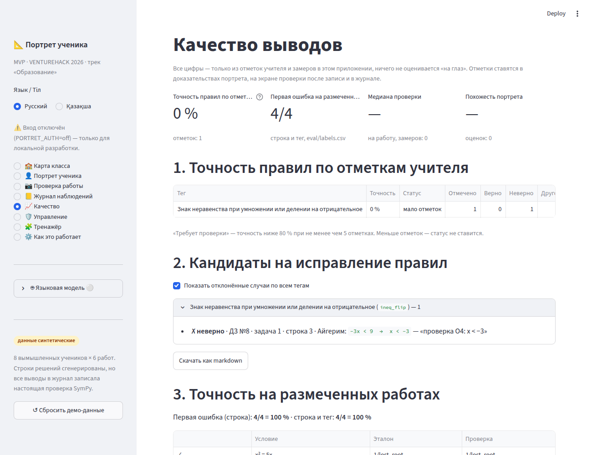

# Агент Омега · Согласованность после слияния (завершение фазы 1)

Задание: [`agents/OMEGA.md`](../agents/OMEGA.md) — план агента Коммандо. Шесть направлений писались параллельно, поэтому несогласованности сидели на стыках: просьбы из «Нужно от других» остались невыполненными, а допущения одного агента нарушал код другого. Все пункты O1–O17 закрыты. Новых возможностей нет: пожелания из раздела «Не входит» не тронуты.

**Итог:** `python -m pytest -q` → **390 passed** (334 прежних без правок + 56 в `tests/test_omega.py`, без сети и без ключа API). Демо «Потеря корня: 4/6 → 5/7» не изменилось; повторная проверка той же работы снова даёт 5/7. Один коммит на пункт, сначала P0.

## Что сделано — по пунктам плана

### P0 — неверные данные, утечка, согласие, отображение

| # | Где | Итог |
|---|---|---|
| O1 | `core/pipeline.py`, `core/db.py`, `core/privacy.py`, `core/ocr_store.py` | `pipeline.delete_submission` (сигнатура прежняя): 1) наблюдения `source="practice"` этой работы отвязываются (`submission_id = NULL`), у `practice_items` — `source_submission_id = NULL`; 2) удаляются строки всех таблиц со столбцом `observation_id`, которые ссылаются на удаляемые наблюдения (сейчас `reviews`); 3) удаляются строки всех таблиц со столбцом `submission_id` этой работы (`observations`, `steps`, `attempts`, `teacher_comments`, `ocr_lines`, `check_timings`); 4) последней — сама работа. Таблицы находит общий помощник `db.tables` (+ `db.qi`) — по `sqlite_master` и `PRAGMA table_info`; им же теперь пользуется `privacy.delete_student`. Всё в одной транзакции, при ошибке — откат. `ocr_store.delete_submission` никто не вызывал — удалён. |
| O2 | `core/quality.py`, `core/review.py`, `ui/review.py`, `app.py` | Необязательный `student_ids=None` у `_reviewed`, `tag_precision`, `tag_status`, `rejected_cases`, `candidates_markdown`, `timing_summary`, `metrics_csv`, `metrics_markdown` и у `review.rating_summary` (она лежит в `core/review.py`, а не в `quality`). `None` — все ученики, как раньше; иначе `student_id IN (…)`. `render_quality(..., student_ids=None)` передаёт фильтр во все расчёты и во все три выгрузки; `app.py` подставляет `auth.visible_student_ids(conn, user)`. Тот же фильтр — у бейджа «требует проверки» в портрете (`precision_badge`), чтобы его цифры совпадали со страницей «Качество». `eval_accuracy` не тронут. |
| O3 | `core/practice.py`, `ui/practice.py`, `app.py` | `practice.can_practice(conn, sid)` — `consent.required_ok`. Без согласия страница «Тренажёр» после выбора ученика показывает пояснение на ru/kk (для ученика — «обратись к учителю», для учителя — где отметить согласие) и не создаёт ни сессий, ни попыток. Кнопки, которые пишут в базу, проверяют согласие и в своих колбэках: его могли отозвать, пока страница открыта. `render(..., role=None)`: при `role == "student"` сводка «👩‍🏫 Для учителя» не показывается; `app.py` передаёт `user["role"]`. |
| O4 | `app.py`, `ui/review.py`, `ui/practice.py` | Все пять мест — `<code>{esc(…)}</code>` с `unsafe_allow_html=True`, как уже было в портрете для ученика. Проверено в Chromium (скриншот ниже): `−3x < 9  →  x < −3` вместо `&lt;`. Заодно закрыта Markdown-инъекция через обратные кавычки (`docs/zeta.md`). |

### P1 — контракты из «Нужно от других»

| # | Где | Итог |
|---|---|---|
| O5 | `app.py` | Помощник `llm_allowed(ru, kk)` вызывает `auth.rate_limit(user, "llm")` перед «Распознать строки» и «✨ Привязать советы к работам»: при лимите — `st.warning` с текстом Дзеты, вызова модели нет. В «Записать в журнал…» при лимите разметка комментария идёт по словарю (`tag_comment_keywords`), как при `LLMError`: прежняя работа к этому моменту уже удалена. |
| O6 | `ui/review.py`, `app.py` | Необязательный `reviewer=None` у `controls`, `after_record`, `submission_controls`, `log_controls`, `rating_form` → `review.add`, `reject_errors`, `add_rating`. `app.py` передаёт `str(user["id"])`; при `PORTRET_AUTH=off` id нет — остаётся «учитель». `reviewer_name`: числовой `reviewer` показывается как `display_name` (`auth.get_user`) — в подсказке бейджа и в подписи отметки; старые отметки «учитель» выглядят как раньше. |
| O7 | `app.py` | В фильтре «Источник» журнала — `practice` с подписью «тренажёр / жаттықтырғыш». |
| O8 | `core/ocr.py`, `core/kinds/*`, `core/llm.py`, `app.py`, `evaluate.py` | 1) `score_lines(lines, kind=None)` / `score_line(line, kind=None)`: если `kind` есть в `core.kinds.KINDS`, разбирается ли строка, решает `parses(raw)` модуля вида (реестр `kinds.PARSES`). `parses` написаны в `inequality`, `system`, `biquadratic` на их собственных разборщиках и повторяют ветки их `check`: там, где `check` ставит `unparsed`, `parses` даёт `False`, и наоборот. `app._prep` передаёт `p["kind"]`, `evaluate.py` — `kind` из разметки; `--kind` у `--draft` принимает и виды Беты. Без `kind` поведение прежнее. 2) `clean_text`: `\infty → ∞`, `\cup → ∪`, `\in → ∈`, `\{` и `\}` удаляются. 3) `llm._RULES`: знаки `< > ≤ ≥`, `∞`, `∪`, скобки промежутков и `;` — как в тетради; строка знаков «+ − +» — как есть; система — двумя строками, большую скобку не переписывать; запрет — только на фигурные скобки LaTeX. Контракт `recognize()` прежний. |
| O9 | `core/tags.py`, `app.py`, `ui/assignments.py` | Один словарь на ru/kk: `KIND_NAMES` (виды задач) и `LINE_KINDS` (виды строк). `status_note` и выбор вида в «Управление» → «Задания» берут подписи из них; у строк `ineq`, `signs`, `subst`, `system`, `interval`, `point` теперь есть подпись справа. |
| O10 | `core/seed.py`, `app.py` | `seed.EXTRA_DEMO_TEXT` — демо ДЗ №8 из `docs/beta.md`. Кнопка «Вставить демо-работу» — для любого задания с демо-текстом; комментарий учителя подставляется только для ДЗ №7. Айгерим ищется по псевдониму в синтетическом классе, а не по `id = 1`; если её не видно — кнопка без имени и берёт выбранного ученика. |
| O11 | `core/portrait.py`, `app.py` | `p["methods_by_skill"]`: `{навык: [{"tag", "count", "total", "refs"}]}` по всем тегам вида `method` с наблюдениями; знаменатель — работы с задачами навыка. `p["methods"]` не тронут. Раздел «2. Как решает» показывает методы других навыков под квадратными («Неравенства: какими способами»), версия для ученика — в «Уверенно пользуешься». |
| O12 | `core/portrait.py` | `n_obs` — `COUNT(*)` наблюдений ученика в журнале, как на карте класса: не зависит от отметок и включает тренажёр. |
| O13 | `app.py` | Бейдж «синтетические данные» в портрете — только если `consent.is_synthetic(conn, sid)`. Бейдж и подпись «8 вымышленных учеников…» в боковой панели — только если среди видимых пользователю учеников есть синтетические (то же определение: сдачи `source='synthetic'`). |
| O14 | `core/quality.py`, `evaluate.py` | `quality.reference_accuracy(labels)` — одна функция: пропускает черновики `status=draft`, возвращает их число (`n_draft`) и строки сверки. Её вызывают `quality.eval_accuracy` (страница «Качество», слайд) и часть `evaluate.py` про эталонные строки. |
| O15 | `core/audit.py`, `ui/review.py`, `app.py` | Действие `export_quality` («выгрузка со страницы «Качество»» / «Сапа» бетінен түсіру»). Все три кнопки скачивания — `rule_candidates.md` и метрики (md, CSV) — пишут его через `on_click=audit.log`; `render_quality(..., user=None)`, `app.py` передаёт пользователя. |

### P2 — документация и описания в коде

| # | Где | Итог |
|---|---|---|
| O16 | `docs/alpha.md`, `eval/README.md`, `evaluate.py` | Отчёт Альфы написан по коду и коммиту `689207c`: этап A, B1, B2, B5; B3 и B4 не сделаны — реальных фото нет, цифры не выдуманы. Казахские тексты Альфы собраны по AST. `eval/README.md` и докстринг `evaluate.py`: колонки `problem` и `status`, ключи `--draft`, `--out`, `--passes`, `--labels`, пять видов задач с примерами строк (проверены прогоном `evaluate.py`), все 14 тегов ошибок. |
| O17 | `README.md`, `.streamlit/secrets.toml.example`, `app.py`, `core/db.py`, `core/checker.py`, `core/knowledge.py`, `ui/dynamics.py`, `docs/delta.md` | README — по итоговому состоянию (разделы, темы, запуск, переменные, вход, сценарий демо, журнал, персональные данные, структура, ссылки на отчёты, пометка об исторической карте кода в `agents/*.md`). В `secrets.toml.example` — `PORTRET_ADMIN_LOGIN`, `PORTRET_ADMIN_PASSWORD`, `PORTRET_DEMO`. «Как это работает»: темы Беты и их ошибки, полная таблица «Своё и стороннее», «Персональные данные» таблицей. Комментарии `db.SCHEMA` (`skill`, `kind`, `source`), `LineResult.kind`, `CheckResult.kind`, докстринг `portrait.py` п. 2. Подпись «Динамики»: параметры BKT подобраны «по данным всех учеников в базе» — так и считает `knowledge.class_sequences`. |

### Решения по ходу

- **O1, общий помощник.** Вынесен в `core/db.py` (`tables`, `qi`): `pipeline` не должен импортировать `privacy` (тот тянет `portrait`). В `privacy` остались имена `_tables` и `_qi` — теперь это ссылки на общие функции.
- **O5, одна проверка на действие.** «Распознать строки» с двумя прочтениями — два запроса к модели, а лимит списывает один. Лимит — защита от перерасхода, а не точный учёт.
- **O8, `parses` повторяет ветки `check`.** Разбор строки у неравенств и систем зависит от вида строки (промежуток, пара, строка системы), поэтому общий `is_unparsable` для них не годится. Согласованность `parses` с `check` проверяется тестом на эталонах и типичных ошибках ДЗ №8–10; вручную сверено и на всех 59 параметризованных случаях `tests/test_beta.py` — расхождений нет.
- **O17, `docs/delta.md`.** План называл раздел «Что не сделано и почему» пустым, но в слитой версии в нём три пункта. Они оставлены; добавлены пункты, выявленные после слияния (BKT по всем ученикам базы, пожелания Беты и Гаммы из «Не входит», аудит отметок «совет применён»). Формулировка «подбирает параметры по всему классу» в таблице этапа B исправлена.
- **agents/*.md** не переписывались: это задания фазы 1.

## Как проверено

```text
$ python -m pytest -q
390 passed                       # 334 прежних без правок + 56 новых
$ python evaluate.py
Задач в разметке (без черновиков)                    4
Первая ошибка (строка) на эталонных строках          4/4 = 100%
Первая ошибка (строка и тег) на эталонных строках    4/4 = 100%
```

`tests/test_omega.py` — по пунктам плана; Streamlit-сценарии идут через `streamlit.testing.v1.AppTest` на копии сида (`PORTRET_DB` во временной папке, вход — `session_state["user"]`, раздел — `session_state["page"]`).

| Пункт | Что проверяет тест |
|---|---|
| O1 | Сценарий плана: живая проверка ДЗ №7 → «неверно» на ошибке → распознавание, замер, тренажёр `self_fixed` по этой работе → повторная проверка текстом. У новой работы нет отметок, в портрете 5/7, 0 строк `ocr_lines` и `check_timings`, `practice.summary(...)["outcomes"]["self_fixed"] == 1`; ни одна строка ни одной таблицы не ссылается на несуществующие `submissions` и `observations`. Двойная повторная проверка — тот же снимок портрета. |
| O2 | Учитель 8 «А» и ученик «Секретный-9Б» с отклонённой ошибкой, замером и оценкой: в `rejected_cases`, `candidates_markdown`, `tag_precision`, `timing_summary`, `rating_summary` и в выгрузках метрик учителя A нет данных 9 «Б»; при `None` — прежний результат. |
| O3 | Гейт следует за согласием (отзыв, бумажная форма, настоящий ученик без согласия). AppTest за демо-ученика и демо-учителя после отзыва согласия: пояснение, ни одной строки в `practice_sessions/items/attempts`; сводка «Для учителя» — только учителю. |
| O4 | Статический: в `app.py` и `ui/*.py` нет шаблонов `` `{esc( ``, `` `{_e( ``, `` `{_esc( ``. |
| O5 | `auth.rate_limit` → `False`: запись работы с комментарием проходит, `tagger="keywords"`, модель не вызвана; «✨ Привязать советы» — предупреждение, модель не вызвана. |
| O6 | Отметка с `reviewer="<id>"` → в бейдже и в колонке журнала имя пользователя; старая «учитель» — как раньше; отметка из интерфейса хранит id учителя. |
| O7 | Фильтр «тренажёр» в журнале оставляет только строки `source="practice"`. |
| O8 | 13 строк новых тем с `kind` не `unparsable`; мусор с `kind` по-прежнему `unparsable`; без `kind` и для `equation` — прежнее поведение; `parses` = «`check` не пометил строку `unparsed`» на эталонах и ошибках ДЗ №8–10; `swap_xy` в строке ответа «(2; 3)» больше не понижается до 0.6; пять правил `clean_text`; правила промпта; `evaluate.recognize_photo` передаёт `kind`. |
| O9 | Каждый вид задачи из `roster.problem_kinds()` и каждый вид строки, который выдают проверки Беты, имеет подпись на ru/kk. |
| O10 | Демо-текст ДЗ №8: `ineq_flip` в строке 3 задачи 1; задача 2 верна, метод `interval_method`; `boundary` с `detail.domain = ["−1"]` в строке 2 задачи 3. AppTest: после удаления Айгерим с id 1 и нового импорта кнопка выбирает её по псевдониму. |
| O11 | Живая проверка ДЗ №8 → `methods_by_skill["inequality"]`: `interval_method` 1/1 (две строки в журнале); `p["methods"]` не изменился; оба портрета показывают метод. |
| O12 | После «неверно» `n_obs` не меняется и равен счётчику карты класса. |
| O13 | Учитель настоящего класса 9 «Б»: ни бейджа в портрете, ни бейджа и подписи в боковой панели; у демо-учителя — есть. |
| O14 | `labels.csv` во временной папке с черновой строкой: `evaluate` и `eval_accuracy` дают одинаковые `n`, `ok_line`, `ok_tag`; черновик пропущен и посчитан. |
| O15 | Все три кнопки «Качества» передают `on_click=audit.log` с `export_quality`; вызов пишет строку в `audit_log` с id учителя. |
| Приёмка | Все 8 разделов без исключений для ролей «учитель», «администратор» и при `PORTRET_AUTH=off`, у ученика — портрет и тренажёр (чужой раздел сбрасывается на портрет); на `kk` — портрет, тренажёр, проверка и карта класса. Демо из README через кнопку «Войти как демо-учитель»: «4/6 → 5/7», «✗ неверно», повторная проверка → снова «4/6 → 5/7», у новой работы нет отметок, висячих ссылок нет. |

**В браузере** (Chromium, `streamlit run app.py`, Streamlit 1.64): страница «Качество» с отклонённым выводом ДЗ №8 — цитата показана как `−3x < 9  →  x < −3`, в тексте страницы нет `&lt;`.



## Новые казахские тексты для вычитки

Собраны скриптом по AST: пары `L(ru, kk)`, `llm_allowed(ru, kk)` и словари `{"ru", "kk"}`, которых не было до правок Омеги. Подписи видов строк «ответ», «проверка», «ОДЗ», «отброшен», «D», «Виет» перенесены из `app.py` в `tags.LINE_KINDS` без изменений и здесь не повторяются.

| Файл | Русский | Қазақша |
|---|---|---|
| `ui/practice.py` | Тренажёр пока недоступен: нет согласия на анализ твоих работ. Обратись к учителю. | Жаттықтырғыш әзірге қолжетімсіз: жұмыстарыңды талдауға келісім жоқ. Мұғаліміңе хабарлас. |
| `ui/practice.py` | Нет согласия на анализ работ этого ученика — тренажёр недоступен, решения и исходы не записываются. Отметьте согласие по бумажной форме: «🛡️ Управление» → «Согласия». | Бұл оқушының жұмыстарын талдауға келісім жоқ — жаттықтырғыш қолжетімсіз, шешімдер мен нәтижелер жазылмайды. Келісімді қағаз нысаны бойынша белгілеңіз: «🛡️ Басқару» → «Келісімдер». |
| `app.py` | Лимит обращений к модели: {n} в час. | Модельге жүгіну шегі: сағатына {n}. |
| `app.py` | Попробуйте позже или введите строки текстом. | Кейінірек қайталаңыз немесе жолдарды мәтінмен енгізіңіз. |
| `app.py` | Попробуйте позже — пока показаны советы из словаря. | Кейінірек қайталаңыз — әзірге сөздіктегі кеңестер көрсетілді. |
| `app.py` | Вставить демо-работу (Айгерим, ДЗ №{number}) | Демо-жұмысты қою (Айгерим, ҮТ №{number}) |
| `app.py` | {навык}: какими способами | {навык}: қандай тәсілмен |
| `app.py` | тренажёр | жаттықтырғыш |
| `core/audit.py` | выгрузка со страницы «Качество» | «Сапа» бетінен түсіру |
| `core/tags.py` | уравнение / выражение / неравенство / система уравнений / биквадратное уравнение | теңдеу / өрнек / теңсіздік / теңдеулер жүйесі / биквадрат теңдеу |
| `core/tags.py` | промежуток / знаки / замена / система / пара (x; y) | аралық / таңбалар / алмастыру / жүйе / (x; y) жұбы |
| `ui/dynamics.py` | …параметры подобраны по данным всех учеников в базе. | …параметрлер базадағы барлық оқушының деректері бойынша таңдалған. |
| `app.py`, «Как это работает» | **Неравенства**: сравниваются множества решений соседних строк; метод интервалов — корни, строка знаков «+ − +», ответ промежутком. Ошибки: *знак неравенства* при делении на отрицательное, *деление на выражение с x*, *не тот промежуток*, *граница* (строгое / нестрогое, точка вне ОДЗ). | **Теңсіздіктер**: көршілес жолдардың шешімдер жиыны салыстырылады; интервалдар әдісі — түбірлер, «+ − +» таңбалар жолы, жауап аралықпен. Қателер: теріс санға бөлгенде *теңсіздік таңбасы*, *x-і бар өрнекке бөлу*, *басқа аралық таңдалған*, *шекара* (қатаң / қатаң емес, ММЖ-дан тыс нүкте). |
| `app.py`, «Как это работает» | **Системы уравнений**: каждая строка должна следовать из системы; способы подстановки и сложения. Ошибки: *подстановка без скобок*, *перепутаны x и y* в ответе. | **Теңдеулер жүйелері**: әр жол жүйеден шығуы керек; алмастыру және қосу тәсілдері. Қателер: *жақшасыз алмастыру*, жауапта *x пен y ауысып кеткен*. |
| `app.py`, «Как это работает» | **Биквадратные уравнения**: замена t = x², уравнение в t, обратная замена. Ошибка: *x² = t при t < 0*; потерянные корни ± — *потеря корня*. | **Биквадрат теңдеулер**: t = x² алмастыруы, t-ға қатысты теңдеу, кері алмастыру. Қате: *t < 0 болғанда x² = t*; жоғалған ± түбірлер — *түбірді жоғалту*. |
| `app.py`, «Как это работает» | **Алгебраические дроби** проверяются как выражения; отдельное правило — *сокращение слагаемых вместо множителей*. | **Алгебралық бөлшектер** өрнектер сияқты тексеріледі; бөлек ереже — *көбейткіштің орнына қосылғышты қысқарту*. |
| `app.py`, «Своё и стороннее» | Уверенность распознанных строк, журнал распознаваний | Танылған жолдардың сенімділігі, тану журналы |
| `app.py`, «Своё и стороннее» | Динамика: тренд, интервал Уилсона, BKT, эффект советов | Динамика: үрдіс, Уилсон аралығы, BKT, кеңестердің әсері |
| `app.py`, «Своё и стороннее» | Тренажёр: задачи под слабое место, лестница подсказок | Жаттықтырғыш: әлсіз тұсқа арналған есептер, көмек сатылары |
| `app.py`, «Своё и стороннее» | Отметки учителя, метрики качества | Мұғалім белгілері, сапа метрикалары |
| `app.py`, «Своё и стороннее» | Аккаунты и роли, согласие, журнал действий, удаление данных | Аккаунттар мен рөлдер, келісім, әрекеттер журналы, деректерді жою |
| `app.py`, «Своё и стороннее» | Подбор параметров BKT, графики динамики / Подготовка фото | BKT параметрлерін таңдау, динамика графиктері / Фотоны дайындау |
| `app.py`, «Персональные данные» | Что / Как; Имена — псевдонимы вместо имён | Не / Қалай; Аттар — аттардың орнына бүркеншік аттар |
| `app.py`, «Персональные данные» | Фото — не сохраняется: после распознавания остаются только строки текста | Фото — сақталмайды: танылғаннан кейін тек мәтін жолдары қалады |
| `app.py`, «Персональные данные» | Согласие — живая работа записывается в журнал, а тренажёр сохраняет решения, только если отмечено согласие (бумажная форма родителя, в базе — только её номер и дата). Синтетическим ученикам демо оно ставится само | Келісім — тірі жұмыс журналға жазылады, ал жаттықтырғыш шешімдерді сақтайды — тек келісім белгіленсе (ата-ананың қағаз нысаны, базада тек оның нөмірі мен күні). Демодағы синтетикалық оқушыларға ол өзі қойылады |
| `app.py`, «Персональные данные» | Доступ — учитель видит только свои классы, ученик — только свой портрет и тренажёр; пароли — только хэш PBKDF2 с солью | Қолжетімділік — мұғалім тек өз сыныптарын көреді, оқушы — тек өз портреті мен жаттықтырғышын; құпиясөздер — тек тұзы бар PBKDF2 хэші |
| `app.py`, «Персональные данные» | Журнал действий — вход, просмотр портрета, запись работы, выгрузки, удаление — только коды действий и id, без имён и текстов работ | Әрекеттер журналы — кіру, портретті қарау, жұмысты жазу, түсіру, жою — тек әрекет коды мен id, аттарсыз және жұмыс мәтіндерінсіз |
| `app.py`, «Персональные данные» | Удаление — по запросу администратор удаляет все данные ученика во всех таблицах: «🛡️ Управление» → «Удаление данных» | Жою — сұрау бойынша әкімші оқушының барлық кестедегі деректерін жояды: «🛡️ Басқару» → «Деректерді жою» |
| `app.py`, «Персональные данные» | Демо — все ученики вымышленные | Демо — барлық оқушы ойдан шығарылған |

## Риски

- **`parses` повторяет ветки `check` модулей видов.** Если Бета поменяет разбор строк в `check`, `parses` нужно поправить вместе с ним. Расхождение поймает `test_parses_agrees_with_check_on_extra_assignments`, но только на строках из сида.
- **Лимит модели — один на действие** (см. «Решения»). Два прочтения фото расходуют два запроса.
- **Удаление работы находит таблицы только по столбцам `submission_id`, `observation_id` и `practice_items.source_submission_id`.** Ссылка под другим именем (например, id наблюдения внутри JSON) не будет найдена. Новые модули должны называть столбцы-ссылки так же — это уже условие `privacy.delete_student`.
- **PostgreSQL (Дзета, этап C).** `db.tables` читает `sqlite_master` и `PRAGMA table_info`: при переходе его нужно переписать на `information_schema.columns` — вместе с `privacy.delete_student`, которая теперь пользуется тем же помощником.
- **Учитель по-прежнему может решать задачи тренажёра от имени ученика** — вопрос 1 к человеку ниже, не менялось.
- **Не входило и не сделано:** `submissions.photo_name` хранит имя загруженного файла (правка — если согласен человек); замена `use_container_width` на `width` (Streamlit 1.64 предупреждает); неиспользуемые импорты, которые были до слияния (`json` в `app.py`, `CheckResult` в `core/pipeline.py`, `zlib` в `core/practice.py`), и неиспользуемый `llm.OCR_PROMPT`.

## Вопросы человеку

Из плана Коммандо, решений не принималось:

1. **Может ли учитель решать задачи тренажёра от имени ученика?** Сейчас может, исходы пишутся в журнал ученика как его собственные (`source="practice"`). Рекомендация Коммандо: писать исходы только для роли «ученик» и при `PORTRET_AUTH=off`, учителю — режим просмотра.
2. **Параметры BKT — по всем классам или по классу ученика?** Сейчас — по всем ученикам базы; подпись исправлена (O17). Рекомендация: пока оставить так (данных мало).

## Нужно от других

- **Следующая фаза:** PostgreSQL (Дзета, этап C) — после O1, с учётом `db.tables` (см. «Риски»). Пожелания из раздела «Не входит» плана — отдельными задачами.
- **Человек:** вычитать казахские тексты выше и в `docs/alpha.md`; ответить на два вопроса; собрать реальные фото для калибровки порога распознавания (`docs/alpha.md`, B3).
