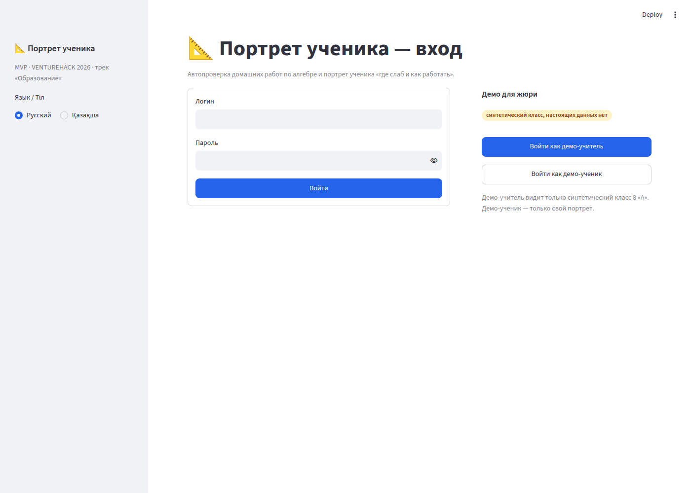
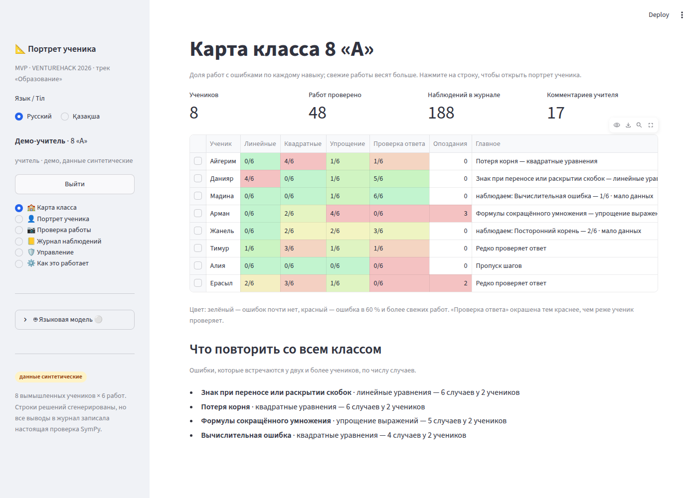
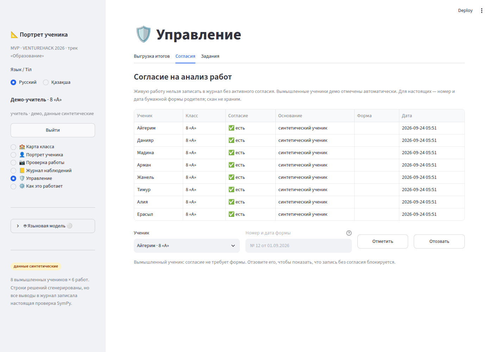
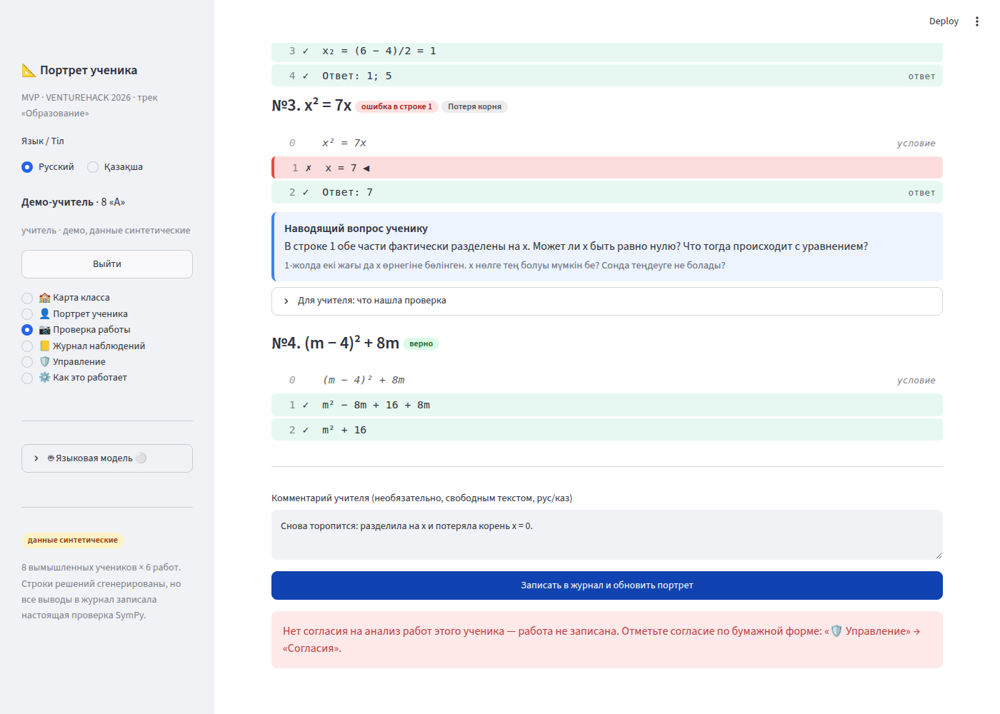
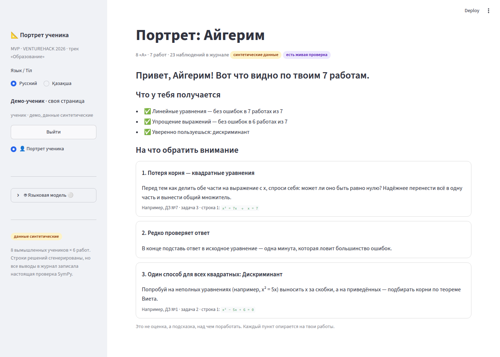
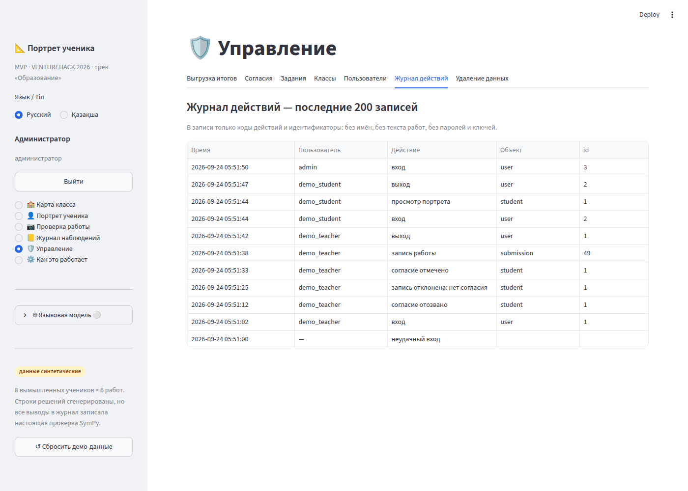
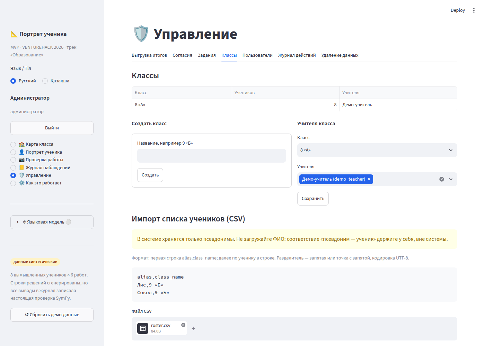
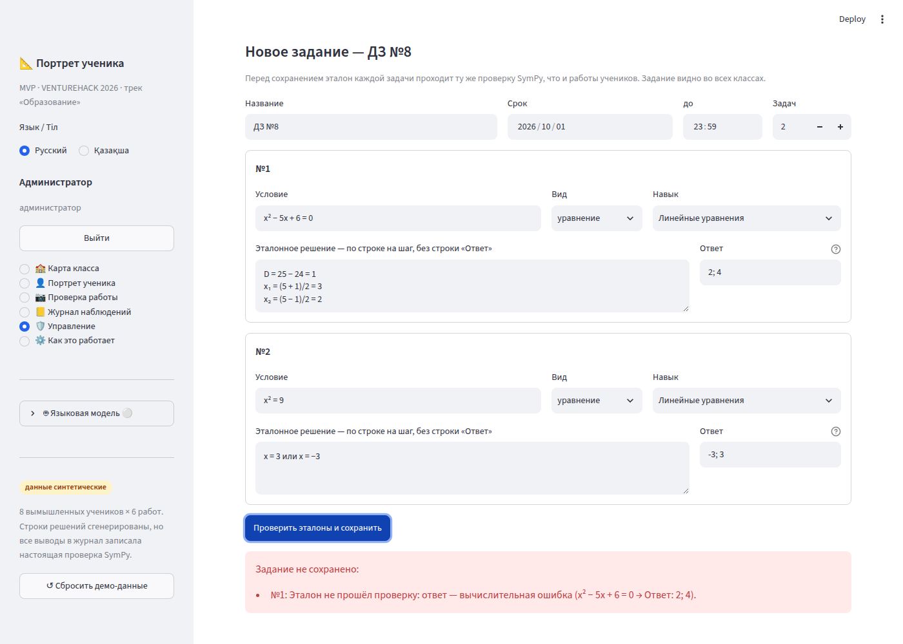

# Агент Дзета · Аккаунты, классы, безопасность

Раньше MVP был демо для одного учителя: без входа, с одним классом и ключом API в боковой панели. Теперь в нём есть роли, изоляция классов, согласие на обработку, журнал действий, удаление данных ученика по запросу и выгрузка итогов в CSV. Добавлены классы, импорт списков учеников и задания, которые создаёт учитель.

> ⚠️ **`PORTRET_AUTH=off` — только для локальной разработки.** В этом режиме каждый посетитель получает права администратора. На публичной ссылке (Streamlit Cloud, школьный сервер) переменную задавать нельзя.

## Как запустить

```bash
pip install -r requirements.txt
streamlit run app.py                         # экран входа; «Войти как демо-учитель» — в один клик
PORTRET_AUTH=off streamlit run app.py        # локально, без входа — всё как раньше
python -m pytest -q                          # 44 теста: 27 прежних + 17 новых
```

| Переменная | Значение |
|---|---|
| `PORTRET_AUTH` | `off` — вход отключён, псевдо-администратор (только локально) |
| `PORTRET_DEMO` | `0` — скрыть кнопки демо-входа (для настоящей школы) |
| `PORTRET_DEMO_PASSWORD` | пароль демо-аккаунтов для входа формой; если не задан — случайный, вход только кнопкой |
| `PORTRET_ADMIN_LOGIN`, `PORTRET_ADMIN_PASSWORD` | создать администратора при запуске; если пароль в окружении сменился, он обновится в базе |
| `ANTHROPIC_API_KEY` / `OPENAI_API_KEY` / `LLM_*` | ключ модели — только на сервере: окружение или `st.secrets` |

## Что сделано — по шагам задания

### Этап A

| # | Шаг | Где | Итог |
|---|---|---|---|
| Z1 | Пользователи и роли | `core/auth.py` | Таблицы `users` и `teacher_classes` (`ensure_schema`). PBKDF2-SHA256, 200 000 итераций, соль `secrets.token_hex(16)`, сравнение через `hmac.compare_digest`. Функция `authenticate` возвращает одинаковый `None` на любой отказ: нет логина, неверный пароль, пустой пароль, аккаунт отключён. Для несуществующего логина хэш всё равно считается, чтобы время ответа не выдавало, есть ли логин. Ещё в модуле: `visible_student_ids`, `allowed_pages`, `can_see`, `ensure_demo_users` (паролей в коде нет) и `dev_user()` для `PORTRET_AUTH=off`. |
| Z2 | Вход | `ui/login.py` | Форма входа на двух языках, кнопки «Войти как демо-учитель / демо-ученик» с пометкой «синтетический класс, настоящих данных нет». Сессия хранится в `st.session_state["user"]`, тайм-аут неактивности — 60 минут. При каждом обращении пользователь перечитывается из базы: отключённый или удалённый аккаунт сразу теряет сессию. После 5 неудачных попыток за 10 минут вход по этому логину приостанавливается (счётчик в памяти процесса). В боковой панели — имя, класс, роль и кнопка «Выйти». При выходе очищается всё состояние сессии, кроме языка: работы, портреты и ключ модели предыдущего пользователя не достаются следующему. `st.stop()` срабатывает до построения меню разделов. |
| Z3 | Изоляция | `app.py`, `portrait.class_map(..., student_ids=None)` | `students()` фильтруется по `visible_student_ids`. Карта класса, её счётчики и блок «Что повторить со всем классом» считаются только по видимым ученикам. Если у пользователя больше одного класса, появляется выбор класса. В журнале наблюдений для всех, кроме администратора, добавлено условие `o.student_id IN (…)`. Ученик видит только свой портрет в версии «для ученика», без выбора. Меню собирается из `auth.allowed_pages`: ученику доступны `portrait` и `practice`, если тренажёр есть. |
| Z4 | Согласие | `core/consent.py` | Таблица `consents`. `required_ok()` проверяет, есть ли активное согласие. Синтетические ученики (те, у кого есть работы с `source='synthetic'`) получают согласие `basis='synthetic'` автоматически и только один раз, поэтому отзыв сохраняется. `give()` требует реквизиты бумажной формы (до 60 символов, без скана). `revoke()` отзывает согласие. В `page_check` первой строкой обработчика «Записать в журнал…» стоит проверка: без согласия — `st.error`, строка аудита `record_refused` и `return`. |
| Z5 | Журнал действий | `core/audit.py` | Таблица `audit_log(id, user_id, action, target_type, target_id, at)`. Свободного текста в записи нет: `action` берётся из фиксированного словаря `ACTIONS`, `target_type` — из `TARGETS`, `target_id` — целое число. Всё остальное отклоняется с `ValueError`. Поэтому имя ученика не может попасть в журнал даже по ошибке. Записываются: вход, неудачный вход (без логина — он может оказаться именем), выход, истечение сессии, просмотр портрета (одна строка на просмотр, а не на каждую перерисовку), запись работы, отказ в записи, выгрузка CSV (карта класса и журнал наблюдений), удаление, отметка и отзыв согласия, действия администратора. |
| Z6 | Удаление | `core/privacy.py: delete_student` | Таблицы находятся через `sqlite_master` и `PRAGMA table_info`. Удаляются строки со столбцом `student_id` и строки работ ученика по `submission_id`. Затем проход до неподвижной точки по столбцам `observation_id`, `session_id`, `item_id`, которые ссылаются на удалённые строки `observations`, `practice_sessions`, `practice_items`, — так покрываются, например, ответы тренажёра по `item_id`. Потом удаляются `submissions` и `students`. `users.student_id` отвязывается, аккаунт ученика отключается. Всё выполняется в одной транзакции с `PRAGMA defer_foreign_keys`; при ошибке — откат. В аудит пишется только `delete_student / student / id`. |
| Z7 | «🛡️ Управление» | `ui/manage.py` | **Учитель:** выгрузка итогов своих классов, согласия своих учеников, задания. **Администратор**, дополнительно: классы, пользователи (создать, назначить классы, сменить пароль, отключить; себя отключить нельзя), журнал действий (последние 200 записей), удаление данных ученика с подтверждением вводом псевдонима. Выгрузка — `privacy.export_class_csv(conn, lang, student_ids) -> bytes`: UTF-8 с BOM, разделитель `;`, колонки «Псевдоним; Класс; по каждому навыку „ошибок / работ“ и „доля, %“; Проверка ответа; Опоздания; Главная рекомендация». Текст, начинающийся с `= + - @`, экранируется апострофом, чтобы Excel не выполнил его как формулу. |
| Z8 | Ключ API | `app.py`, блок «🤖 Языковая модель» | Не-администратор видит только статус «подключена / не подключена». Администратор видит поля, но **значение ключа больше не уходит в браузер**: раньше `text_input(value=cfg.api_key, type="password")` отправлял ключ сервера в HTML страницы. Теперь поле пустое с подсказкой «задан на сервере»; если его не заполнять, остаётся ключ сервера. Кнопку «Сбросить демо-данные» (удаляет всю базу, включая аккаунты) видит только администратор. |
| Z9 | Аудит кода | — | См. раздел «Аудит безопасности» ниже. |

### Этап B

| # | Шаг | Где | Итог |
|---|---|---|---|
| B1 | Классы и списки | `core/roster.py`, `ui/classes.py` (вкладка «Классы» у администратора) | Создание класса (таблица `classes`, чтобы пустой класс тоже существовал). Импорт CSV `alias,class_name`: разделитель `,` или `;`, UTF-8 с BOM или без. Проверяются заголовок, дубликаты в файле и в базе, длина, управляющие символы и `< >`, а также значения, начинающиеся с `= + - @`. Импорт работает по принципу «всё или ничего». Если значение похоже на «Фамилия Имя», появляется предупреждение, а на странице — плашка «в системе хранятся только псевдонимы». Назначение учителей классу. |
| B2 | Задания | `core/roster.py`, `ui/assignments.py` (вкладка «Задания») | Номер — следующий свободный; название, срок, от 1 до 8 задач: условие, вид (`equation`, `expression` + `core.kinds.KINDS`, если модуль есть), навык из `T.SKILLS`, эталонные строки, ответ. Перед сохранением условие разбирается `checker.parse` (белый список символов). Эталон вместе со строкой `Ответ: …` прогоняется через `checker.check_problem`: нужно, чтобы не было `first_error`, не было неразобранных строк и было `correct is True`. Иначе задание не сохраняется, и учитель видит номер задачи, строку, тип ошибки и переход — например, «№1: Эталон не прошёл проверку: ответ — вычислительная ошибка (x² − 5x + 6 = 0 → Ответ: 2; 4)». |
| B3 | Дословные правки вместе с Бетой | `core/seed.py: live_assignment_id`, `app.py: page_check` | Внесены дословно по заданию: живое демо — всегда ДЗ №7, даже после создания №8. |
| B4 | Ограничение частоты вызовов модели | `core/auth.py: rate_limit(user, "llm")` | 30 вызовов в час на пользователя, окно скользящее, хранится в памяти процесса. Встраивание в места вызова — после слияния с Альфой (см. «Нужно от других»). |
| B5 | Поле `reviewer` в отметках Эпсилона | — | После слияния (см. «Нужно от других»). |

### Этап C — PostgreSQL

Не начат: по заданию он выполняется только после слияния всех направлений, потому что затрагивает все SQL-запросы. Что подготовлено: все новые запросы используют `?`, схемы модулей написаны на подмножестве SQL, общем для SQLite и PostgreSQL. Исключения, которые придётся переписать: `INSERT OR IGNORE` в `core/roster.py` → `ON CONFLICT DO NOTHING`, `lastrowid` → `RETURNING id`, `PRAGMA`/`sqlite_master` в `privacy.delete_student` → `information_schema.columns`.

## Изменения в общих файлах

Правки только в разрешённых местах.

- `app.py`:
  1. импорты;
  2. `gate` и `allowed_pages` перед `PAGE_NAMES`;
  3. `"manage"` в `PAGES` перед `"about"`, а также в `PAGE_NAMES` и в словаре последней строки;
  4. блок языковой модели;
  5. `students()` плюс помощники `visible_filter()` и `no_students()`;
  6. фильтры в `page_class`, `page_portrait`, `page_log`, `page_check`;
  7. проверка согласия и аудит в `page_check`;
  8. аудит скачивания CSV журнала наблюдений.

  Точечные защиты:
  - на каждой странице с учениками — `if no_students(): return`, чтобы учитель без классов видел объяснение, а не исключение `studs[0]`;
  - если раздел недоступен роли, выбор раздела сбрасывается;
  - значение по умолчанию для меню — `PAGES[0]`, потому что у ученика нет раздела `class`.
- `core/portrait.py` — только необязательный параметр `class_map(conn, lang="ru", student_ids=None)`. При `None` результат прежний (это проверяет тест).
- `core/seed.py` — только дословная правка B3.

## Аудит безопасности (Z9)

| Проверка | Результат |
|---|---|
| `unsafe_allow_html=True` | 23 вызова в `app.py` и `ui/`, каждый разобран через AST: во всех подставляются только значения, обёрнутые в `esc()`, результаты `badge()` и `render_lines()` (внутри тоже `esc`), подписи из `L()`, числа и классы CSS из белого списка. Мест, где пользовательский текст выводится без `esc()`, не найдено, поэтому правки не потребовались. В новых экранах HTML используется только для плашки на экране входа (константа). |
| SQL | Все значения передаются параметрами `?`. f-строки в SQL встречаются только в трёх видах: (1) фиксированные имена таблиц (`pipeline.delete_submission`); (2) списки плейсхолдеров `IN (?,?,…)` (`app.visible_filter`, `page_class`, `privacy._in`); (3) имена таблиц и столбцов из `sqlite_master`, взятые в кавычки идентификатора (`privacy._qi`). |
| Секреты | `.streamlit/secrets.toml` есть в `.gitignore`, в репозитории его нет (`git ls-files .streamlit` → `config.toml`, `secrets.toml.example`). Ключ API не выводится в браузер (Z8). Пароли, ключи и тексты работ не пишутся в журнал действий: это исключено устройством таблицы (Z5). |
| Зависимости | `pip-audit -r requirements.txt` → `No known vulnerabilities found` (streamlit 1.64.0, sympy 1.14.0, pandas 3.0.6, requests 2.33.1, pillow 12.3.0). Новых зависимостей нет: только стандартная библиотека (`hashlib`, `hmac`, `secrets`, `csv`). |
| CSV-инъекции | Экспорт экранирует `= + - @ \t \r` в начале ячейки. Импорт отклоняет псевдонимы и классы, начинающиеся с `= + - @`. |
| Перебор паролей | Пауза после 5 неудачных попыток за 10 минут на логин; одинаковое сообщение об ошибке; одинаковое время ответа для существующего и несуществующего логина. |

Замечание вне моей зоны: `st.markdown` без `unsafe_allow_html` всё равно рендерит Markdown. Например, цитата из работы в обратных кавычках (`show_ref_work`) может «закрыть» код и вставить Markdown-ссылку. Streamlit вырезает `javascript:`-ссылки, поэтому риск низкий, но при желании цитаты стоит выводить через `st.code`.

## Как проверено

```
$ python -m pytest -q
............................................                             [100%]
44 passed in 10.07s
```

`tests/test_zeta.py` (17 тестов):

| Тест | Что проверяет |
|---|---|
| `test_password_hash` | хэш ≠ пароль; верный пароль проходит, неверный — нет; у одинаковых паролей разные соли и хэши |
| `test_authenticate` | одинаковый `None` для неизвестного логина, неверного и пустого пароля; `disabled` — отказ; в базе нет открытого пароля |
| `test_login_lock` | пауза после 5 неудач и её окончание через 10 минут |
| `test_rate_limit` | 30 вызовов в час; лимит считается для каждого пользователя отдельно; окно сдвигается |
| `test_demo_users` | демо-учитель привязан к 8 «А», демо-ученик — к Айгерим; администратор создаётся из окружения; повторный вызов ничего не дублирует |
| `test_isolation_two_teachers` | у двух учителей с разными классами пересечение видимых учеников пустое; `class_map` учителя 2 без чужих учеников; учитель без классов не видит никого |
| `test_isolation_student_and_admin` | ученик видит только себя, администратор — всех (`None`), аноним — никого |
| `test_allowed_pages` | ученику доступны `portrait` и `practice` (если есть); учителю и администратору — всё |
| `test_class_map_filter` | фильтр работает; при `None` результат прежний |
| `test_consent` | синтетический ученик — да; новый — нет; без реквизитов формы — `ValueError`; после отзыва — нет, в том числе у синтетического |
| `test_audit_no_personal_data` | записи создаются; в журнале нет псевдонимов, ФИО, логина и пароля; свободный текст отклоняется |
| `test_delete_student_everywhere` | прямо в тесте создаются `practice_sessions`, `practice_items`, `practice_answers` (по `item_id`), `review_marks` (по `observation_id`) и `ocr_runs` (по `submission_id`). Проверяется, что строки ученика удалены во всех таблицах, строки других учеников на месте, аккаунт отвязан, `foreign_key_check` чист, аудит содержит только id |
| `test_live_demo_still_works_after_delete_of_other` | после удаления другого ученика живое демо Айгерим по-прежнему даёт 5/7 |
| `test_export_class_csv` | BOM, колонки на `ru` и `kk`, строки, фильтр, пустой набор |
| `test_export_escapes_formulas` | `=HYPERLINK(…)` → `'=HYPERLINK(…)` |
| `test_students_csv_import` | заголовки, дубликаты, формулы, предупреждение о ФИО, дубликаты в базе, назначение учителей классу |
| `test_create_assignment_validates_reference` | неверный эталон, ответ, условие или навык → задание не сохраняется, ошибка указывает номер задачи; верное ДЗ №8 сохраняется, живое демо остаётся на ДЗ №7, работа по новому заданию проверяется |

Вручную, в Chromium через Playwright, на свежей базе:
1. Неверный пароль → «Неверный логин или пароль», кнопки демо остаются на месте.
2. «Войти как демо-учитель» → в боковой панели «Демо-учитель · 8 «А»» и «Выйти»; вкладки «Управления»: «Выгрузка итогов», «Согласия», «Задания».
3. Согласие Айгерим отозвано → «Записать в журнал…» даёт отказ. Согласие снова отмечено → запись проходит, «Потеря корня: 4/6 → 5/7».
4. «Войти как демо-ученик» → в меню только «👤 Портрет ученика», мягкая версия.
5. Администратор (из окружения) → журнал действий без имён; импорт CSV из 3 учеников в 9 «Б» с предупреждением о ФИО; ДЗ №8 с неверным ответом отклонено, после исправления сохранено; на карте класса появился выбор класса.
6. `PORTRET_AUTH=off` → входа нет, меню как раньше плюс «Управление»; сценарий из README даёт 4/6 → 5/7.

## Скриншоты

| | |
|---|---|
| Вход  | Демо-учитель  |
| Согласия  | Запись без согласия  |
| Ученик  | Журнал действий  |
| Импорт списка  | Эталон не прошёл проверку  |

## Что не сделано и почему

- **Этап C (PostgreSQL)** — по заданию только после слияния всех веток.
- **B4: встраивание `rate_limit`** в вызовы `llm.recognize`, `llm.tag_comment` и `llm.personalize` — после слияния с Альфой: блок `with tab_photo:` принадлежит ей.
- **B5: `reviewer`** в отметках Эпсилона — после слияния: таблицы Эпсилона в `main` ещё нет.
- **Задание привязано ко всем классам**, а не к конкретному. В таблице `assignments` нет класса, менять существующие таблицы нельзя. Если понадобится, привязку можно сделать отдельной таблицей `assignment_classes`.
- **Счётчик неудачных входов и лимит модели хранятся в памяти процесса**, как разрешено заданием: при перезапуске они сбрасываются, между несколькими процессами не делятся.

## Риски

- `PORTRET_AUTH=off` на публичной ссылке открывает всё: см. предупреждение в начале.
- Если на хостинге не задан `PORTRET_ADMIN_*`, администратора нет, и управлять пользователями некому. Демо при этом работает.
- Кнопки демо включены по умолчанию (`PORTRET_DEMO` ≠ `0`). Демо-учитель видит только синтетический класс, но для настоящей школы кнопки нужно выключить.
- «Сбросить демо-данные» (только администратор) удаляет всю базу, включая аккаунты и настоящие классы. Администратор из окружения и демо-аккаунты пересоздаются при следующем входе, остальные — нет.
- Тайм-аут считается между действиями пользователя: Streamlit не выполняет скрипт, пока пользователь ничего не делает.
- Синтетический ученик определяется по наличию работ с `source='synthetic'`. Если в чужой ветке появятся синтетические работы у настоящего ученика, он получит автоматическое согласие.

## Нужно от других

- **Альфа:** перед каждым вызовом модели в `page_check` (`llm.recognize`, `llm.tag_comment`) и в `portrait_teacher` (`llm.personalize`) добавить `if not auth.rate_limit(user, "llm"): st.warning(L("Лимит обращений к модели: 30 в час. Попробуйте позже или введите строки текстом.", "Модельге жүгіну шегі: сағатына 30. Кейінірек қайталаңыз немесе жолдарды мәтінмен енгізіңіз.")); return`. Таблицы распознаваний (`core/ocr_store.py`) должны иметь столбец `submission_id` или `student_id` — тогда `privacy.delete_student` очистит их сам. Фото и так не сохраняются.
- **Гамма:** в таблицах тренажёра — `student_id` в `practice_sessions`, `session_id` в `practice_items`, `item_id` в дочерних таблицах. Тогда удаление покроет их автоматически (проверено тестом на таблицах с такими именами). Страница должна называться `practice`: только её `allowed_pages` откроет ученику. Внутри `ui/practice.py` для ученика брать `user["student_id"]`, без выбора ученика.
- **Дельта:** если в `ui/dynamics.py` будет свой выбор учеников или запросы по всем ученикам, фильтровать по `auth.visible_student_ids(conn, user)` (передать `user` в `render`). Таблица интервенций — со столбцом `student_id`.
- **Эпсилон:** отметки учителя — со столбцом `observation_id` (удаляются вместе с наблюдением). Поле `reviewer` заполнять из `user["id"]` (B5), а не свободным текстом. Выбор учеников в `ui/review.py` — через `auth.visible_student_ids`.
- **Бета:** B3 внесена дословно. `core/roster.problem_kinds()` подхватит новые виды задач, если `core/kinds` объявит `KINDS` — список кодов видов, которые понимает `checker.check_problem`.
- **Человек при слиянии:** добавить ссылку на `docs/zeta.md` в README. На хостинге задать `PORTRET_ADMIN_LOGIN` и `PORTRET_ADMIN_PASSWORD` в secrets; для настоящей школы — `PORTRET_DEMO=0`.

## Новые казахские тексты для вычитки

Все строки `kk` из новых файлов и из новых строк `app.py` (собраны скриптом по AST).

| Файл | Русский | Қазақша |
|---|---|---|
| `core/auth.py` | администратор | әкімші |
| `core/auth.py` | учитель | мұғалім |
| `core/auth.py` | ученик | оқушы |
| `core/audit.py` | вход | кіру |
| `core/audit.py` | неудачный вход | сәтсіз кіру |
| `core/audit.py` | выход | шығу |
| `core/audit.py` | сессия истекла | сессия мерзімі өтті |
| `core/audit.py` | просмотр портрета | портретті қарау |
| `core/audit.py` | запись работы | жұмысты жазу |
| `core/audit.py` | запись отклонена: нет согласия | жазу қабылданбады: келісім жоқ |
| `core/audit.py` | выгрузка CSV | CSV түсіру |
| `core/audit.py` | удаление данных ученика | оқушы деректерін жою |
| `core/audit.py` | согласие отмечено | келісім белгіленді |
| `core/audit.py` | согласие отозвано | келісім қайтарылды |
| `core/audit.py` | создан пользователь | пайдаланушы құрылды |
| `core/audit.py` | пользователь отключён | пайдаланушы өшірілді |
| `core/audit.py` | пользователь включён | пайдаланушы қосылды |
| `core/audit.py` | пароль изменён | құпиясөз өзгертілді |
| `core/audit.py` | классы учителя изменены | мұғалім сыныптары өзгертілді |
| `core/audit.py` | создан класс | сынып құрылды |
| `core/audit.py` | импорт списка учеников | оқушылар тізімін импорттау |
| `core/audit.py` | создано задание | тапсырма құрылды |
| `core/consent.py` | синтетический ученик | синтетикалық оқушы |
| `core/consent.py` | бумажная форма родителя | ата-ананың қағаз нысаны |
| `core/roster.py` | ru | kk |
| `core/roster.py` | Пустое название класса. | Сынып атауы бос. |
| `core/roster.py` | f"Недопустимое название класса «{name[:MAX_CLASS]}»." | f"«{name[:MAX_CLASS]}» сынып атауы жарамсыз." |
| `core/roster.py` | Пустой псевдоним. | Бүркеншік ат бос. |
| `core/roster.py` | f"Недопустимый псевдоним «{alias[:MAX_ALIAS]}»." | f"«{alias[:MAX_ALIAS]}» бүркеншік аты жарамсыз." |
| `core/roster.py` | f"Слишком много строк (больше {MAX_IMPORT})." | f"Жол тым көп ({MAX_IMPORT}-ден артық)." |
| `core/roster.py` | Условие не разбирается: проверьте запись. | Шарт талданбады: жазылуын тексеріңіз. |
| `core/roster.py` | Нет условия. | Шарт жоқ. |
| `core/roster.py` | f"Неизвестный вид задачи: {kind}." | f"Есептің белгісіз түрі: {kind}." |
| `core/roster.py` | f"Неизвестный навык: {skill}." | f"Белгісіз дағды: {skill}." |
| `core/roster.py` | Нет эталонного решения. | Эталон шешім жоқ. |
| `core/roster.py` | Нет ответа. | Жауап жоқ. |
| `core/roster.py` | f"Эталон: не разобраны строки {', '.join(map(str, unparsed))}." | f"Эталон: {', '.join(map(str, unparsed))} жолдары талданбады." |
| `core/roster.py` | f"Эталон не прошёл проверку: {where} — {T.name(fe['tag'], 'ru').lower()} ({fe['evidence']})." | f"Эталон тексеруден өтпеді: {where_kk} — {T.name(fe['tag'], 'kk').lower()} ({fe['evidence']})." |
| `core/roster.py` | Нет названия. | Атауы жоқ. |
| `core/roster.py` | Нет задач. | Есеп жоқ. |
| `core/roster.py` | Файл пустой. | Файл бос. |
| `core/roster.py` | Нужны ровно две колонки: alias,class_name (первая строка — заголовок). | Дәл екі баған керек: alias,class_name (бірінші жол — тақырып). |
| `core/roster.py` | f"Строка {no}: нужно 2 значения." | f"{no}-жол: 2 мән керек." |
| `core/roster.py` | f"Строка {no}: дубликат «{alias}» в классе {cls}." | f"{no}-жол: {cls} сыныбында «{alias}» қайталанады." |
| `core/roster.py` | f"Строка {no}: «{alias}» похоже на имя и фамилию — используйте псевдоним." | f"{no}-жол: «{alias}» аты-жөніне ұқсайды — бүркеншік ат қолданыңыз." |
| `core/roster.py` | В уравнении должен быть ровно один знак «=». | Теңдеуде дәл бір «=» белгісі болуы керек. |
| `core/roster.py` | Проверка не смогла разобрать эталон. | Тексеру эталонды талдай алмады. |
| `core/roster.py` | Ответ не совпадает с решением условия или не упрощён до конца. | Жауап шарттың шешімімен сәйкес келмейді немесе соңына дейін ықшамдалмаған. |
| `core/roster.py` | f"ДЗ №{number} уже есть." | f"№{number} ҮТ бар." |
| `core/roster.py` | В выражении не должно быть знака «=». | Өрнекте «=» белгісі болмауы керек. |
| `core/roster.py` | Файл не в кодировке UTF-8. | Файл UTF-8 кодтауында емес. |
| `ui/login.py` | 📐 Портрет ученика — вход | 📐 Оқушы портреті — кіру |
| `ui/login.py` | Автопроверка домашних работ по алгебре и портрет ученика «где слаб и как работать». | Алгебрадан үй жұмысын автоматты тексеру және «қай жері әлсіз, қалай жұмыс істеу керек» портреті. |
| `ui/login.py` | своя страница | өз бетім |
| `ui/login.py` | Выйти | Шығу |
| `ui/login.py` | Демо-вход недоступен. | Демо-кіру қолжетімсіз. |
| `ui/login.py` | f"Слишком много неудачных попыток. Попробуйте через {wait // 60 + 1} мин." | f"Сәтсіз әрекет тым көп. {wait // 60 + 1} минуттан кейін қайталаңыз." |
| `ui/login.py` | Неверный логин или пароль. | Логин немесе құпиясөз қате. |
| `ui/login.py` | Сессия завершена: больше 60 минут без действий. Войдите снова. | Сессия аяқталды: 60 минуттан астам әрекетсіз. Қайта кіріңіз. |
| `ui/login.py` | Пароль | Құпиясөз |
| `ui/login.py` | Войти | Кіру |
| `ui/login.py` | Войти как демо-учитель | Демо-мұғалім ретінде кіру |
| `ui/login.py` | Войти как демо-ученик | Демо-оқушы ретінде кіру |
| `ui/login.py` | Демо-учитель видит только синтетический класс 8 «А». Демо-ученик — только свой портрет. | Демо-мұғалім тек синтетикалық 8 «А» сыныбын көреді. Демо-оқушы — тек өз портретін. |
| `ui/login.py` | ⚠️ Вход отключён (PORTRET_AUTH=off) — только для локальной разработки. | ⚠️ Кіру өшірілген (PORTRET_AUTH=off) — тек жергілікті әзірлеу үшін. |
| `ui/login.py` |  · демо, данные синтетические |  · демо, деректер синтетикалық |
| `ui/login.py` | Демо для жюри | Қазылар алқасына арналған демо |
| `ui/login.py` | синтетический класс, настоящих данных нет | синтетикалық сынып, нақты деректер жоқ |
| `ui/manage.py` | CSV: псевдоним; по каждому навыку «ошибок / работ» и доля; проверка ответа; опоздания; главная рекомендация. Кодировка UTF-8 с BOM — файл открывается в Excel. | CSV: бүркеншік ат; әр дағды бойынша «қате / жұмыс» және үлесі; жауапты тексеру; кешігу; басты ұсыныс. UTF-8 (BOM) кодтауы — файл Excel-де ашылады. |
| `ui/manage.py` | Класс | Сынып |
| `ui/manage.py` | Подготовить CSV | CSV дайындау |
| `ui/manage.py` | Живую работу нельзя записать в журнал без активного согласия. Вымышленные ученики демо отмечены автоматически. Для настоящих — номер и дата бумажной формы родителя; скан не храним. | Белсенді келісімсіз тірі жұмысты журналға жазуға болмайды. Демодағы ойдан шығарылған оқушылар автоматты түрде белгіленген. Нақты оқушыларға — ата-ана қағаз нысанының нөмірі мен күні; скан сақталмайды. |
| `ui/manage.py` | Ученик | Оқушы |
| `ui/manage.py` | Номер и дата формы | Нысанның нөмірі мен күні |
| `ui/manage.py` | Отметить | Белгілеу |
| `ui/manage.py` | Отозвать | Қайтару |
| `ui/manage.py` | Изменить пользователя | Пайдаланушыны өзгерту |
| `ui/manage.py` | Новый пароль | Жаңа құпиясөз |
| `ui/manage.py` | Сменить пароль | Құпиясөзді ауыстыру |
| `ui/manage.py` | В записи только коды действий и идентификаторы: без имён, без текста работ, без паролей и ключей. | Жазбада тек әрекет кодтары мен идентификаторлар: атсыз, жұмыс мәтінінсіз, құпиясөз бен кілтсіз. |
| `ui/manage.py` | По запросу родителя или ученика: работы, строки решений, журнал наблюдений, комментарии, согласия и данные других модулей (тренажёр, отметки, интервенции). Действие необратимо; в журнал действий попадает только факт удаления и id. | Ата-ананың немесе оқушының сұрауы бойынша: жұмыстар, шешім жолдары, бақылау журналы, пікірлер, келісімдер және басқа модульдердің деректері. Әрекет қайтымсыз; әрекеттер журналына тек жою фактісі мен id жазылады. |
| `ui/manage.py` | Для подтверждения введите псевдоним ученика | Растау үшін оқушының бүркеншік атын енгізіңіз |
| `ui/manage.py` | 🗑️ Удалить данные ученика | 🗑️ Оқушы деректерін жою |
| `ui/manage.py` | 🛡️ Управление | 🛡️ Басқару |
| `ui/manage.py` | Выгрузка итогов | Қорытындыны түсіру |
| `ui/manage.py` | Согласия | Келісімдер |
| `ui/manage.py` | Задания | Тапсырмалар |
| `ui/manage.py` | Итоги класса для электронного журнала | Электрондық журналға арналған сынып қорытындысы |
| `ui/manage.py` | Нет учеников в ваших классах. | Сыныптарыңызда оқушы жоқ. |
| `ui/manage.py` | ⬇️ Скачать CSV | ⬇️ CSV жүктеу |
| `ui/manage.py` | f"Строк: {data.decode('utf-8-sig').count(chr(10)) - 1}. Скачивание записывается в журнал действий." | f"Жол саны: {data.decode('utf-8-sig').count(chr(10)) - 1}. Жүктеу әрекеттер журналына жазылады." |
| `ui/manage.py` | Согласие на анализ работ | Жұмыстарды талдауға келісім |
| `ui/manage.py` | № 12 от 01.09.2026 | № 12, 01.09.2026 |
| `ui/manage.py` | Только реквизиты бумажной формы — без имён и без скана. | Тек қағаз нысанының деректемелері — атсыз және сканссыз. |
| `ui/manage.py` | Вымышленный ученик: согласие не требует формы. Отзовите его, чтобы показать, что запись без согласия блокируется. | Ойдан шығарылған оқушы: келісімге нысан керек емес. Келісімсіз жазу бұғатталатынын көрсету үшін оны қайтарыңыз. |
| `ui/manage.py` | Пользователи и классы учителей | Пайдаланушылар және мұғалім сыныптары |
| `ui/manage.py` | ➕ Новый пользователь | ➕ Жаңа пайдаланушы |
| `ui/manage.py` | Классы учителя | Мұғалім сыныптары |
| `ui/manage.py` | Сохранить классы | Сыныптарды сақтау |
| `ui/manage.py` | Себя отключить нельзя. | Өзіңізді өшіруге болмайды. |
| `ui/manage.py` | Журнал действий — последние 200 записей | Әрекеттер журналы — соңғы 200 жазба |
| `ui/manage.py` | Удаление всех данных ученика | Оқушының барлық деректерін жою |
| `ui/manage.py` | Учеников нет. | Оқушы жоқ. |
| `ui/manage.py` | Нет доступа. | Қолжетімділік жоқ. |
| `ui/manage.py` | Считаю портреты… | Портреттерді есептеп жатырмын… |
| `ui/manage.py` | Имя в системе | Жүйедегі аты |
| `ui/manage.py` | Роль | Рөлі |
| `ui/manage.py` | f"Пароль (не короче {auth.MIN_PASSWORD} символов)" | f"Құпиясөз (кемінде {auth.MIN_PASSWORD} таңба)" |
| `ui/manage.py` | Классы (для учителя) | Сыныптар (мұғалімге) |
| `ui/manage.py` | Ученик (для роли «ученик») | Оқушы («оқушы» рөлі үшін) |
| `ui/manage.py` | Создать | Құру |
| `ui/manage.py` | Пароль слишком короткий. | Құпиясөз тым қысқа. |
| `ui/manage.py` | Пароль изменён. | Құпиясөз өзгертілді. |
| `ui/manage.py` | Включить | Қосу |
| `ui/manage.py` | Отключить | Өшіру |
| `ui/manage.py` | Удалено:  | Жойылды:  |
| `ui/manage.py` | Классы | Сыныптар |
| `ui/manage.py` | Пользователи | Пайдаланушылар |
| `ui/manage.py` | Журнал действий | Әрекеттер журналы |
| `ui/manage.py` | Удаление данных | Деректерді жою |
| `ui/manage.py` | Согласие | Келісім |
| `ui/manage.py` | Основание | Негіз |
| `ui/manage.py` | Форма | Нысан |
| `ui/manage.py` | Дата | Күні |
| `ui/manage.py` | Укажите номер и дату бумажной формы (до 60 символов). | Қағаз нысанының нөмірі мен күнін көрсетіңіз (60 таңбаға дейін). |
| `ui/manage.py` | Активен | Белсенді |
| `ui/manage.py` | Для учеников — псевдоним. | Оқушыларға — бүркеншік ат. |
| `ui/manage.py` | Время | Уақыт |
| `ui/manage.py` | Пользователь | Пайдаланушы |
| `ui/manage.py` | Действие | Әрекет |
| `ui/manage.py` | Объект | Нысан |
| `ui/manage.py` | есть | бар |
| `ui/manage.py` | нет | жоқ |
| `ui/manage.py` | Для роли «ученик» выберите ученика. | «Оқушы» рөлі үшін оқушыны таңдаңыз. |
| `ui/manage.py` | Укажите логин и имя. | Логин мен атты көрсетіңіз. |
| `ui/manage.py` | Такой логин уже есть. | Мұндай логин бар. |
| `ui/manage.py` | Пользователь создан. | Пайдаланушы құрылды. |
| `ui/classes.py` | В системе хранятся только псевдонимы. Не загружайте ФИО: соответствие «псевдоним — ученик» держите у себя, вне системы. | Жүйеде тек бүркеншік аттар сақталады. Аты-жөнін жүктемеңіз: «бүркеншік ат — оқушы» сәйкестігін жүйеден тыс, өзіңізде сақтаңыз. |
| `ui/classes.py` | Формат: первая строка alias,class_name; далее по ученику в строке. Разделитель — запятая или точка с запятой, кодировка UTF-8. | Пішімі: бірінші жол alias,class_name; әрі қарай әр жолда бір оқушы. Бөлгіш — үтір немесе нүктелі үтір, кодтауы UTF-8. |
| `ui/classes.py` | Файл CSV | CSV файлы |
| `ui/classes.py` | f"Импортировать {len(rows)}" | f"{len(rows)} импорттау" |
| `ui/classes.py` | Импорт списка учеников (CSV) | Оқушылар тізімін импорттау (CSV) |
| `ui/classes.py` | f"«{d['alias']}» уже есть в классе {d['class_name']}." | f"«{d['alias']}» {d['class_name']} сыныбында бар." |
| `ui/classes.py` | f"Добавлено учеников: {n}. Отметьте согласия на вкладке «Согласия»." | f"Қосылған оқушылар: {n}. Келісімдерді «Келісімдер» қойындысында белгілеңіз." |
| `ui/classes.py` | Название, например 9 «Б» | Атауы, мысалы 9 «Б» |
| `ui/classes.py` | Нужны класс и хотя бы один учитель. | Сынып және кемінде бір мұғалім керек. |
| `ui/classes.py` | Учителя | Мұғалімдер |
| `ui/classes.py` | Сохранить | Сақтау |
| `ui/classes.py` | Учеников | Оқушы |
| `ui/classes.py` | Создать класс | Сынып құру |
| `ui/classes.py` | Учителя класса | Сынып мұғалімдері |
| `ui/classes.py` | Псевдоним | Бүркеншік ат |
| `ui/classes.py` | Такой класс уже есть. | Мұндай сынып бар. |
| `ui/assignments.py` | Перед сохранением эталон каждой задачи проходит ту же проверку SymPy, что и работы учеников. Задание видно во всех классах. | Сақтамас бұрын әр есептің эталоны оқушылардың жұмыстары сияқты SymPy тексеруінен өтеді. Тапсырма барлық сыныпқа көрінеді. |
| `ui/assignments.py` | Название | Атауы |
| `ui/assignments.py` | Срок | Мерзімі |
| `ui/assignments.py` | до | дейін |
| `ui/assignments.py` | Задач | Есеп |
| `ui/assignments.py` | уравнение | теңдеу |
| `ui/assignments.py` | выражение | өрнек |
| `ui/assignments.py` | Проверить эталоны и сохранить | Эталондарды тексеріп, сақтау |
| `ui/assignments.py` | f"ДЗ №{done} сохранено: все эталоны прошли проверку." | f"№{done} ҮТ сақталды: барлық эталон тексеруден өтті." |
| `ui/assignments.py` | f"Новое задание — ДЗ №{number}" | f"Жаңа тапсырма — №{number} ҮТ" |
| `ui/assignments.py` | f"ДЗ №{number}" | f"№{number} ҮТ" |
| `ui/assignments.py` | Условие | Шарты |
| `ui/assignments.py` | Вид | Түрі |
| `ui/assignments.py` | Навык | Дағды |
| `ui/assignments.py` | Эталонное решение — по строке на шаг, без строки «Ответ» | Эталон шешім — әр қадам бір жолда, «Жауап» жолынсыз |
| `ui/assignments.py` | Ответ | Жауап |
| `ui/assignments.py` | Для уравнения — корни через «;». | Теңдеу үшін — түбірлер «;» арқылы. |
| `ui/assignments.py` | Проверяю эталоны… | Эталондарды тексеріп жатырмын… |
| `ui/assignments.py` | Задание не сохранено: | Тапсырма сақталмады: |
| `app.py` | В ваших классах пока нет учеников. Классы назначает администратор. | Сыныптарыңызда әзірге оқушы жоқ. Сыныптарды әкімші тағайындайды. |
| `app.py` | Нет согласия на анализ работ этого ученика — работа не записана. Отметьте согласие по бумажной форме: «🛡️ Управление» → «Согласия». | Бұл оқушының жұмыстарын талдауға келісім жоқ — жұмыс жазылмады. Келісімді қағаз нысаны бойынша белгілеңіз: «🛡️ Басқару» → «Келісімдер». |
| `app.py` | Статус:  | Күйі:  |
| `app.py` | подключена | қосылған |
| `app.py` | не подключена | қосылмаған |
| `app.py` | задан на сервере | серверде берілген |
| `docs/zeta.md` (для Альфы) | Лимит обращений к модели: 30 в час. Попробуйте позже или введите строки текстом. | Модельге жүгіну шегі: сағатына 30. Кейінірек қайталаңыз немесе жолдарды мәтінмен енгізіңіз. |

